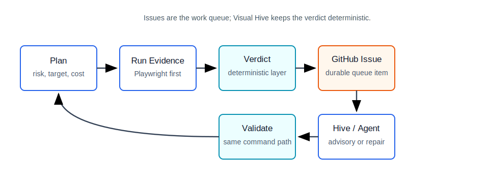
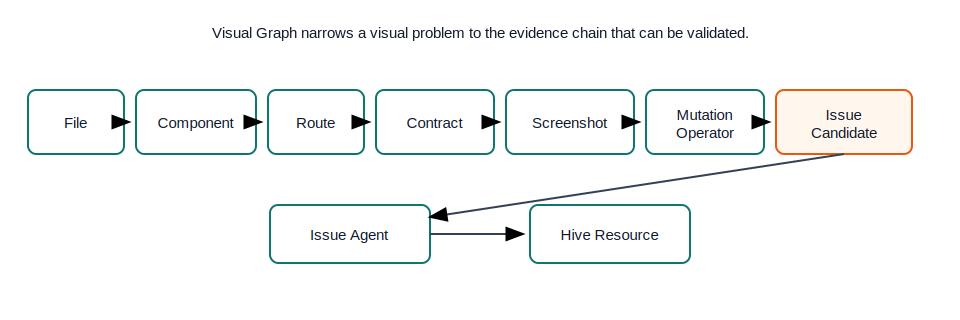
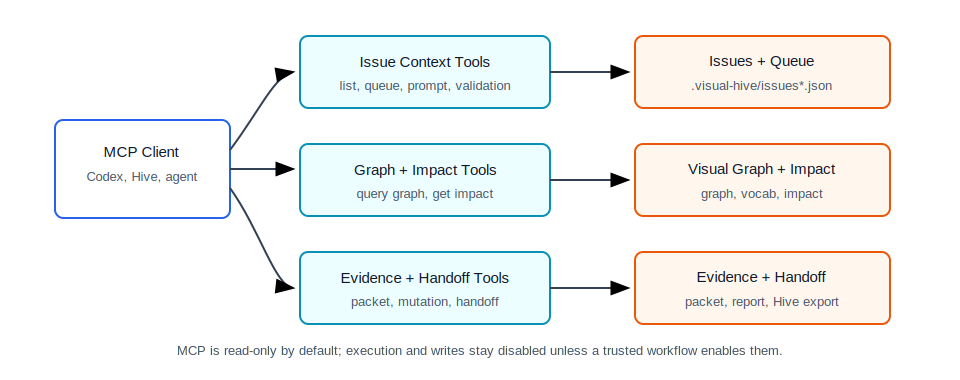
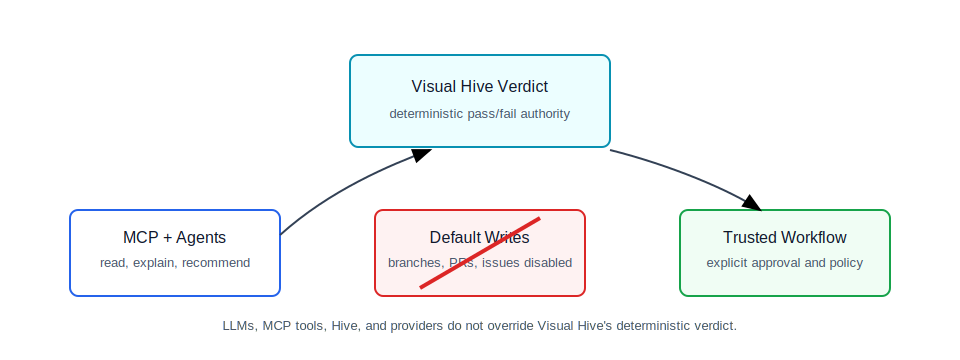

# Visual Hive

Visual Hive turns visual regressions, missing coverage, mutation survivors, and weak UI tests into deterministic evidence and GitHub issues that Hive or agents can act on.

It is a deterministic-first visual QA control plane for web projects. Playwright is the default first-party local browser runner and primary local evidence source. Visual Hive owns the final verdict layer, packages the evidence, and routes work through issues. LLMs, MCP tools, Hive, agents, and optional providers can explain or act on evidence, but they do not decide pass/fail by default.

## Quick Links

- [Quickstart](#quickstart)
- [Issue-centric architecture](docs/issue-centric-architecture.md)
- [Issue-agent architecture](docs/issue-centric-agent-architecture.md)
- [MCP / agent interface](docs/mcp.md)
- [GitHub App model](docs/github-app.md)
- [Public info site](apps/visual-hive-site)
- [Agent factors](docs/visual-hive-agent-factors.md)
- External demo repo: `visual-hive-demo-site` uses the `vh:*` commands shown below.

## Why It Exists

Frontend teams usually have fragments of visual quality evidence: screenshots, selector tests, traces, mutation gaps, flaky baselines, workflow warnings, and review comments. Visual Hive makes those signals coherent. It plans the right local checks, runs deterministic browser evidence, records graph-backed artifacts, identifies weak or missing coverage, and turns findings into durable issue candidates with validation commands.

The product boundary is intentional:

- Visual Hive detects, proves, packages, routes, and validates.
- GitHub Issues are the durable queue.
- Hive or agents may repair in explicitly governed workflows.
- Visual Hive reruns deterministic validation before anything is considered resolved.

## What It Does

- Plans checks from changed files, target safety, risk, schedule, and cost.
- Runs Playwright-backed selector, flow, console/page/network, and screenshot contracts.
- Compares screenshots with configured tolerances and baseline review policy.
- Measures mutation adequacy so weak visual tests become concrete work.
- Builds a Visual Graph linking files, components, routes, selectors, contracts, screenshots, mutations, artifacts, issues, agents, and Hive resources.
- Emits Evidence Packets, reports, issue candidates, issue queues, handoff packets, MCP manifests, tool registry cards, and Control Plane snapshots.
- Keeps default local and PR-safe paths no-network, no-provider, no-real-issue, no-branch, and no-PR.

## Issue-Centric Loop



Visual Hive issue candidates include kind, severity, lifecycle status, dedupe fingerprint, labels, owner hint, body, affected surfaces, reproduction command, validation command, linked artifacts, and guardrails. A trusted workflow or GitHub App can create or update real GitHub issues from sanitized artifacts; local/default runs only write dry-run evidence.

Issues are the right handoff object because they provide review, dedupe, ownership, lifecycle, labels, and a safe place for humans, Hive, or agents to coordinate around already-packaged evidence.

## Visual Graph



The Visual Graph narrows a visual problem to the affected subgraph. Instead of asking an agent to inspect an entire repo, Visual Hive can point to the specific route, component, selector, contract, screenshot, mutation survivor, artifact, issue, and validation command.

Useful graph commands:

```bash
npm run demo:graph:search
npm run demo:graph:impact
```

## MCP / Agent Interface



The first-party MCP server is a read-only adapter over existing `.visual-hive` artifacts. Issue agents should start with:

- `visual_hive_list_issues`
- `visual_hive_get_issue_context`
- `visual_hive_read_issue_queue`
- `visual_hive_query_visual_graph`
- `visual_hive_get_visual_impact`
- `visual_hive_read_evidence_packet`
- `visual_hive_read_mutation_report`
- `visual_hive_list_artifacts`
- `visual_hive_get_validation_command`
- `visual_hive_get_agent_prompt`
- `visual_hive_get_handoff_context`

Generate the manifest:

```bash
node packages/cli/dist/index.js mcp --config examples/demo-react-app/visual-hive.config.yaml --describe --output .visual-hive/mcp-manifest.json
```

Start the stdio server for an MCP client:

```bash
node packages/cli/dist/index.js mcp --config examples/demo-react-app/visual-hive.config.yaml --stdio
```

See [docs/mcp.md](docs/mcp.md) for resources, tools, setup-only repo mode, and disabled execution tools.

## Safety Model



Default Visual Hive runs are conservative:

- Visual Hive owns deterministic verdicts.
- Playwright is the default local browser evidence runner.
- LLM output is prompt/offline triage only.
- MCP is read-only by default.
- Optional visual providers are not required and are not gating by default.
- Agents must not approve baselines, weaken thresholds, create issues, create branches, open PRs, call Hive, upload provider artifacts, or access secrets unless a trusted workflow explicitly enables that path.
- Workflows that execute untrusted PR code must not use `pull_request_target`.

## Quickstart

Use Node 22 and npm.

```bash
npm ci
npm run build
npm run typecheck
npm test
npm run lint
npm run demo:all
```

Run the full product proof in this repo:

```bash
npm run demo:full-run
```

That command exercises the major demo surfaces and verifies the local safety boundary: zero external calls, zero real GitHub issues, zero branches, zero PRs, and no provider uploads.

## Public Info Site

The public landing/onboarding site lives in `apps/visual-hive-site`. It is separate from the local-first Control Plane in `packages/control-plane`.

```bash
npm run site:dev
npm run site:typecheck
npm run site:build
```

The site is a static Vite app designed for Vercel with the project root set to `apps/visual-hive-site`, build command `npm run build`, and output directory `dist`. It explains the issue-centric Visual Hive loop, links to GitHub/docs/demo-site proof, and keeps the current production state honest: GitHub App hosting and live issue publishing are guarded directions, not defaults.

## External Demo-Site Proof

The external `visual-hive-demo-site` repo is expected to expose the consumer-facing command names:

```bash
npm ci
npm run vh:full-run
npm run vh:graph:search
npm run vh:graph:impact
npm run vh:issues
npm run vh:agent:issue
```

Those commands prove Visual Hive from a consumer repo rather than from this product checkout. This repository documents and builds the product; the external repo owns its own `vh:*` scripts.

## Production Direction

The production direction is:

1. Install the GitHub App on a selected repo.
2. Open a setup issue with detected framework, target, workflow, and selector guidance.
3. Generate a reviewed setup PR or setup bundle.
4. Run Visual Hive in PR-safe CI.
5. Publish sanitized issue candidates from trusted artifacts.
6. Let Hive, agents, or humans act from those issues.
7. Rerun Visual Hive validation and update issue state.

The current GitHub App package is mock/local first and makes zero network calls. Hosted production issue publishing is a guarded direction, not a default behavior of local runs.

## Generated Artifacts

Common `.visual-hive` artifacts include:

- `plan.json`
- `report.json`
- `evidence-packet.json`
- `verdict.json`
- `mutation-report.json`
- `visual-graph.json`
- `visual-impact.json`
- `issues.json`
- `issue-queue.json`
- `handoff.json`
- `hive/hive-export.json`
- `agents/<dedupe>/agent-request.md`
- `tools/tool-registry.json`
- `context-ledger.json`
- `mcp-manifest.json`
- `artifacts-index.json`

Generated `.visual-hive` files stay ignored unless baseline artifacts are intentionally reviewed and committed.

## Current Status

Current `main` includes the issue-centric artifact model, Visual Graph and impact commands, no-network issue publishing dry runs, a real first-party MCP stdio server, issue-agent request generation, Control Plane evidence snapshots, and a full local demo acceptance suite.

Use `npm run demo:full-run` as the strongest local proof. Use the external `visual-hive-demo-site` `vh:*` commands in that repo for consumer-proof validation.
