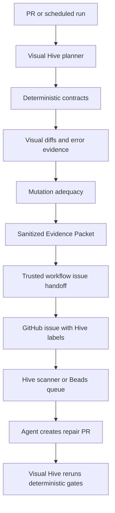

# Visual Hive Agent-Forward Master Documentation v2
Generated: 2026-07-02
This single file combines the updated core docs and the new agent-forward/MCP integration guidance.


---

# File: `visual-hive-vision-and-research-rationale-agent-forward-v2.md`

# Visual Hive Vision and Research Rationale — Updated Enterprise Research Pass

Status: research-informed product direction, agent-readable architecture guidance  
Date: 2026-07-02  
Target repo: `DavidDiaz0317/visual-hive`

---

## Executive thesis

Visual Hive is an enterprise-grade, deterministic-first visual QA orchestration and evidence platform for AI-accelerated software projects.

The important distinction is that Visual Hive is not a screenshot diff wrapper, a Playwright wrapper, a demo app, or a dashboard bolted onto test output. It is the control and evidence layer that decides what visual/user-flow risk exists, which deterministic checks should run, which targets are safe, how much the run should cost, what evidence is produced, and which human or agent receives the next repair task.

The project should be developed as frontier infrastructure for AI-maintained codebases:

```text
Visual Hive turns user-visible software risk into structured, deterministic evidence.
Humans, agents, providers, and Hive consume the evidence.
They do not replace the evidence.
```

That sentence should be preserved in the README, docs, agent instructions, prompt builders, Control Plane UI, and GitHub workflow templates.

---

## What this update adds

The previous docs already established the right foundation: deterministic-first execution, local-first defaults, GitHub-safe workflows, mutation adequacy, Evidence Packet thinking, KubeStellar/Hive handoff, provider optionality, and LLM governance. This update adds five missing layers:

1. A current ecosystem map of visual and adjacent testing tools beyond Playwright.
2. A stronger enterprise product standard.
3. A direct correlation with the AI Codebase Maturity Model paper.
4. A formal testing layer lattice from unit tests through mutation, canary, protected environments, and agent feedback loops.
5. A concrete agent-documentation strategy so Codex, Copilot, Hive agents, and future repair agents can understand the system without repeatedly rediscovering the repo.

---

## Current state of testing tools and what Visual Hive should learn

The modern testing ecosystem is no longer a simple unit/integration/e2e pyramid. It is a lattice of specialized engines, hosted review systems, observability systems, mutation engines, and AI-assisted QA platforms. Visual Hive should not rebuild all of them. It should own the orchestration layer that decides when each layer is useful and whether its output is trustworthy.

### Tool landscape

| Category | Representative tools | What they are good at | Limit for Visual Hive's vision | Visual Hive implication |
| --- | --- | --- | --- | --- |
| Browser automation and deterministic E2E | Playwright, Cypress, WebdriverIO | Real browser flows, selectors, screenshots, network interception, traces, CI execution | They execute checks but do not own repo-level policy, protected target safety, cost control, or agent handoff | Use as deterministic execution backends, with Playwright as default |
| Component and story visual testing | Storybook, Chromatic, Loki, Vitest Browser Mode, Happo | Design-system and component-level visual coverage | Often isolated from live app flows, auth states, production-like data, and repo-wide risk selection | Add component/story targets as one layer, not the full product |
| Hosted visual review | Argos, Percy/BrowserStack, Chromatic, Applitools, Happo | Hosted baselines, approval UIs, browser/device grids, team review | Can become noisy or expensive without project-aware planning and policy | Integrate through guarded adapters; Visual Hive owns selection, safety, budget, evidence |
| Open-source visual regression | BackstopJS, Loki, Lost Pixel patterns | Simple screenshot comparison, Storybook or page coverage, CI-friendly workflows | Usually weaker on enterprise governance, multi-target safety, mutation adequacy, and agent repair handoff | Borrow simplicity and local-first ergonomics, avoid becoming only a screenshot tool |
| AI-assisted QA and autonomous exploration | Meticulous, Wopee.io, QA Wolf-style managed QA | Session-derived tests, AI-generated flows, self-healing locators, broad app exploration | Model/heuristic output can be opaque; pass/fail must not depend on AI judgment alone | Use these ideas for setup/recommendation/coverage discovery; deterministic contracts still decide pass/fail |
| Test orchestration, flake, and trace systems | Currents, Replay.io, Playwright traces, CI dashboards | Test balancing, flake visibility, replayable debugging evidence | Usually not visual-QA-specific and not tied to mutation or Hive work routing | Build flake/stability history and trace extraction into Evidence Packets |
| Mutation testing | Stryker, PIT, mutation-testing research | Adequacy measurement: prove tests catch intentional faults | Traditional mutation focuses on code-level mutants, not visual/user-flow contracts | Build UI/auth/API/visual mutation operators and optionally interop with existing mutation engines |
| Synthetic monitoring and live canaries | Checkly, Playwright-based synthetic monitors, protected scheduled workflows | Post-deploy confidence and live environment monitoring | Needs strict secret handling and separation from untrusted PRs | Schedule protected/live-cluster lanes; never run secret-bearing checks on untrusted PR code |

### Lessons from specific tools

#### Playwright remains the default deterministic oracle

Playwright should stay the default runner because it supports real browser contracts, screenshots, traces, and CI execution without a paid provider. Visual Hive should continue generating readable Playwright specs and should treat `toHaveScreenshot`, selector checks, route checks, console/page/network failures, and trace artifacts as deterministic evidence.

Visual Hive should avoid overfitting to Playwright, though. The product should make space for Cypress, WebdriverIO, Vitest Browser Mode, Storybook, and provider-backed runs as adapters. The config and Evidence Packet should describe contracts, targets, outputs, and policy in Visual Hive terms first, then map to backend-specific tools second.

#### Vitest Browser Mode is strategically interesting

Vitest Browser Mode now makes browser-based component/page screenshot tests a realistic lower-level visual layer. This matters because many UI regressions can be caught before full E2E. Visual Hive should eventually support a component-visual lane that can run fast on PRs when a component or design-token file changes.

Recommended future direction:

```text
changed component/design-token files
  -> select component visual contracts
  -> optionally run Vitest Browser Mode or Storybook/Chromatic adapter
  -> include results in Evidence Packet beside Playwright app-flow results
```

#### WebdriverIO visual service broadens the device/native horizon

WebdriverIO visual testing can cover desktop browser, mobile browser, native app, and hybrid app screenshot comparisons. Visual Hive should not build this immediately, but the schema should not assume “web page only.” Enterprise customers may eventually want dashboard web apps, Electron shells, mobile surfaces, or internal admin apps covered by the same policy/evidence model.

#### Argos, Percy, Chromatic, Applitools, and Happo should be adapters, not the core

Hosted providers are useful when teams need review UIs, stable hosted baselines, cross-browser/device rendering, and team approval flows. But these providers do not replace Visual Hive's differentiator: project-aware test planning, protected target safety, mutation adequacy, cost policy, and agent-ready evidence.

Provider usage should remain:

```text
disabled by default
mockable in tests
explicit in config
forbidden on untrusted PRs unless safe and no secrets are exposed
budget-aware
summarized in reports even when skipped
```

#### Lost Pixel is useful as a pattern, not a dependency

Lost Pixel's open-source pattern is valuable because it combines Storybook/Ladle/Histoire/page/custom screenshots, masks, thresholds, and retries. However, its product status has changed. Visual Hive should learn from the architecture and ergonomics, not build a hard dependency on the service.

#### Meticulous suggests session-derived coverage and backend replay

Meticulous is valuable conceptually because it uses real user sessions to build test coverage and mocks backend responses by replaying captured responses. Visual Hive should not depend on an external AI service, but it should eventually support:

- importing route/session traces;
- converting high-value sessions into proposed contracts;
- generating deterministic fixtures or HAR-backed mocks;
- ranking routes by observed usage and risk;
- producing “suggested contracts” that a human or agent must review before they become gating checks.

This would give Visual Hive a strong new angle: not just “test the routes listed in config,” but “discover the visual/user-flow states the product actually uses.”

#### Wopee.io suggests autonomous exploration, but Visual Hive must keep deterministic gates

AI agents that explore a site and generate tests are useful for setup and coverage discovery. Visual Hive should use this idea in the Setup Agent, route discovery, contract recommendation, and missing-test prompts. It should not let an AI explorer decide pass/fail or silently approve baselines.

Safe application:

```text
AI/heuristic explorer proposes routes and contracts
  -> deterministic policy engine validates safety and scope
  -> user/owner approves contract additions
  -> deterministic runner gates future changes
```

#### Currents and Replay.io show what evidence quality should feel like

Enterprise teams need fast feedback, flake insight, historical runs, parallelization, and replayable traces. Visual Hive's Evidence Packet and Control Plane should therefore include:

- run history;
- flake/stability index;
- sharding/parallelization metadata;
- Playwright trace links;
- reproduction commands;
- artifact retention policy;
- failure fingerprints;
- rerun history;
- target lifecycle logs.

#### Stryker and PIT validate mutation adequacy as a serious engineering signal

Mutation testing is not just a research idea. It is a practical way to measure whether a test suite catches faults. Visual Hive's special contribution is applying mutation adequacy to user-visible UI/auth/API/layout contracts rather than only code-level mutants.

Recommended positioning:

```text
Traditional mutation testing asks: did unit tests catch code mutants?
Visual Hive asks: did user-visible contracts catch product-risk mutants?
```

---

## The testing layer lattice

Visual Hive should explicitly document and implement a layered testing lattice. This should replace vague “unit to e2e to mutation” language with stable layers agents can reason about.

| Layer | Name | Primary question | Typical tools | PR lane | Scheduled/protected lane | Evidence artifact |
| --- | --- | --- | --- | --- | --- | --- |
| 0 | Repo intelligence | What app, routes, packages, workflows, targets, selectors, and risk areas exist? | Visual Hive analyzer, static scanner, package/workflow parser | yes | yes | `.visual-hive/repo-map.json`, `.visual-hive/coverage.json` |
| 1 | Static/build/workflow safety | Does the code build, typecheck, lint, and avoid unsafe workflow patterns? | TypeScript, ESLint, npm scripts, GitHub workflow audit | yes | yes | build logs, workflow audit, safety findings |
| 2 | Unit | Do pure functions and low-level modules behave correctly? | Vitest/Jest, framework unit tests | changed-files only | full suite | JUnit/test output |
| 3 | Component and accessibility | Do components render usable, accessible states? | Testing Library, Storybook, axe, Vitest Browser Mode | selected | full/design-system | component reports, accessibility findings |
| 4 | API/contract | Do API contracts and error states behave as expected? | MSW, contract tests, Playwright API, mock services | selected | full/fault injected | API contract results |
| 5 | Component visual | Do UI components and design tokens visually drift? | Storybook/Chromatic/Loki/Vitest Browser/Argos | selected | broader cross-browser | component screenshots/diffs |
| 6 | E2E user-flow | Do critical routes and user flows work in a real browser? | Playwright/Cypress/WebdriverIO | fast critical flows | full flows | generated specs, traces, screenshots |
| 7 | Cross-browser/device visual | Does rendering hold across browsers/devices? | Applitools, Percy, BrowserStack, Happo, WDIO | rarely, gated by budget | yes | normalized provider result |
| 8 | Canary/synthetic/protected | Does deployed/staging/live-cluster behavior still hold? | scheduled Playwright, Checkly-like monitors, protected targets | no secrets on PR | yes | protected run report, redacted secret readiness |
| 9 | Mutation/fault injection | Would tests catch intentional UI/auth/API/layout breakage? | Visual Hive mutation engine, Stryker interop later | limited fast mutants | full mutation suite | `.visual-hive/mutation-report.json` |
| 10 | Flake/history/cost governance | Are failures trustworthy and is the system sustainable? | Visual Hive history, flake index, provider cost policy | yes summary | yes full | `.visual-hive/history.json`, cost report |
| 11 | Agent/Hive feedback loop | Can a human or agent repair the issue with bounded evidence? | GitHub issues, Hive Beads, Codex/Hive agents | issue draft only | trusted issue/handoff | Evidence Packet, repair prompt, handoff result |

### Fast PR lane

The fast PR lane should aim for under three minutes for typical repos. It should run:

- repo/workflow safety checks;
- changed-file planning;
- affected unit/component tests when available;
- critical deterministic Playwright contracts;
- no-login/public-demo canary checks when PR-safe;
- screenshot comparisons only for selected critical routes;
- a small set of high-value mutations when configured;
- no protected secrets;
- no external provider upload unless explicitly safe and allowed by policy.

### Daily/deep lane

The daily/deep lane should run:

- broader E2E routes;
- protected targets;
- fake OAuth or command groups;
- scheduled provider uploads;
- visual mutation suites;
- false-positive/false-negative calibration;
- trace extraction;
- flake/stability scoring;
- issue or Hive handoff from sanitized artifacts.

### Release/protected lane

The release/protected lane should run:

- staging/live-cluster checks;
- cross-browser/device provider adapters where justified;
- strict mutation thresholds;
- baseline approval policy;
- issue/handoff workflow;
- audit artifacts suitable for enterprise review.

---

## ACMM correlation: why the paper matters to Visual Hive

The AI Codebase Maturity Model paper is directly relevant because it argues that maturity is not about which model or tool is used; it is about feedback loop topology and whether human judgment has been encoded into persistent artifacts, tests, metrics, and governance.

Visual Hive should be framed as the visual/user-flow QA subsystem that helps a codebase progress through ACMM maturity. It is not “the agent.” It is the measurement and gating infrastructure that makes agent work safe.

### Mapping ACMM to Visual Hive

| ACMM idea | Visual Hive interpretation |
| --- | --- |
| Progression is defined by feedback loops, not model choice | Visual Hive should improve the loop: plan → run → evidence → mutation adequacy → triage → issue/handoff → repair → rerun |
| Human judgment becomes encoded in artifacts | Visual contracts, target safety rules, baselines, mutation mappings, and provider/cost policies encode review judgment |
| Testing volume/reliability is foundational | Visual Hive should treat flaky visual tests as product risk, not noise |
| Level 5 holdgated autonomy | Visual Hive can generate repair-ready issues and holdgated prompts, but human review remains explicit |
| Level 6 governed autonomy | Future only: Hive may orchestrate agents, but Visual Hive should still provide deterministic gates and audit trails |
| Beads/ledger concept | Visual Hive Evidence Packets and Hive handoff artifacts should be durable, versioned work items |
| Multi-agent governance | Visual Hive should route work to Hive, not become a general agent supervisor |

### Visual Hive maturity levels aligned to ACMM

| Visual Hive level | Name | Behavior | ACMM relationship |
| --- | --- | --- | --- |
| VH-1 | Local advisory | CLI runs locally, creates reports, no GitHub writes | ACMM Level 1/2 support |
| VH-2 | PR measured | Read-only PR workflows, no secrets, fast deterministic checks | ACMM Level 3 measurement loop |
| VH-3 | Scheduled adequacy | Daily mutation/canary/provider checks with stable artifacts | ACMM Level 4 adaptive feedback |
| VH-4 | Trusted issue handoff | Sanitized artifacts create/update GitHub issues | ACMM Level 5 holdgated agent readiness |
| VH-5 | Hive queue integration | Evidence Packets become Hive Beads or queue items | ACMM Level 5/6 bridge |
| VH-6 | Governed repair loop | Agents may open PRs, but Visual Hive reruns deterministic gates and humans approve autonomy policy | ACMM Level 6-compatible, not default |

### Product implication

Visual Hive should never jump straight to autonomous repair. The product should first make evidence reliable. Enterprise users will trust agents only if failures are reproducible, security boundaries are clear, artifacts are sanitized, and the system can explain why a target or contract was selected.

---

## KubeStellar Hive integration

Hive is a natural downstream consumer because it already separates deterministic infrastructure from agent judgment. Visual Hive should not compete with Hive as an orchestrator. Visual Hive should feed Hive high-quality QA work items.

### Division of responsibility

```text
Visual Hive owns:
  visual/user-flow risk detection
  deterministic contract execution
  visual diff metadata
  mutation adequacy
  target safety policy
  provider/LLM/cost policy
  sanitized Evidence Packets
  repair-ready issue bodies and prompts

Hive owns:
  agent queueing and assignment
  work governance
  Beads/work-item ledger
  multi-agent coordination
  hold labels and escalation
  agent PR lifecycle
```

### Recommended handoff modes

| Mode | Purpose | Default posture |
| --- | --- | --- |
| `dry_run` | Write local sanitized handoff artifacts only | enabled for development |
| `github_issue` | Trusted workflow creates or updates deduplicated issue | first real integration |
| `beads_file` | Write a Beads-compatible JSON file for Hive import | safe bridge without network |
| `beads_api` | Post directly to Hive Beads/API | future, trusted only, disabled by default |

### Handoff artifact set

```text
.visual-hive/evidence-packet.json
.visual-hive/hive-handoff.json
.visual-hive/hive-issue.md
.visual-hive/hive-bead-request.json
.visual-hive/hive-handoff-result.json
.visual-hive/repair-prompt.md
.visual-hive/missing-tests.md
```

### Handoff work item types

Visual Hive should classify agent-ready work into stable types:

- `visual_regression`
- `login_regression`
- `missing_baseline_review`
- `mutation_survivor`
- `coverage_gap`
- `flake_hotspot`
- `provider_policy_blocked`
- `protected_target_missing_secret`
- `target_startup_failure`
- `workflow_safety_violation`
- `setup_hardening_blocker`

### Example future config

```yaml
integrations:
  hive:
    enabled: false
    mode: dry_run # dry_run | github_issue | beads_file | beads_api
    labels:
      - visual-hive
      - hive/quality
      - ai-ready
    minSeverity: medium
    includeMutationSurvivors: true
    includeCoverageGaps: true
    handoffPolicy:
      trustedOnly: true
      requireSanitizedEvidence: true
      createIssuesFromWorkflowRunOnly: true
      neverExecutePrCodeInTrustedWorkflow: true
    beads:
      agent: quality
      type: visual-qa-finding
      priorityFromSeverity: true
      apiUrlEnv: HIVE_DASHBOARD_URL
      tokenEnv: HIVE_DASHBOARD_TOKEN
```

### Example handoff flow



### Feedback from Hive back to Visual Hive

Hive repair results should never directly mark a Visual Hive finding as passed. Instead, Hive should write back metadata such as:

```json
{
  "agentRepairAttempt": {
    "source": "hive",
    "beadId": "...",
    "agent": "quality",
    "prUrl": "...",
    "status": "opened",
    "notes": "..."
  },
  "visualHiveValidation": {
    "required": true,
    "latestRunId": null,
    "latestStatus": "pending"
  }
}
```

Only a new Visual Hive deterministic run should close or resolve the finding.

---

## Enterprise Evidence Packet v0.3

The Evidence Packet should become the stable contract between CLI, Control Plane, GitHub Actions, providers, LLM prompts, Hive, and future hosted/cloud mode.

### Required properties

The packet must be:

- schema-versioned;
- deterministic-first;
- sanitized;
- stable across CLI/UI/Hive integrations;
- safe to attach to GitHub issues;
- useful to agents without exposing secrets;
- traceable to repo, commit, workflow, mode, target, contract, and artifact paths;
- able to represent skipped work and why it was skipped.

### Suggested top-level shape

```json
{
  "schemaVersion": "visual-hive.evidence-packet.v0.3",
  "source": {
    "visualHiveVersion": "0.3.0",
    "generatedAt": "2026-07-02T00:00:00Z",
    "repo": "owner/repo",
    "branch": "feature/example",
    "commit": "sha",
    "workflow": {
      "provider": "github-actions",
      "trigger": "pull_request",
      "runId": "...",
      "permissions": "read-only"
    },
    "mode": "pr"
  },
  "governance": {
    "deterministicFirst": true,
    "llmNeverSoleOracle": true,
    "prSafe": true,
    "trustedWorkflow": false,
    "sanitized": true,
    "secretValuesPresent": false,
    "externalUploadAllowed": false,
    "acmmLevel": "VH-2",
    "agentPolicy": "measured"
  },
  "repoIntelligence": {
    "frameworks": [],
    "packageManager": "npm",
    "routes": [],
    "changedFiles": [],
    "riskSignals": []
  },
  "plan": {
    "selectedTargets": [],
    "selectedContracts": [],
    "excludedContracts": [
      { "id": "protected-live", "reason": "protected target not allowed on pull_request" }
    ]
  },
  "deterministicResults": {
    "status": "failed",
    "contracts": [],
    "selectorAssertions": [],
    "textAssertions": [],
    "visualDiffs": [],
    "consoleErrors": [],
    "pageErrors": [],
    "networkErrors": []
  },
  "mutationEvidence": {
    "enabled": true,
    "score": 0.82,
    "minScore": 0.75,
    "operators": []
  },
  "providers": {
    "argos": { "enabled": false, "skippedReason": "external upload disabled on PR" },
    "chromatic": { "enabled": false, "skippedReason": "storybook target not detected" }
  },
  "artifacts": {
    "reports": [],
    "screenshots": [],
    "diffs": [],
    "traces": [],
    "prompts": []
  },
  "triage": {
    "findings": [],
    "issueMarkdownPath": ".visual-hive/issue.md",
    "repairPromptPath": ".visual-hive/repair-prompt.md"
  },
  "hive": {
    "handoffReady": false,
    "recommendedMode": "github_issue",
    "labels": ["visual-hive", "hive/quality", "ai-ready"],
    "blockedReasons": []
  }
}
```

---

## Agent documentation and skills strategy

Because most coding work will be performed by agents, Visual Hive should treat agent documentation as part of the product architecture, not an afterthought.

### Required files

| File | Purpose |
| --- | --- |
| `AGENTS.md` | Root-level source of truth for Codex-style agents; must explain enterprise goal, deterministic-first policy, commands, and repo conventions |
| `.github/copilot-instructions.md` | GitHub Copilot-specific mirror of critical instructions |
| `.github/instructions/testing.instructions.md` | Path/file scoped test-authoring rules for GitHub Copilot/VS Code-style tools |
| `docs/agents/enterprise-definition-of-done.md` | Prevents agents from stopping at stubs, demos, or docs-only changes |
| `docs/agents/testing-layer-contract.md` | Defines the layer lattice and what each layer must emit |
| `docs/agents/visual-contract-authoring.md` | How to author stable visual/user-flow contracts |
| `docs/agents/mutation-adequacy.md` | How mutation operators map to contracts and what survived mutants mean |
| `docs/agents/hive-handoff-policy.md` | How to create safe GitHub/Hive work items |
| `docs/agents/provider-and-llm-governance.md` | Rules for external provider calls, LLM calls, cost, and secrets |
| `.visual-hive/repo-map.json` | Generated machine-readable repo context for agents |
| `.visual-hive/repo-context.md` | Generated human/agent-readable repo summary |

### Agent instruction principles

Every agent-facing file should repeat these rules:

- Visual Hive is enterprise software.
- Do not reduce the project to a demo.
- Deterministic evidence decides pass/fail.
- LLMs explain and draft; they do not approve.
- PR workflows do not receive secrets.
- Do not use `pull_request_target` to execute untrusted code.
- Any config field change requires Zod schema, JSON schema, docs, tests, examples, and migration notes where applicable.
- No external provider call happens unless config, policy, credentials, and run mode allow it.
- Stop feature expansion when CI is red.
- Prefer vertical slices: scan → recommend → plan → run → evidence → triage → UI → docs → tests.

---

## Research program

Visual Hive can become a strong research project if it measures the right questions.

### Core research questions

1. Does contract-aware visual mutation testing detect meaningful UI regressions beyond screenshot diffing alone?
2. Do Evidence Packets reduce time-to-diagnosis for human reviewers and AI coding agents?
3. Does changed-file planning reduce CI cost without reducing defect detection?
4. Does session-derived route discovery improve route/contract coverage compared with static config alone?
5. Do survived visual mutations produce better agent repair prompts than generic coverage reports?
6. Does Hive/GitHub issue handoff improve agent repair success rate versus raw CI logs?
7. Does a flake/baseline stability index predict which visual tests need masks, fixtures, or better readiness conditions?
8. Does provider cost policy preserve useful visual signal while avoiding unnecessary external uploads?
9. Can ACMM-style maturity levels predict when a repo is ready for holdgated or governed agent repair?

### Metrics

Visual Hive should track:

- deterministic pass/fail rate;
- selected/skipped contracts with reasons;
- created/missing/changed baseline counts;
- visual diff ratio and severity;
- console/page/network errors;
- target startup reliability;
- mutation score and survived operators;
- flaky rerun rate;
- screenshot churn rate;
- CI duration;
- external screenshot count and cost estimate;
- Evidence Packet completeness score;
- issue/handoff creation count;
- agent repair cycle count;
- time from failure to actionable repair PR;
- false-positive and false-negative calibration results.

---

## Enterprise constraints and safety model

Visual Hive should be designed for enterprise adoption from the beginning.

### Enterprise requirements

- Stable schemas for config, reports, coverage, Evidence Packet, handoff, provider results, history, and LLM usage.
- Backward-compatible migrations or clear schema-version handling.
- Redaction and sanitization for logs, URLs, headers, tokens, cookies, screenshots, prompts, and issue bodies.
- Audit trail for baseline approval, provider upload, issue creation, and config edits.
- Clear local-first mode with no hosted backend required.
- Future cloud/GitHub App mode that can ingest the same artifacts.
- Least-privilege GitHub permissions.
- Budget policy for providers and LLMs.
- Mock adapters for all provider/LLM integrations.
- SARIF/JUnit/Markdown/JSON export where useful for enterprise CI systems.
- Path traversal protections in the Control Plane artifact browser.
- Explicit retention policy for screenshots, traces, and reports.

### Non-goals

Visual Hive should not claim to prove full correctness. It complements unit, integration, accessibility, performance, reliability, security, and manual review. It protects user-visible visual and workflow contracts and produces evidence for humans and agents.

Visual Hive should not silently repair production code. The safe product path is:

```text
deterministic failure
  -> sanitized evidence
  -> human/agent-readable issue
  -> holdgated repair PR
  -> deterministic rerun
  -> explicit human or policy-approved merge
```

---

## Updated near-term direction

The next phase should focus on operational readiness, not new surface area for its own sake.

Highest-leverage order:

1. Stabilize existing CI/demo flows.
2. Add or harden Evidence Packet schema and writer.
3. Add `repo-map`/analysis output so agents stop rediscovering the repo repeatedly.
4. Add the testing layer lattice to docs, config, and report output.
5. Add Hive handoff dry-run artifacts.
6. Add trusted GitHub issue handoff design/workflow.
7. Add KubeStellar Console example coverage for hosted demo, local preview, fake OAuth planning, and protected live cluster scheduling.
8. Add flake/baseline stability tracking.
9. Add provider evaluation and mock adapters before any new real provider network calls.
10. Expand Control Plane to show Evidence Packet, layer coverage, Hive readiness, and failure inbox.

---

## References to keep in docs

- Playwright visual comparisons: https://playwright.dev/docs/test-snapshots
- Playwright traces: https://playwright.dev/docs/trace-viewer
- Cypress visual testing: https://docs.cypress.io/app/tooling/visual-testing
- WebdriverIO visual service: https://webdriver.io/docs/visual-testing/
- Vitest Browser Mode visual regression: https://vitest.dev/guide/browser/visual-regression-testing
- Storybook visual testing: https://storybook.js.org/docs/writing-tests/visual-testing
- Chromatic for Playwright: https://www.chromatic.com/docs/playwright/
- Argos GitHub Marketplace: https://github.com/marketplace/argos-visual-testing
- Percy visual testing: https://www.browserstack.com/percy/visual-testing
- Applitools Ultrafast Grid: https://applitools.com/platform/ultrafast-grid/
- Happo: https://happo.io/docs
- BackstopJS: https://github.com/garris/BackstopJS
- Loki: https://loki.js.org/
- Lost Pixel: https://docs.lost-pixel.com/user-docs/get-started/overview
- Meticulous: https://www.meticulous.ai/
- Wopee.io: https://www.wopee.io/
- QA Wolf: https://www.qawolf.com/
- Currents: https://currents.dev/
- Replay.io Playwright: https://docs.replay.io/test-suites/playwright
- Checkly: https://www.checklyhq.com/
- Stryker Mutator: https://stryker-mutator.io/
- PIT Mutation Testing: https://pitest.org/
- KubeStellar Hive: https://github.com/kubestellar/hive
- AI Codebase Maturity Model paper: https://arxiv.org/pdf/2604.09388


---

# Agent-Forward Integration Addendum

## Why this belongs in the core vision

Visual Hive is not only a visual testing tool. It is intended to be the evidence and governance layer that allows AI coding agents to safely create, review, repair, and improve tests in real codebases. The project should therefore be **agent-forward**, while remaining **deterministic-first** and **agent-independent**.

The distinction matters:

```text
Agent-forward:
  Visual Hive exposes compact, structured, machine-readable evidence and safe tools
  so agents can produce higher-quality work.

Agent-dependent:
  Visual Hive requires an LLM or agent to decide what is true.
```

Visual Hive must choose the first path. The deterministic pipeline produces truth; agents consume that truth and act on it under policy.

## Canonical integration order

The integration path should be explicit across docs, code, examples, and demos:

```text
1. CLI + stable --json output
2. Evidence Packet
3. Handoff Packet
4. GitHub issue / Hive dry-run handoff
5. Visual Hive MCP server
6. Direct Hive Bead API
7. HTTP API / hosted Control Plane API
```

This order prevents the project from prematurely tying itself to a single agent platform or orchestration runtime. A CLI with stable JSON works in local development, GitHub Actions, Codex, Claude Code, Copilot-style agents, Goose-style agents, containers, and Hive-managed agents. The Evidence Packet becomes the durable product boundary. MCP and Hive become adapters over that boundary.

## CLI as the first agent interface

The CLI should not be treated as a temporary beginner interface. It is the canonical execution surface because agents and CI can use it reliably when outputs are structured.

Required posture:

```bash
visual-hive doctor --json
visual-hive recommend --json
visual-hive validate --json
visual-hive plan --mode pr --json
visual-hive run --mode pr --json
visual-hive mutate --json
visual-hive triage --json
visual-hive evidence build --json
visual-hive handoff hive --mode dry-run --json
visual-hive handoff github-issue --dry-run --json
visual-hive mcp --stdio
visual-hive serve --api --port 8787
```

Every command that matters to an agent should have:

- schema-versioned JSON;
- stable exit codes;
- deterministic artifact paths;
- clear selected/skipped reasons;
- reproduction commands;
- no paid provider calls by default;
- no LLM calls by default;
- no secret value printing;
- protected target enforcement.

## Evidence Packet as the true API

The Evidence Packet is the stable contract that all integrations consume. It should matter more than whether the caller is CLI, UI, MCP, GitHub, Hive, or a future HTTP API.

Path:

```text
.visual-hive/evidence-packet.json
```

The packet should include:

- source metadata: repo, commit, branch, workflow, mode, Visual Hive version;
- repo intelligence: framework, package manager, scripts, routes, workflow hints, risk signals;
- test-layer map: unit, component, visual, E2E, canary, protected, mutation, governance, agent feedback;
- plan: selected/skipped targets and contracts with reasons;
- deterministic results: selector/text assertions, screenshot diffs, console/page/network errors;
- mutation adequacy: killed, survived, not-applicable, score, recommendations;
- provider posture: enabled, disabled, skipped, missing token names, cost policy, external calls made;
- safety posture: PR-safe status, protected target handling, external upload/LLM usage status;
- artifacts: paths, summaries, redaction state, local-only markers;
- triage: classification, severity, suggested files, missing tests, reproduction commands;
- handoff readiness: GitHub issue body, Hive Bead request, agent packet pointer.

This packet should be sanitized enough for trusted issue creation and agent handoff. Raw local artifacts may remain available, but the packet must explicitly mark unsafe/local-only artifacts.

## Handoff Packet as the agent queue contract

The Handoff Packet is a smaller task object derived from the Evidence Packet. It exists so Hive, GitHub issues, and repair agents do not need to ingest the entire report.

Path:

```text
.visual-hive/handoff.json
```

It should include:

```json
{
  "schemaVersion": "visual-hive.handoff.v1",
  "kind": "visual-regression-finding",
  "title": "Visual Hive: login control appeared on public demo",
  "priority": 1,
  "severity": "critical",
  "type": "bug",
  "externalRef": "visual-hive://owner/repo/commit/abc123/signature/login-public-demo",
  "dedupeSignature": "sha256:...",
  "labels": ["visual-hive", "hive/quality", "ai-ready", "needs-test"],
  "summary": "The public demo rendered login controls that should not be visible.",
  "evidencePacketPath": ".visual-hive/evidence-packet.json",
  "issueBodyPath": ".visual-hive/hive-issue.md",
  "repairPromptPath": ".visual-hive/repair-prompt.md",
  "reproductionCommands": [
    "visual-hive run --contract hosted-demo-no-login --mode local"
  ],
  "metadata": {
    "visual_hive_schema": "visual-hive.handoff.v1",
    "repo": "owner/repo",
    "commit": "abc123",
    "mode": "schedule",
    "classification": "login_regression",
    "mutation_score": "0.75"
  }
}
```

Metadata targeting Hive should remain small, sanitized, and string-valued where possible.

## Hive integration role

Hive should be treated as an optional agent governance and orchestration partner, not as a required runtime.

```text
Visual Hive:
  Detect visual/user-flow risk.
  Run deterministic checks.
  Measure mutation adequacy.
  Produce sanitized evidence.
  Classify failures.
  Generate repair-ready prompts.
  Hand off findings.

Hive:
  Govern the agent queue.
  Assign work to quality/CI/security agents.
  Enforce maturity and policy.
  Manage agent cadence and budgets.
  Open issues/PRs under governance.
  Preserve audit trail.
```

The recommended integration order is:

1. dry-run handoff artifacts;
2. trusted GitHub issue handoff with Hive labels;
3. optional direct Hive Bead API;
4. deeper cooperative agent workflows.

Direct Hive API should never be required for ordinary Visual Hive use.

## MCP-enabled tools as strength amplifiers

MCP tools can make agents stronger, but only if they are treated as gated strength amplifiers rather than always-on context dumps.

High-value categories:

| MCP/tool category | Value | Default posture |
| --- | --- | --- |
| Visual Hive MCP | Read plans, reports, evidence, mutation survivors, repair prompts, safe commands | First-party, supported |
| Playwright MCP | Live DOM/accessibility snapshots for authoring and repair | Local, optional, not CI oracle |
| Storybook/Chromatic MCP | Component/story/design-system context | Optional, strong for component-heavy repos |
| GitHub MCP | PRs, issues, checks, logs, workflow state | Read-only by default; writes trusted only |
| Applitools MCP | Enterprise visual AI and cross-browser result analysis | Paid/trusted profile only |
| BrowserStack MCP | Real-device/cross-browser debugging and logs | Paid/trusted profile only |
| Sentry MCP | Protected/prod error context and MCP observability | Optional, trusted only |
| Jira/Linear/Slack MCPs | Enterprise routing and team handoff | Later, issue-routing only |

Visual Hive should not expose every tool to every agent. The tool surface must be role-gated, budget-gated, and mode-gated.

## Token and credit efficiency thesis

The major MCP risk is not only direct provider billing. It is context bloat.

Visual Hive should therefore use this pattern:

```text
compact evidence first
  -> role-specific Agent Packet
  -> small Tool Cards
  -> local tools before external tools
  -> external MCP only with explicit reason
  -> summarize/filter results before model context
  -> cache repeatable results
  -> record cost and outcome
```

An agent should start with:

- objective;
- role;
- evidence summary;
- allowed tools;
- forbidden actions;
- reproduction command;
- budget;
- artifact pointers.

It should not start with full logs, full traces, full screenshots, full schemas, and every MCP tool definition.

## Agent Packet

Visual Hive should generate per-task agent packets.

Example:

```json
{
  "schemaVersion": "visual-hive.agent-packet.v1",
  "role": "repair_agent",
  "objective": "Repair failed dashboard-shell contract",
  "evidenceSummary": {
    "classification": "missing_element",
    "contract": "dashboard-shell",
    "target": "local-preview",
    "mutationScore": 0.72
  },
  "allowedTools": [
    "visualHive.latestEvidence",
    "visualHive.reproductionCommands",
    "visualHive.runFocused",
    "playwright.accessibilitySnapshot"
  ],
  "forbiddenActions": [
    "baseline.approve",
    "provider.upload",
    "github.write",
    "protectedTarget.run"
  ],
  "budgets": {
    "maxToolCalls": 20,
    "maxToolResultTokens": 12000,
    "maxExternalCostUsd": 0
  },
  "reproductionCommands": [
    "visual-hive run --contract dashboard-shell --mode local"
  ],
  "artifactPointers": [
    ".visual-hive/evidence-packet.json",
    ".visual-hive/artifacts/dashboard-shell/diff.png"
  ]
}
```

This is the strongest path for agent quality: give the agent exactly the job, the evidence, the safe tools, and the budget.

## Updated research questions

Add these to the research program:

1. Do Evidence Packets improve repair-agent success compared with raw CI logs?
2. Does MCP-assisted test authoring produce stronger visual/user-flow contracts than static repo context alone?
3. Which MCP categories measurably reduce false positives, false negatives, or diagnosis time?
4. How much token/cost overhead is introduced by MCP schemas and tool results under different gating policies?
5. Can Tool Cards and Agent Packets preserve agent strength while reducing context size?
6. Do mutation survivors produce better agent-generated tests than generic coverage reports?
7. Does trusted GitHub issue/Hive handoff improve auditability and reduce unsafe autonomous repair behavior?
8. Can Visual Hive learn which tools are worth using for a given repo by tracking cost, outcome, and rerun success?

## Updated references for agent/tool integration

- [Model Context Protocol introduction](https://modelcontextprotocol.io/docs/getting-started/intro)
- [Model Context Protocol architecture](https://modelcontextprotocol.io/docs/learn/architecture)
- [Playwright MCP](https://playwright.dev/docs/getting-started-mcp)
- [Chromatic MCP](https://www.chromatic.com/docs/mcp/)
- [GitHub MCP Server](https://github.com/github/github-mcp-server)
- [GitHub blog: practical guide to the GitHub MCP server](https://github.blog/ai-and-ml/generative-ai/a-practical-guide-on-how-to-use-the-github-mcp-server/)
- [Applitools MCP](https://applitools.com/docs/eyes/integrations/mcp-servers/applitools-mcp)
- [BrowserStack MCP Server](https://www.browserstack.com/docs/browserstack-mcp-server/overview)
- [Sentry MCP monitoring](https://docs.sentry.io/ai/monitoring/mcp/)
- [Anthropic engineering: code execution with MCP](https://www.anthropic.com/engineering/code-execution-with-mcp)
- [MCPGauge](https://arxiv.org/html/2508.12566v1)


---

# File: `visual-hive-complete-product-goal-agent-forward-v2.md`

# Visual Hive Complete Product Goal — Updated Enterprise Goal

Status: agent-readable product north star  
Date: 2026-07-02  
Target repo: `DavidDiaz0317/visual-hive`

---

## The sentence every agent must preserve

Visual Hive is an enterprise-grade, local-first/cloud-ready, deterministic-first visual QA orchestration and evidence platform.

It turns visual and user-flow risk into structured evidence that humans, GitHub, optional providers, LLM prompt builders, and Hive agents can safely consume.

It is not a demo, side project, screenshot wrapper, dashboard-only project, or generic testing toy.

---

## Product north star

Visual Hive should let a serious engineering team connect a repository and answer:

- What user-visible behavior is protected?
- Which routes, viewports, components, auth states, API states, and visual baselines are covered?
- Which checks run on every PR, which run daily, and which require protected secrets?
- Which failures are deterministic product failures versus environment/provider/flake issues?
- Did mutation testing prove the tests are meaningful?
- What changed file or risk signal selected each contract?
- What would this run cost if external providers or LLMs were enabled?
- Which artifacts are safe to send to GitHub, Hive, or a repair agent?
- What exact repair prompt or issue should an agent receive?
- What should be improved next to raise visual QA maturity?

The system should feel guided for beginners and deeply controllable for enterprise teams.

---

## Enterprise product standard

Visual Hive is enterprise-level only when these properties are true:

1. **Reproducible:** every failure has a target, contract, mode, commit, run command, artifact path, and reason.
2. **Governed:** PR-safe, protected, provider, LLM, baseline, and issue-creation policy is explicit.
3. **Deterministic-first:** Playwright/contracts/mutation/provider-normalized deterministic results decide status; LLM output never decides pass/fail alone.
4. **Local-first:** the default path works with CLI + Playwright + GitHub Actions + artifacts, without a paid provider.
5. **Cloud-ready:** artifacts and schemas are stable enough for a future GitHub App or hosted Control Plane.
6. **Agent-ready:** docs and artifacts are structured enough that coding agents can work without guessing the architecture.
7. **Auditable:** reports, Evidence Packets, baseline actions, provider usage, LLM prompts, and handoffs are traceable.
8. **Secure by default:** no secrets in untrusted PR workflows, no privileged execution of PR code, no silent external uploads.
9. **Budget-aware:** external screenshots, LLM tokens, and provider calls are planned and reported before use.
10. **Extensible:** provider and runner integrations are adapters over Visual Hive policy, not the product's core identity.

---

## Product boundary

Visual Hive owns:

```text
repo scanning
recommendation/setup
project-aware planning
changed-file risk selection
target safety
contract generation/execution
visual diff metadata
mutation adequacy
flake/baseline stability
provider policy and normalization
LLM prompt generation/governance
Evidence Packets
triage and issue bodies
Hive handoff artifacts
Control Plane UX
```

External tools may own:

```text
hosted visual review UIs
long-term image hosting
browser/device grids
Storybook publishing
enterprise visual AI diff engines
managed QA services
synthetic monitor hosting
```

Visual Hive should integrate those tools when they add value, but the product must remain useful without them.

---

## Testing layer lattice

Visual Hive must establish testing as a layered quality system, not a single Playwright pass.

| Layer | Name | Description | First-class Visual Hive output |
| --- | --- | --- | --- |
| 0 | Repo intelligence | Detect repo type, package manager, routes, workflows, test scripts, selectors, apps, services, targets, and risk areas | `.visual-hive/repo-map.json`, `.visual-hive/repo-context.md` |
| 1 | Static/build/workflow safety | Typecheck, lint, build, workflow security, secret/protected-target safety | workflow audit, safety findings |
| 2 | Unit | Low-level behavior for modules, utilities, reducers, handlers | unit test summary |
| 3 | Component/a11y | Component states, accessibility, selectors, accessible names | component/a11y findings |
| 4 | API/contract | API success/error/empty/loading state contracts | API contract results |
| 5 | Component visual | Story/component/design-token visual regression | component screenshots/diffs |
| 6 | E2E user-flow | Critical browser flows and route-level visual contracts | Playwright specs, screenshots, traces |
| 7 | Cross-browser/device | Browser/device visual variation where provider value is justified | normalized provider results |
| 8 | Canary/protected | Hosted demo, staging, live cluster, secret-bearing scheduled checks | protected target report |
| 9 | Mutation/fault injection | Prove tests catch intentional breakage | mutation report and survived recommendations |
| 10 | Flake/history/cost | Run stability, baseline churn, provider spend, external screenshot budget | history/cost/stability reports |
| 11 | Agent/Hive feedback | Convert evidence into repair-ready tasks and validate repair PRs | Evidence Packet, issue, repair prompt, Hive handoff |

### Required lane behavior

#### Pull request lane

Use `pull_request`, read-only permissions, no secrets, no protected targets. It should be fast and selected by changed files.

Minimum PR outputs:

```text
.visual-hive/plan.json
.visual-hive/report.json
.visual-hive/triage.json
.visual-hive/evidence-packet.json
.visual-hive/issue.md or issue-preview.md
```

#### Scheduled/deep lane

Use `schedule`/`workflow_dispatch`, may use protected secrets only when configured. It should run deeper coverage, mutation adequacy, provider upload if allowed, and flake/history updates.

Minimum scheduled outputs:

```text
.visual-hive/report.json
.visual-hive/mutation-report.json
.visual-hive/history.json
.visual-hive/provider-results.json
.visual-hive/evidence-packet.json
.visual-hive/hive-handoff.json
```

#### Trusted issue/handoff lane

Use trusted artifact consumption. Do not checkout or execute untrusted PR code. Sanitize issue bodies and dedupe by signature.

Minimum handoff outputs:

```text
.visual-hive/hive-issue.md
.visual-hive/hive-bead-request.json
.visual-hive/hive-handoff-result.json
```

---

## Required agent documentation pack

The repo should include agent-facing documentation that is treated as product infrastructure.

### Root `AGENTS.md`

Must include:

- enterprise goal;
- architecture overview;
- workspace/package layout;
- deterministic-first rule;
- security and provider rules;
- testing commands;
- schema update rules;
- vertical-slice work pattern;
- “stop feature work when CI is red.”

### `.github/copilot-instructions.md`

A shorter mirror for GitHub Copilot:

- Visual Hive is enterprise software;
- preserve deterministic-first model;
- never introduce `pull_request_target` execution of PR code;
- update schemas/docs/tests/examples together;
- avoid stubs;
- keep LLM/provider calls opt-in and mockable.

### `.github/instructions/testing.instructions.md`

Path-scoped guidance for files under `packages/**`, `examples/**`, `docs/**`, `schemas/**`, `.github/workflows/**`:

- what test layer each file affects;
- how to add contracts;
- how to validate mutations;
- what artifacts must be emitted;
- which commands to run.

### `docs/agents/*`

Add these documents:

```text
docs/agents/enterprise-definition-of-done.md
docs/agents/testing-layer-contract.md
docs/agents/visual-contract-authoring.md
docs/agents/mutation-adequacy.md
docs/agents/hive-handoff-policy.md
docs/agents/provider-and-llm-governance.md
docs/agents/repo-map-and-context.md
```

---

## Repo intelligence and knowledge graph

Visual Hive should add a machine-readable repo map before agents generate tests. This is the easiest format for agents to consume because it is structured, schema-validated, and stable.

### Command

```bash
visual-hive analyze --repo . --out .visual-hive/repo-map.json --markdown .visual-hive/repo-context.md
```

### Repo map responsibilities

The analyzer should detect:

- package manager;
- workspaces;
- scripts;
- frameworks;
- apps/packages;
- routes;
- Storybook/Ladle/Histoire presence;
- Playwright/Cypress/WebdriverIO/Vitest/Jest presence;
- GitHub workflows and triggers;
- risky workflow patterns;
- test IDs/selectors;
- public/protected target hints;
- route/component ownership hints;
- changed-file-to-contract mappings;
- missing coverage areas;
- recommended setup profile;
- recommended first contracts.

### Suggested JSON shape

```json
{
  "schemaVersion": "visual-hive.repo-map.v0.1",
  "generatedAt": "2026-07-02T00:00:00Z",
  "repo": { "root": ".", "name": "visual-hive" },
  "packageManager": "npm",
  "workspaces": [],
  "apps": [],
  "packages": [],
  "scripts": {},
  "testing": {
    "unit": [],
    "component": [],
    "e2e": [],
    "visual": [],
    "mutation": []
  },
  "routes": [],
  "targets": [],
  "contracts": [],
  "workflows": [],
  "riskSignals": [],
  "coverageGaps": [],
  "recommendedNextActions": []
}
```

---

## Current ecosystem positioning

Visual Hive should explicitly position itself relative to other tools.

### Playwright

Default deterministic execution backend. Visual Hive should produce readable specs and use Playwright traces/screenshots/errors as evidence.

### Cypress and WebdriverIO

Potential future runner adapters. WebdriverIO is especially useful for mobile/native/hybrid visual horizons. Cypress may be useful for teams already standardized on Cypress.

### Vitest Browser Mode

Potential fast component/page visual lane. Useful for PR checks when component files or design tokens change.

### Storybook/Chromatic/Loki/Happo

Component/design-system lane. Visual Hive should detect Storybook and recommend component visual coverage, especially for design systems.

### Argos/Percy/Applitools

Hosted review/cross-browser provider lane. These should be optional, budget-aware, mocked in tests, and skipped by default on PRs.

### Meticulous/Wopee/AI QA tools

Inspiration for route discovery, session-derived test suggestions, and self-healing setup recommendations. They should not become pass/fail oracles in Visual Hive.

### Currents/Replay/Checkly

Inspiration for run history, flake index, trace replay, sharding, and synthetic canary UX.

### Stryker/PIT

Proof that mutation adequacy is a serious engineering discipline. Visual Hive's unique angle is UI/auth/API/visual mutation adequacy.

---

## CLI/Core product goals

The CLI should support:

```bash
visual-hive init
visual-hive recommend
visual-hive analyze
visual-hive plan
visual-hive run
visual-hive mutate
visual-hive triage
visual-hive report
visual-hive evidence
visual-hive pipeline
visual-hive ui
visual-hive providers inspect
visual-hive providers evaluate
visual-hive baselines inspect
visual-hive baselines approve --dry-run
visual-hive coverage inspect
visual-hive test-layers audit
visual-hive integrations hive handoff --dry-run
visual-hive integrations hive handoff --mode github_issue
```

### `pipeline` should be the operational spine

The pipeline command should eventually orchestrate:

```text
analyze -> recommend/read config -> plan -> run -> mutate when selected -> triage -> evidence -> provider normalization -> handoff preview -> summary
```

### `test-layers audit`

This command should inspect the repo/config/report and produce:

```text
.visual-hive/testing-layers.json
.visual-hive/coverage.json
.visual-hive/missing-tests.md
```

It should make missing layers explicit. Example:

```text
Layer 5 component visual: not configured; Storybook detected.
Layer 8 protected canary: configured but skipped on PR because target is protected.
Layer 9 mutation: enabled for schedule, skipped on PR by cost policy.
```

---

## Config model additions

Add or plan fields for:

```yaml
enterprise:
  productTier: local-first
  evidenceRetentionDays: 30
  requireSchemaVersion: true

testingLayers:
  enabled: true
  prBudgetSeconds: 180
  scheduleBudgetMinutes: 30
  layers:
    repoIntelligence: true
    staticBuildWorkflow: true
    unit: detect
    componentA11y: detect
    apiContract: detect
    componentVisual: detect
    e2eUserFlow: true
    crossBrowserDevice: provider-gated
    canaryProtected: schedule-only
    mutationFaultInjection: schedule-or-selected
    flakeHistoryCost: true
    agentHiveFeedback: trusted-only

repoMap:
  enabled: true
  output: .visual-hive/repo-map.json
  markdownOutput: .visual-hive/repo-context.md

evidencePacket:
  enabled: true
  output: .visual-hive/evidence-packet.json
  schemaVersion: visual-hive.evidence-packet.v0.3
  includeTraces: true
  sanitize: true

integrations:
  hive:
    enabled: false
    mode: dry_run
    trustedOnly: true
    labels: [visual-hive, hive/quality, ai-ready]

governance:
  deterministicFirst: true
  llmNeverSoleOracle: true
  noSecretsOnPullRequest: true
  noExternalUploadByDefault: true
  forbidPullRequestTargetExecution: true
```

---

## Control Plane additions

The Control Plane should expose enterprise readiness, not only run output.

Add or prioritize:

1. Evidence Packet viewer.
2. Testing layer coverage page.
3. Repo map page.
4. Hive handoff readiness page.
5. Provider cost and skip reasons page.
6. Flake/baseline stability page.
7. Workflow safety audit page.
8. Agent-ready issue/prompt preview.
9. Protected target readiness panel.
10. Schema/version compatibility panel.

---

## KubeStellar example expectations

The KubeStellar example must be treated as realistic enterprise dogfooding, not a demo.

Minimum modeled targets:

```text
hosted-demo-no-login        PR-safe canary URL, no login exposure
local-preview-dashboard     command target, dashboard/routes screenshots
fake-oauth-fullstack        commandGroup target, planned/runtime when stable
protected-live-cluster      protected target, scheduled/manual only
storybook-or-component      optional if detected
```

Minimum modeled contracts:

```text
public demo never shows login controls
dashboard shell renders primary regions
clusters route renders table/card states
settings route preserves controls and empty states
mobile viewport has no horizontal overflow
API 500 shows stable error state
empty data shows stable empty state
auth changes select auth contracts
docs-only changes skip expensive/protected contracts
schedule mode selects protected targets when secrets are configured
```

---

## LLM governance

LLMs may:

- explain failures;
- summarize diffs;
- suggest missing tests;
- draft issues;
- generate repair prompts;
- review mutation survivors;
- help generate proposed contracts;
- explain setup recommendations.

LLMs may not:

- decide pass/fail;
- approve baselines;
- override deterministic failures;
- access secrets;
- upload screenshots externally;
- silently connect paid providers;
- run untrusted code in privileged workflows.

Default mode:

```yaml
llm:
  enabled: false
  mode: prompt_only
  neverSoleOracle: true
  sanitizePrompts: true
```

---

## Provider governance

Every provider adapter must implement:

- availability check;
- credential-name check only;
- policy check;
- budget estimate;
- dry-run/mock mode;
- upload/compare/fetch when explicitly allowed;
- normalized result;
- skipped reason;
- external calls made count;
- test coverage.

No adapter should make a network call unless all are true:

```text
provider enabled
credentials present
run mode allows external calls
policy allows external upload
budget constraints pass
trusted context when secrets are involved
```

---

## Enterprise definition of done for agent work

A change is not done unless:

1. It is implemented, not just scaffolded.
2. It has tests or an explicit reason tests are not applicable.
3. It updates docs when behavior changes.
4. It updates config schema, JSON schema, examples, and tests when fields change.
5. It preserves PR-safe/no-secret defaults.
6. It produces or updates artifacts when appropriate.
7. It runs relevant validation commands.
8. It explains remaining limitations honestly.
9. It does not make paid provider/LLM/network calls by default.
10. It improves an end-to-end vertical slice.

Preferred vertical slice:

```text
scan -> recommend -> config -> plan -> run -> evidence -> triage -> UI/issue -> test -> docs
```

Avoid disconnected broad scaffolding.

---

## Immediate product priorities

1. Stabilize current build/test/demo flows.
2. Add Evidence Packet v0.3 schema and writer if not already complete.
3. Add repo-map analyzer and markdown context output.
4. Add testing-layer lattice docs and audit output.
5. Add Hive handoff dry run.
6. Add KubeStellar example layer coverage.
7. Add agent documentation pack.
8. Add provider evaluation/skip-reason report.
9. Add flake/baseline stability index.
10. Reflect all of the above in the Control Plane.

---

## Final product standard

Visual Hive is substantially complete when a user can:

1. Install it.
2. Run it locally on a real repo.
3. Generate a recommended config and workflows.
4. Understand what each testing layer covers.
5. Run fast PR-safe checks.
6. Run deeper scheduled/protected checks.
7. Manage baselines safely.
8. See deterministic visual/user-flow failures.
9. See mutation adequacy.
10. Understand flake/baseline stability.
11. Understand provider recommendations and cost.
12. Generate sanitized Evidence Packets.
13. Create trusted issue/handoff artifacts.
14. Route failures to Hive or agents under governance.
15. Rerun deterministic gates on repairs.
16. Dogfood against KubeStellar Console and another external repo.

Remaining gaps should be external activation items, not missing core architecture.


---

# Agent-Forward Product Architecture Addendum

## Product-level decision

Visual Hive should be **agent-forward**, not merely AI-adjacent. The system should be designed so that agents can safely administer, create, review, repair, and improve tests through structured evidence and governed tools.

The product principle:

> Visual Hive gives agents the smallest sufficient evidence and tool surface needed to perform a test-quality task, while deterministic checks remain the source of truth.

This should be visible in CLI behavior, schemas, docs, examples, Control Plane UX, GitHub workflows, and future Hive integration.

## Integration priority

Prioritize integration surfaces in this order:

```text
1. CLI + stable --json
2. Evidence Packet
3. Handoff Packet
4. Agent Packet
5. GitHub issue / Hive dry-run handoff
6. Visual Hive MCP server
7. Direct Hive Bead API
8. HTTP API / hosted Control Plane API
9. Third-party MCP/provider integrations
```

This order keeps the product portable and enterprise-safe. CLI/JSON and artifacts work anywhere. MCP, Hive, APIs, and providers become adapters over the same core.

## Required first-party agent artifacts

Visual Hive should produce these artifacts as first-class outputs:

```text
.visual-hive/evidence-packet.json
.visual-hive/evidence-summary.md
.visual-hive/handoff.json
.visual-hive/hive-issue.md
.visual-hive/hive-bead-request.json
.visual-hive/agent-packet.json
.visual-hive/tools/tool-registry.json
.visual-hive/tools/tool-cards.md
.visual-hive/context-ledger.json
.visual-hive/testing-layers.json
.visual-hive/coverage.json
```

Each artifact has a different job:

| Artifact | Purpose |
| --- | --- |
| Evidence Packet | Full stable machine-readable truth for the run |
| Evidence Summary | Compact human/agent summary of the run |
| Handoff Packet | Small task object for GitHub, Hive, and queues |
| Hive Issue | Sanitized issue body for trusted GitHub issue creation |
| Hive Bead Request | Optional direct Hive API payload |
| Agent Packet | Role-specific task context for agents |
| Tool Registry | All known tools, costs, risks, modes, and role access |
| Tool Cards | Compact descriptions of only the tools an agent may use |
| Context Ledger | Token/tool/external-cost budget and usage tracking |
| Testing Layers | Layer-by-layer coverage and missing-test posture |
| Coverage | Route/target/contract/viewport/risk coverage map |

## Tool Registry product requirement

Visual Hive should own the tool registry rather than expecting each agent to discover tools blindly.

Suggested config:

```yaml
agentTools:
  defaultPolicy: gated
  exposeThirdPartyMcp: false
  maxToolDefinitionsPerAgent: 8
  maxToolCallsPerTask: 20
  maxToolResultTokensPerTask: 12000
  maxExternalCostUsdPerTask: 0
  requireTrustedModeForWrites: true
  requireTrustedModeForProviderMcp: true

  mcpServers:
    visualHive:
      enabled: true
      kind: first_party
      transport: stdio
      costClass: local
      defaultAccess: read_only

    playwright:
      enabled: false
      kind: local
      command: npx
      args: ["@playwright/mcp@latest"]
      costClass: local
      defaultAccess: read_only
      allowedRoles: [test_creator, repair_agent]
      allowedModes: [local, pr_debug, schedule]

    github:
      enabled: false
      kind: remote_or_local
      costClass: external_api
      defaultAccess: read_only
      allowedRoles: [review_agent, handoff_agent, admin_agent]
      writeRequiresTrustedMode: true

    applitools:
      enabled: false
      kind: provider
      costClass: paid_provider
      defaultAccess: read_only
      allowedRoles: [provider_specialist]
      allowedModes: [schedule, manual, trusted]

    browserstack:
      enabled: false
      kind: provider
      costClass: paid_provider
      defaultAccess: read_only
      allowedRoles: [provider_specialist]
      allowedModes: [schedule, manual, trusted]
```

## Agent profiles

Visual Hive should define role-specific profiles. Each profile should map to allowed tools, forbidden actions, budgets, and expected outputs.

```yaml
agentProfiles:
  setup_agent:
    purpose: Generate a safe Visual Hive setup.
    tools:
      - visualHive.doctor
      - visualHive.recommend
      - visualHive.validateConfig
      - visualHive.generateConfigPreview
      - github.readRepoMetadata
    forbidden:
      - provider.write
      - github.createIssue
      - github.mergePullRequest

  test_creator:
    purpose: Add or improve visual/user-flow contracts.
    tools:
      - visualHive.coverage
      - visualHive.plan
      - visualHive.mutationReport
      - visualHive.generateContractDraft
      - playwright.accessibilitySnapshot
      - storybook.componentIndex
    forbidden:
      - baseline.approve
      - provider.upload
      - github.write

  repair_agent:
    purpose: Reproduce and fix deterministic failures.
    tools:
      - visualHive.latestEvidence
      - visualHive.reproductionCommands
      - visualHive.runFocused
      - playwright.accessibilitySnapshot
      - playwright.screenshot
    forbidden:
      - baseline.approve
      - provider.upload
      - protectedTarget.run

  review_agent:
    purpose: Review whether a change improved evidence.
    tools:
      - visualHive.compareReports
      - visualHive.mutationReport
      - github.readPullRequest
      - github.readChecks
    forbidden:
      - github.mergePullRequest
      - baseline.approve
      - provider.write

  handoff_agent:
    purpose: Create/update sanitized GitHub issue or Hive Bead.
    tools:
      - visualHive.handoffDryRun
      - visualHive.issueBody
      - github.createOrUpdateIssue
      - hive.createBead
    trustedOnly: true

  provider_specialist:
    purpose: Use Applitools/BrowserStack/Chromatic only when local evidence is insufficient.
    tools:
      - visualHive.providerReadiness
      - applitools.fetchResults
      - browserstack.fetchSessionLogs
      - chromatic.storybookContext
    trustedOnly: true
    requiresBudget: true
```

## Visual Hive MCP server

A first-party MCP server should be implemented after the CLI and Evidence Packet stabilize.

Command:

```bash
visual-hive mcp --stdio
```

Read-only/default resources:

```text
visual-hive://config
visual-hive://latest-plan
visual-hive://latest-report
visual-hive://latest-evidence
visual-hive://latest-handoff
visual-hive://coverage-map
visual-hive://mutation-report
visual-hive://repair-prompt
visual-hive://artifacts/index
```

Read-only/default tools:

```text
visual_hive_doctor
visual_hive_validate_config
visual_hive_recommend_setup
visual_hive_plan
visual_hive_read_latest_report
visual_hive_read_evidence_packet
visual_hive_explain_failure
visual_hive_list_reproduction_commands
visual_hive_generate_repair_prompt
visual_hive_generate_handoff_dry_run
```

Execution tools should be disabled unless explicitly enabled:

```text
visual_hive_run
visual_hive_mutate
visual_hive_update_baseline
visual_hive_handoff_github_issue
visual_hive_handoff_hive_bead
visual_hive_provider_upload
```

MCP safety flags:

```bash
visual-hive mcp --stdio \
  --repo . \
  --allow-run=false \
  --allow-mutate=false \
  --allow-baseline-write=false \
  --allow-provider-upload=false \
  --allow-handoff=false
```

## Tool Broker

The Tool Broker is a future internal service that lets agents request compact summaries instead of directly loading raw results from many tools.

Bad pattern:

```text
agent -> GitHub MCP -> huge logs
agent -> Visual Hive report -> huge JSON
agent -> provider MCP -> huge result
agent manually merges context
```

Preferred pattern:

```text
agent -> Visual Hive Tool Broker:
  "Summarize failed GitHub checks and matching visual failures."

Tool Broker:
  reads GitHub/Visual Hive/provider data locally
  filters to relevant failures
  returns a compact summary + artifact pointers
```

This keeps agent strength high while reducing token usage and tool noise.

## Context Ledger

Every agent task should track budget and usage:

```json
{
  "taskId": "vh-task-123",
  "role": "repair_agent",
  "budget": {
    "maxInputTokens": 30000,
    "maxOutputTokens": 8000,
    "maxToolCalls": 20,
    "maxExternalCostUsd": 0,
    "maxProviderScreenshots": 0
  },
  "usage": {
    "toolCalls": 4,
    "estimatedInputTokens": 9200,
    "externalCostUsd": 0,
    "providerScreenshots": 0
  }
}
```

The Control Plane should surface this in an Agent/Tool Usage panel so teams can see which agent/tool paths are actually worth the cost.

## MCP escalation ladder

Agents should escalate tool use in a predictable order:

```text
Level 0: Visual Hive summary + local artifacts
Level 1: Visual Hive full Evidence Packet
Level 2: Playwright/Storybook local MCP inspection
Level 3: GitHub read-only logs/checks
Level 4: Hosted provider result fetch
Level 5: Provider upload / real-device / cross-browser run
Level 6: GitHub issue write or Hive Bead write
```

Each escalation should require a reason and should be recorded in the context ledger.

Example reasons:

```text
Escalated to Playwright MCP because selector failure lacked enough DOM context.
Escalated to BrowserStack because failure reproduced only on mobile Safari.
Escalated to Applitools because enterprise profile requested cross-browser visual AI.
```

## Control Plane additions

Add these future Control Plane sections:

### Agent Handoff

Show:

- Evidence Packet status;
- Handoff Packet status;
- GitHub issue dry-run body;
- Hive Bead request preview;
- labels;
- dedupe signature;
- trusted workflow readiness;
- missing secret names only;
- safe/unsafe artifact markers.

### Agent Tool Registry

Show:

- enabled tools/MCP servers;
- role access;
- cost class;
- trusted-only status;
- read/write capability;
- allowed modes;
- budget policy;
- recent usage outcomes.

### Agent Packet Preview

Show the exact compact packet a repair/test/review agent would receive.

### Context Ledger

Show:

- tool calls used;
- estimated input/output tokens;
- external provider cost;
- provider screenshots;
- remaining budget;
- final outcome.

## Enterprise policy defaults

```yaml
agentTools:
  exposeThirdPartyMcp: false
  defaultAccess: read_only
  providerMcpDefault: disabled
  githubWritesFromPr: false
  externalUploadsFromPr: false
  baselineApprovalByAgent: false
  requireHumanApprovalFor:
    - provider_upload_enablement
    - baseline_approval
    - github_issue_creation
    - hive_bead_creation
    - paid_provider_connection
    - protected_target_run
```

Enterprise users can loosen these policies, but Visual Hive should not start there.

## Updated finished product standard

Visual Hive should be considered agent-forward when a user can:

1. run Visual Hive locally with no LLM or provider;
2. produce a stable Evidence Packet;
3. produce a compact Agent Packet;
4. produce a Hive/GitHub Handoff Packet in dry-run mode;
5. give an agent a role-specific task packet and tool card set;
6. prevent the agent from seeing or calling unsafe tools;
7. track tool calls, tokens, and external cost;
8. optionally expose read-only Visual Hive MCP resources;
9. optionally connect local debugging MCPs such as Playwright/Storybook;
10. optionally use paid provider MCPs only under trusted, budgeted enterprise policy;
11. preserve deterministic pass/fail and human/governed approval boundaries.


---

# File: `visual-hive-roadmap-agent-forward-v2.md`

# Visual Hive Roadmap — Agent-Forward Enterprise v2

This roadmap integrates the original Visual Hive roadmap with the agent-forward, Hive, API, and MCP/tool-efficiency strategy.

The long-term product direction is:

> Visual Hive is the deterministic visual/user-flow evidence layer for AI-maintained codebases. Agents, humans, GitHub, Hive, providers, and the Control Plane consume Visual Hive evidence; they do not replace it.

## Guiding order of integration

```text
1. CLI + stable --json
2. Evidence Packet
3. Handoff Packet
4. Agent Packet
5. GitHub issue / Hive dry-run handoff
6. Visual Hive MCP server
7. Direct Hive Bead API
8. HTTP API / hosted Control Plane API
9. Third-party MCP/provider integrations
```

## Testing layer lattice

Visual Hive should document and increasingly emit artifacts for these layers:

| Layer | Name | Purpose |
| --- | --- | --- |
| 0 | Repo intelligence | Understand package manager, framework, scripts, routes, workflows, test tools, selectors, risk signals |
| 1 | Static/build/workflow safety | Typecheck, build, lint, dependency/workflow/security posture |
| 2 | Unit | Function/module correctness |
| 3 | Component/accessibility | Component render contracts, accessibility names/roles, Storybook where available |
| 4 | API/contract | API response shape, error states, fixtures, mocked services |
| 5 | Component visual | Component/story screenshots, design-system drift |
| 6 | E2E user-flow | Real browser route/user-flow obligations |
| 7 | Cross-browser/device provider | Optional provider/device/browser grid coverage |
| 8 | Canary/protected | Hosted demo, staging, live cluster, secret-bearing scheduled checks |
| 9 | Mutation/fault injection | Prove tests catch intentional UI/auth/API/layout breakage |
| 10 | Flake/history/cost governance | Baseline churn, retries, unstable targets, provider/LLM/MCP budgets |
| 11 | Agent/Hive feedback | Evidence packets, agent packets, handoff packets, repair outcomes |

## v0.1 — Local deterministic foundation

- npm workspace CLI.
- Zod config validation.
- Playwright generated specs.
- Basic visual snapshots.
- Basic mutation score.
- Offline triage and GitHub markdown.
- Demo React app.
- No paid provider, LLM, or external service required.

## v0.2 — Realistic visual/user-flow checks

- Tolerance-based PNG visual diffing.
- Rich target kinds: `url`, `deployPreview`, `storybook`, `command`, `commandGroup`, `protected`.
- Structured report schema with selector, screenshot, console, page, and network error details.
- Mutation-to-contract mapping and applicability reporting.
- Realistic KubeStellar Console example.
- PR-safe vs protected target rules.
- Clear selected/skipped plan reasons.

## v0.3 — Operational beta and Evidence Packet

Goal: Visual Hive can run against real repositories and produce agent-ready evidence without unsafe provider/LLM/workflow behavior.

Deliverables:

- Operational pipeline command with bootstrap/strict CI modes.
- Pre-publish GitHub Action wrapper for target repositories.
- External consumer smoke fixture proving setup, bootstrap, strict pass, and deliberate visual regression failure.
- Setup/readiness hardening for incomplete contracts, workflow distribution gaps, and artifact evidence.
- Evidence Packet schema:

```text
schemas/visual-hive.evidence-packet.schema.json
.visual-hive/evidence-packet.json
.visual-hive/evidence-summary.md
```

Evidence Packet must include:

- source/repo metadata;
- repo intelligence summary;
- testing-layer map;
- selected/skipped targets/contracts;
- deterministic results;
- visual diffs;
- mutation evidence;
- provider/LLM/tool policy posture;
- artifacts and redaction status;
- triage/repair guidance;
- handoff readiness.

Additional v0.3 items:

- Hive/GitHub handoff design documented and dry-run capable.
- KubeStellar example hardened:
  - hosted demo no-login canary;
  - local preview screenshots;
  - fake OAuth `commandGroup` planning/runtime if stable;
  - protected live-cluster scheduled/manual target;
  - auth changed-files select auth contracts;
  - docs-only changes skip expensive/protected checks.
- Agent documentation added or hardened:
  - root `AGENTS.md`;
  - `.github/copilot-instructions.md`;
  - `.github/instructions/testing.instructions.md`;
  - `docs/agents/*`.

## v0.4 — Agent Packet, Tool Registry, and Handoff Packet

Goal: agents receive compact, role-specific work packets instead of raw logs and huge contexts.

Deliverables:

- Handoff Packet:

```text
.visual-hive/handoff.json
.visual-hive/hive-issue.md
.visual-hive/hive-bead-request.json
.visual-hive/hive-handoff-result.json
```

- Agent Packet:

```text
.visual-hive/agent-packet.json
```

- Tool Registry and Tool Cards:

```text
.visual-hive/tools/tool-registry.json
.visual-hive/tools/tool-cards.md
```

- Context Ledger:

```text
.visual-hive/context-ledger.json
```

- CLI commands or equivalents:

```bash
visual-hive evidence build --json
visual-hive handoff hive --mode dry-run --json
visual-hive agent packet --role repair_agent --finding <id> --json
visual-hive tools list --json
visual-hive tools recommend --role repair_agent --json
```

- Role profiles:
  - setup_agent;
  - test_creator;
  - repair_agent;
  - review_agent;
  - handoff_agent;
  - provider_specialist.

- Token/cost controls:
  - max tool definitions per agent;
  - max tool calls per task;
  - max tool result tokens;
  - max external cost;
  - trusted-only writes.

## v0.5 — First-party Visual Hive MCP server

Goal: expose Visual Hive to agents through an agent-native protocol without making MCP the core implementation.

Deliverables:

- Local stdio MCP server:

```bash
visual-hive mcp --stdio
```

- Read-only/default resources:

```text
visual-hive://config
visual-hive://latest-plan
visual-hive://latest-report
visual-hive://latest-evidence
visual-hive://latest-handoff
visual-hive://coverage-map
visual-hive://mutation-report
visual-hive://repair-prompt
visual-hive://artifacts/index
```

- Read-only/default tools:

```text
visual_hive_doctor
visual_hive_validate_config
visual_hive_recommend_setup
visual_hive_plan
visual_hive_read_latest_report
visual_hive_read_evidence_packet
visual_hive_explain_failure
visual_hive_list_reproduction_commands
visual_hive_generate_repair_prompt
visual_hive_generate_handoff_dry_run
```

- Execution tools disabled unless explicitly enabled:

```text
visual_hive_run
visual_hive_mutate
visual_hive_update_baseline
visual_hive_handoff_github_issue
visual_hive_handoff_hive_bead
visual_hive_provider_upload
```

- MCP safety flags:

```bash
visual-hive mcp --stdio \
  --allow-run=false \
  --allow-mutate=false \
  --allow-baseline-write=false \
  --allow-provider-upload=false \
  --allow-handoff=false
```

- MCP prompt templates:
  - repair failure;
  - add missing contract;
  - review mutation survivor;
  - stabilize flake;
  - KubeStellar console regression.

## v0.6 — Trusted GitHub/Hive handoff

Goal: Visual Hive can hand off failures to enterprise workflows safely.

Deliverables:

- Trusted GitHub issue workflow:
  - consumes sanitized artifacts;
  - does not execute PR code;
  - dedupes by Visual Hive signature;
  - applies labels such as `visual-hive`, `hive/quality`, `ai-ready`;
  - includes Evidence Packet summary, repair prompt, and reproduction commands.

- Direct Hive Bead API mode, disabled by default:

```bash
visual-hive handoff hive --mode bead_api --json
```

- Hive config:

```yaml
integrations:
  hive:
    enabled: false
    mode: dry_run # dry_run | github_issue | bead_api
    agent: quality
    labels:
      - visual-hive
      - hive/quality
      - ai-ready
    beadApi:
      urlEnv: HIVE_DASHBOARD_URL
      tokenEnv: HIVE_DASHBOARD_TOKEN
    githubIssue:
      createFromTrustedWorkflow: true
      dedupeBy: visual_hive_signature
```

- Strict safeguards:
  - no issue creation from untrusted PR execution;
  - no direct Bead API from untrusted PR lane;
  - no secret value printing;
  - metadata kept small and sanitized.

## v0.7 — Optional local and provider MCPs

Goal: use external MCP-enabled tools only when they add measurable strength.

Local/low-risk integrations:

- Playwright MCP for DOM/accessibility snapshots during test authoring and repair.
- Storybook/Chromatic MCP for component/story/design-system context.
- GitHub MCP read-only for PR/check/log context.

Provider/trusted integrations:

- Applitools MCP for enterprise visual AI/cross-browser result review.
- BrowserStack MCP for real-device/cross-browser debugging.
- Sentry MCP for protected/prod error context and MCP observability.

Requirements:

- disabled by default;
- role-gated;
- mode-gated;
- budget-gated;
- trusted-only for writes/provider uploads;
- usage recorded in context ledger;
- artifact summaries preferred over raw result dumps.

## v0.8 — Tool Broker and cost-learning loop

Goal: maximize agent strength per token and per dollar.

Deliverables:

- Tool Broker that returns compact summaries from multiple sources.
- Tool search before tool load:

```text
visual_hive_search_tools(query, role, detailLevel)
```

where `detailLevel` can be:

```text
names_only
summary
full_schema
```

- Cached summaries by:

```text
repo + commit + configHash + contractId + targetId + viewport
```

- MCP/tool value tracking:

```json
{
  "mcpValue": {
    "tool": "playwright.accessibilitySnapshot",
    "reason": "selector repair",
    "costClass": "local",
    "inputTokensEstimated": 2400,
    "outcome": "contract_repaired",
    "rerunStatus": "passed"
  }
}
```

- Control Plane tool/cost/value panels.

## v1.0 — Enterprise stable release

Visual Hive reaches v1.0 when it has:

- stable public config schema;
- stable report schema;
- stable Evidence Packet schema;
- stable Handoff Packet schema;
- stable Agent Packet schema;
- deterministic Playwright-based execution;
- mutation adequacy;
- trusted GitHub issue creation workflow;
- optional Hive Bead API;
- first-party read-only MCP server;
- provider adapters for Percy, Chromatic, Argos, Applitools, and/or BrowserStack-style workflows;
- monorepo-scale planning and cost budgets;
- Control Plane views for setup, runs, coverage, mutation, baselines, providers, LLMs, agents, tools, and handoff;
- KubeStellar Console dogfood path;
- docs that make the enterprise posture explicit;
- no required LLM or paid provider by default;
- secure PR/protected target separation.

## v1.1+ — Governed autonomy experiments

Only after v1.0 foundations are stable:

- agent-generated repair PRs under hold labels;
- mutation-guided automatic test improvement proposals;
- Hive agent queue feedback loops;
- tool-value learning by repo;
- org-wide Visual QA health scoring;
- hosted Control Plane / GitHub App;
- enterprise audit and policy inheritance;
- benchmark dataset of visual/user-flow regressions and mutation survivors.

## Always defer

Do not prioritize these before the deterministic/agent packet foundation is stable:

- paid provider dependency as the main path;
- LLM as pass/fail oracle;
- direct production-impacting actions from untrusted PR workflows;
- broad MCP tool exposure;
- autonomous baseline approval;
- direct Hive API as the only handoff path;
- hosted backend requirement for basic use.


---

# File: `visual-hive-agent-documentation-pack-agent-forward-v2.md`

# Visual Hive Agent Documentation Pack

Status: copy-ready guidance for files agents should add or update  
Date: 2026-07-02  
Target repo: `DavidDiaz0317/visual-hive`

---

## Purpose

Most implementation work in Visual Hive will be performed by coding agents. The repo therefore needs durable, high-signal markdown files that encode the product goal, testing layers, governance rules, and definition of done.

This pack gives the content structure for those files.

---

## 1. Root `AGENTS.md` additions

Add or merge the following sections into the root `AGENTS.md`.

```markdown
# Visual Hive Agent Instructions

Visual Hive is enterprise-grade, deterministic-first visual QA orchestration software.

Do not treat it as a demo, side project, screenshot wrapper, or dashboard-only project. The product goal is to run against real repositories, produce deterministic evidence, measure visual/user-flow test adequacy, and hand off safe repair tasks to humans, GitHub, optional providers, and Hive agents.

## Core invariants

- Deterministic tests decide pass/fail.
- LLMs may explain, summarize, draft, and suggest; they must never be the sole oracle.
- Playwright is the default deterministic browser runner.
- External providers are optional, policy-gated, budget-aware, and mockable.
- No paid provider or network call is required by default.
- PR workflows must not receive secrets.
- Do not use `pull_request_target` to execute untrusted PR code.
- Protected targets run only in trusted scheduled/manual lanes unless explicitly configured otherwise.
- Secret values must never be logged; secret names may be reported when missing.
- Agent handoff is evidence delivery, not autonomous approval.

## Enterprise definition of done

A change is done only when:

1. The implementation is functional, not just scaffolded.
2. Relevant tests pass or a clear limitation is documented.
3. Config field changes update Zod schema, JSON schema, docs, tests, and examples together.
4. Reports/artifacts remain schema-versioned and sanitized.
5. The default path remains local-first and no-provider.
6. GitHub workflow changes preserve least privilege.
7. Generated artifacts are ignored where appropriate.
8. The change improves an end-to-end vertical slice.

## Preferred work pattern

Inspect current state first. Then build vertical slices:

scan -> recommend -> plan -> run -> mutate -> triage -> evidence -> UI/issue -> tests -> docs

When CI is red, stop feature expansion and stabilize.

## Validation commands

Use the smallest relevant set during development, then run full validation before handoff when feasible:

```bash
npm install
npm run build
npm run typecheck
npm test
npm run lint
npm run demo:all
npm run demo:ci
npm run smoke:cli
npm run ui:build
npm run smoke:ui
```
```

---

## 2. `.github/copilot-instructions.md`

```markdown
# GitHub Copilot Instructions for Visual Hive

Visual Hive is enterprise-grade deterministic visual QA orchestration software.

Preserve these invariants:

- Deterministic checks decide pass/fail.
- LLM output is advisory only.
- Playwright is the default browser runner, but Visual Hive owns planning, policy, reports, mutation, and evidence.
- No external provider call should happen unless config, policy, credentials, and run mode allow it.
- PR workflows must be no-secret and read-only by default.
- Never execute untrusted PR code from a privileged `pull_request_target` workflow.
- Protected targets belong in trusted scheduled/manual lanes.
- Config/schema changes require docs, tests, examples, Zod schema, and JSON schema updates together.
- Avoid stubs and docs-only changes when product behavior is expected.
- Prefer vertical slices that produce user-visible artifacts.
```

---

## 3. `.github/instructions/testing.instructions.md`

```markdown
---
applyTo: "packages/**,examples/**,schemas/**,docs/**,.github/workflows/**"
---

# Visual Hive Testing Instructions

When changing Visual Hive, identify which testing layer is affected:

0. Repo intelligence
1. Static/build/workflow safety
2. Unit
3. Component/accessibility
4. API/contract
5. Component visual
6. E2E user-flow
7. Cross-browser/device provider
8. Canary/protected
9. Mutation/fault injection
10. Flake/history/cost governance
11. Agent/Hive feedback

Update tests and artifacts for the affected layer.

Required patterns:

- Planner changes must test selected and skipped reasons.
- Runner changes must test generated specs and report output.
- Mutation changes must test killed, survived, and not-applicable cases.
- Provider changes must test disabled, missing credential, policy-blocked, mock, and success paths.
- GitHub workflow changes must preserve read-only/no-secret PR posture.
- Evidence/report schema changes must update schema files and example artifacts.
```

---

## 4. `docs/agents/enterprise-definition-of-done.md`

```markdown
# Enterprise Definition of Done

Visual Hive work is not complete because a page renders or a command exists.

A complete change must:

- solve a real product problem;
- preserve deterministic-first behavior;
- keep local-first no-provider defaults;
- update schemas/docs/tests/examples when contracts change;
- produce actionable artifacts;
- avoid unsafe GitHub workflow patterns;
- avoid secret leaks;
- include a validation summary;
- document limitations honestly.

Do not stop at stubs, TODO-only implementations, empty adapters, or shallow UI screens.
```

---

## 5. `docs/agents/testing-layer-contract.md`

```markdown
# Testing Layer Contract

Visual Hive uses a testing lattice:

| Layer | Name | Output |
| --- | --- | --- |
| 0 | Repo intelligence | repo-map.json, repo-context.md |
| 1 | Static/build/workflow safety | workflow audit, build/typecheck/lint results |
| 2 | Unit | unit test summary |
| 3 | Component/accessibility | component/a11y report |
| 4 | API/contract | API success/error/empty/loading results |
| 5 | Component visual | component screenshots/diffs |
| 6 | E2E user-flow | Playwright specs, screenshots, traces |
| 7 | Cross-browser/device | normalized provider result |
| 8 | Canary/protected | protected target report |
| 9 | Mutation/fault injection | mutation-report.json |
| 10 | Flake/history/cost | history/cost/stability reports |
| 11 | Agent/Hive feedback | evidence-packet.json, issue.md, hive-handoff.json |

Every selected/skipped check must have a reason.
```

---

## 6. `docs/agents/visual-contract-authoring.md`

```markdown
# Visual Contract Authoring

Write contracts around user-visible obligations, not implementation details.

Good contracts say:

- public demo must not show login controls;
- dashboard shell renders primary regions;
- cluster table/card state is visible;
- API error state is readable;
- empty data state is stable;
- mobile viewport has no horizontal overflow.

Avoid:

- brittle selectors without user meaning;
- sleeps/timeouts instead of readiness conditions;
- default `networkidle` waiting;
- screenshots of dynamic data without masks/fixtures;
- CI-only baseline creation unless explicitly allowed.

Each visual contract should include:

- target;
- route;
- viewports;
- readiness selector/text;
- assertions;
- screenshot policy;
- tolerance;
- masks where needed;
- run modes;
- severity;
- mutation mappings.
```

---

## 7. `docs/agents/mutation-adequacy.md`

```markdown
# Mutation Adequacy

Mutation testing answers: would the current contracts catch intentional breakage?

Mutation outcomes:

- killed: a deterministic contract caught the fault;
- survived: the fault was not caught and a test/contract is missing or weak;
- not_applicable: the mutation did not apply to selected contracts or target.

Core Visual Hive mutation operators:

- hide-critical-button
- force-login-on-demo
- remove-demo-badge
- api-500
- empty-data
- mobile-overflow
- route-guard-bypass
- hidden-error-banner
- broken-image
- removed-accessible-name
- theme-token-drift
- stale-loading-state

Survived mutations must produce actionable recommendations and repair prompts.
```

---

## 8. `docs/agents/hive-handoff-policy.md`

```markdown
# Hive Handoff Policy

Visual Hive feeds Hive deterministic visual QA evidence. Hive coordinates agent work.

Visual Hive must not become a general multi-agent orchestrator.

Allowed handoff modes:

- dry_run: write sanitized local artifacts;
- github_issue: trusted workflow creates or updates GitHub issue;
- beads_file: write a Hive Beads-compatible JSON file;
- beads_api: future trusted-only direct post.

Handoff requirements:

- Evidence Packet exists;
- artifacts are sanitized;
- secret values are absent;
- issue body is deduped by signature;
- untrusted PR code is not executed in trusted handoff workflow;
- repair prompt includes reproduction commands and missing-test guidance;
- Hive repair does not close Visual Hive finding until deterministic rerun passes.
```

---

## 9. `docs/agents/provider-and-llm-governance.md`

```markdown
# Provider and LLM Governance

External provider and LLM integrations are optional.

No provider or LLM call is made unless:

- it is enabled in config;
- run mode allows it;
- required credentials are present by name;
- budget policy allows it;
- trusted context is available when secrets are involved;
- the adapter supports mock/dry-run behavior.

LLMs may explain, summarize, suggest, draft, and help generate proposed contracts.

LLMs may not decide pass/fail, approve baselines, override deterministic failures, access secrets, upload screenshots, connect billing, or run untrusted code.
```

---

## 10. `docs/agents/repo-map-and-context.md`

```markdown
# Repo Map and Context

Agents should use the generated repo map before creating tests or modifying Visual Hive architecture.

Command:

```bash
visual-hive analyze --repo . --out .visual-hive/repo-map.json --markdown .visual-hive/repo-context.md
```

The repo map should include:

- package manager;
- workspaces;
- scripts;
- frameworks;
- routes;
- targets;
- contracts;
- workflows;
- selectors/test IDs;
- test tools;
- risk signals;
- coverage gaps;
- recommended next actions.

Do not repeatedly rediscover the repo when the repo map already exists.
```


---

# Agent-Forward Tooling and Integration Instructions

These sections should be copied into repo agent docs where appropriate. They are intended for Codex, Copilot, Claude Code, and future Hive-managed agents.

## Core agent rule

Visual Hive is deterministic-first and agent-forward. Agents may create, repair, and review tests, but deterministic evidence decides pass/fail.

Agents must prefer:

```text
CLI --json
Evidence Packet
Evidence Summary
Agent Packet
Tool Cards
Reproduction commands
```

over:

```text
raw logs
full traces
entire screenshots
provider dashboards
full MCP schemas
guessing from code alone
```

## Required agent reading order

Before making changes, an agent should read:

1. root `AGENTS.md`;
2. this agent documentation pack;
3. `docs/agents/enterprise-definition-of-done.md`;
4. `docs/agents/testing-layer-contract.md`;
5. `docs/agents/visual-contract-authoring.md`;
6. `docs/agents/mutation-adequacy.md`;
7. `docs/agents/hive-handoff-policy.md`;
8. `docs/agents/provider-and-llm-governance.md`;
9. `docs/agents/mcp-and-tool-efficiency.md`;
10. latest `.visual-hive/evidence-packet.json` if present;
11. latest `.visual-hive/agent-packet.json` if present.

## Agent role behavior

### setup_agent

Purpose: generate or harden repo setup.

Allowed:

- read repo metadata;
- run `visual-hive doctor --json`;
- run `visual-hive recommend --json`;
- validate config;
- generate config/workflow previews;
- suggest provider options with cost/safety notes.

Forbidden:

- connect paid providers;
- create repository secrets;
- write GitHub issues from PR code;
- enable protected targets in PR lane;
- make real LLM/provider calls by default.

### test_creator

Purpose: add or improve visual/user-flow contracts.

Allowed:

- read coverage/mutation reports;
- inspect selected routes and components;
- use local Playwright/Storybook MCP if enabled;
- add deterministic selectors/text/screenshot contracts;
- add mutation mappings.

Forbidden:

- approve baselines;
- upload provider artifacts;
- weaken thresholds to hide failures;
- remove failing tests without replacement evidence.

### repair_agent

Purpose: reproduce and fix deterministic failures.

Allowed:

- read Evidence Packet and repair prompt;
- run focused local commands;
- inspect DOM/accessibility snapshots if enabled;
- modify app code or tests to satisfy contracts.

Forbidden:

- treat LLM interpretation as pass/fail;
- skip failing contracts without policy reason;
- run protected targets without trusted mode;
- approve visual baselines autonomously.

### review_agent

Purpose: evaluate whether a change improves Visual Hive evidence.

Allowed:

- compare reports;
- inspect mutation score;
- review selected/skipped reasons;
- verify artifact and schema changes are consistent.

Forbidden:

- merge PRs;
- approve baselines;
- make provider writes;
- ignore red validation commands.

### handoff_agent

Purpose: create or update sanitized GitHub issues or Hive Beads.

Allowed only in trusted mode:

- read sanitized Evidence Packet;
- compute dedupe signature;
- generate GitHub issue body;
- generate Hive Bead request;
- create/update external work item if configured.

Forbidden:

- execute PR code;
- include secret values;
- attach raw unsafe logs;
- write to GitHub/Hive from untrusted PR lanes.

### provider_specialist

Purpose: use external visual/device/provider tools only when local evidence is insufficient.

Allowed only in trusted/budgeted profiles:

- check provider readiness;
- fetch normalized provider results;
- run real-device/cross-browser checks if configured;
- summarize provider evidence.

Forbidden:

- enable billing;
- upload screenshots from PR lane by default;
- make external calls without budget/policy;
- replace Visual Hive deterministic pass/fail.

## Agent Packet contract

Agents should be given a compact packet like:

```json
{
  "schemaVersion": "visual-hive.agent-packet.v1",
  "role": "repair_agent",
  "objective": "Repair failed dashboard-shell contract",
  "evidenceSummary": {
    "classification": "missing_element",
    "contract": "dashboard-shell",
    "target": "local-preview",
    "mutationScore": 0.72
  },
  "allowedTools": [
    "visualHive.latestEvidence",
    "visualHive.reproductionCommands",
    "visualHive.runFocused",
    "playwright.accessibilitySnapshot"
  ],
  "forbiddenActions": [
    "baseline.approve",
    "provider.upload",
    "github.write",
    "protectedTarget.run"
  ],
  "budgets": {
    "maxToolCalls": 20,
    "maxToolResultTokens": 12000,
    "maxExternalCostUsd": 0
  },
  "reproductionCommands": [
    "visual-hive run --contract dashboard-shell --mode local"
  ],
  "artifactPointers": [
    ".visual-hive/evidence-packet.json",
    ".visual-hive/artifacts/dashboard-shell/diff.png"
  ]
}
```

If no Agent Packet exists, the agent should generate one or request one through the CLI once the command exists.

## MCP/tool efficiency instructions

Agents must not load every MCP tool or raw artifact by default.

Preferred sequence:

```text
1. Read compact objective and Evidence Summary.
2. Read allowed Tool Cards.
3. Use local Visual Hive CLI/JSON first.
4. Use local Playwright/Storybook MCP only if it answers a specific missing context question.
5. Use GitHub MCP read-only only if CI/PR/check context is required.
6. Use provider MCP only under trusted, budgeted policy.
7. Record why each escalation was needed.
```

Agents should avoid:

- opening entire traces when a 30-line summary is sufficient;
- copying full logs into prompts;
- calling provider tools just because they exist;
- exposing paid/external tools to ordinary repair/test tasks;
- repeatedly fetching the same context instead of using cached artifacts.

## Tool Cards

Each allowed tool should be summarized as a card:

```md
## Tool: visualHive.latestEvidence
Use when: You need the latest deterministic result, mutation score, artifacts, or repair commands.
Cost: local, low-token.
Returns: compact summary + paths to full artifacts.
Do not use for: raw screenshot inspection.

## Tool: playwright.accessibilitySnapshot
Use when: You need live DOM roles/text/labels to create or repair a user-flow contract.
Cost: local browser run, medium-token.
Returns: scoped accessibility tree for one route.
Do not use for: pass/fail decisions already covered by Visual Hive report.
```

## Required final handoff from agents

Every agent run should end with:

```markdown
## Summary
- What changed and why.

## Evidence
- What Visual Hive artifacts were read or produced.

## Validation
- command: result

## Tool/Cost Usage
- tools used
- reason for each escalation
- estimated external cost
- budget remaining

## Remaining Gaps
- ranked list with next concrete action
```

## Definition of done for agent-authored work

Agent-authored work is not done until:

- deterministic tests pass or failures are honestly documented;
- schemas/docs/examples are updated with config/report changes;
- provider/LLM defaults remain disabled;
- PR-safe/protected boundaries are preserved;
- Evidence Packet or relevant artifact output is produced if the work touches reporting/handoff;
- mutation adequacy is not weakened;
- any MCP/provider use is justified and recorded;
- no secret values appear in logs, artifacts, prompts, or issue bodies.


---

# File: `visual-hive-agent-forward-integration-path.md`

# Visual Hive Agent-Forward Integration Path

## Decision

Visual Hive should be **agent-forward**, but not agent-dependent. The integration strategy should be:

1. **CLI + JSON-first contracts as the canonical surface.**
2. **Evidence Packet and Handoff Packet as the stable machine interface.**
3. **MCP server as the main agent-native surface once the CLI contracts are stable.**
4. **Hive integration through GitHub issue handoff first, direct Bead API second.**
5. **HTTP API / Control Plane API after the local core is stable, mainly for UI, GitHub App, hosted mode, and enterprise integrations.**

The key architectural rule:

> All integrations must call the same Visual Hive core service layer. CLI, MCP, HTTP API, GitHub Actions, and Hive handoff must not become separate implementations.

Visual Hive should not force users to have Hive installed. Hive should be an optional orchestration partner. Visual Hive must remain useful to a repo using only `npx visual-hive`, Playwright, and GitHub Actions.

---

## Why this order

### CLI first

The CLI should be the first-class interface because it is:

- easy for humans;
- easy for CI;
- easy for Codex, Claude Code, Copilot CLI, Goose, and other local agents;
- easy to test;
- easy to run in target repositories without a daemon;
- secure by default;
- portable across GitHub Actions, local development, containers, and Hive-managed agents.

This is similar in spirit to agent-native tools such as `bd`, where agents are expected to use command output in JSON form. Visual Hive should adopt the same principle: every important command must have `--json`, stable exit codes, and schema-versioned output.

### Evidence Packet second

The Evidence Packet is the actual product boundary. It lets every integration consume the same truth:

- humans in the Control Plane;
- GitHub issue workflows;
- Hive Beads;
- MCP tools/resources;
- external CI systems;
- future hosted Visual Hive;
- LLM repair prompts;
- enterprise audit systems.

Without this packet, integrations will scrape logs and become brittle.

### MCP third

MCP should be added after the CLI/Evidence Packet are stable because it is the most natural agent-native interface. Agents increasingly discover tools dynamically, call tools, read resources, and use structured prompts. Visual Hive should expose those capabilities through MCP, but the MCP server should be a thin adapter over the core/CLI behavior, not the product’s foundation.

MCP should start **read-only by default**. Commands that execute tests, mutate files, update baselines, upload to providers, or hand off to Hive should require explicit enablement and should surface policy warnings.

### Hive issue handoff before direct Bead API

Hive is moving fast, and its internal API may evolve. GitHub issues are stable, auditable, and already fit enterprise review workflows. Therefore:

- **Phase 1:** trusted GitHub issue handoff with Hive labels.
- **Phase 2:** direct Hive Bead API handoff when explicitly configured.
- **Phase 3:** deeper Hive/Visual Hive cooperation around queue policy, agent specialization, and repair PRs.

Direct Bead API is valuable, but it should not be the only path.

### HTTP API later

The HTTP API should support the Control Plane and future hosted/GitHub App usage. It should not be the initial required integration path for agents because local agents and CI can operate more safely through the CLI and artifacts. The HTTP API becomes important when Visual Hive needs multi-repo dashboards, remote artifact ingestion, repo connection management, org policies, and enterprise access control.

---

## Integration surfaces

## 1. CLI: canonical execution surface

Every meaningful Visual Hive operation should be available through a stable CLI.

Required command posture:

```bash
visual-hive doctor --json
visual-hive recommend --json
visual-hive init --profile free-local
visual-hive validate --json
visual-hive plan --mode pr --json
visual-hive run --mode pr --json
visual-hive mutate --json
visual-hive triage --json
visual-hive report --json
visual-hive evidence build --json
visual-hive handoff hive --mode dry-run --json
visual-hive handoff github-issue --dry-run --json
visual-hive mcp --stdio
visual-hive serve --api --port 8787
```

CLI design requirements:

- every command supports `--json` where useful;
- all JSON is schema-versioned;
- exit codes are stable and documented;
- no paid provider call by default;
- no LLM call by default;
- no secret value is printed;
- PR mode refuses protected targets unless explicitly allowed in a trusted lane;
- all commands write deterministic artifacts under `.visual-hive/`;
- every failure includes a reproduction command;
- commands should be safe for agents to call repeatedly.

Suggested exit codes:

| Code | Meaning |
| --- | --- |
| `0` | success / no failing contracts |
| `1` | deterministic test failure |
| `2` | config/schema validation failure |
| `3` | target startup/environment failure |
| `4` | protected target or secret policy violation |
| `5` | provider/LLM policy violation |
| `6` | mutation score below threshold |
| `7` | internal Visual Hive error |

---

## 2. Evidence Packet: stable machine contract

The Evidence Packet should be the canonical artifact consumed by every downstream integration.

Path:

```text
.visual-hive/evidence-packet.json
```

Minimum structure:

```json
{
  "schemaVersion": "visual-hive.evidence.v1",
  "source": {
    "tool": "visual-hive",
    "version": "0.3.0",
    "repo": "owner/repo",
    "commit": "abc123",
    "branch": "feature/x",
    "mode": "pr",
    "runId": "github-actions-run-id"
  },
  "plan": {
    "selectedContracts": [],
    "skippedContracts": [],
    "selectedTargets": [],
    "skippedTargets": []
  },
  "deterministicResults": {
    "status": "failed",
    "contracts": [],
    "visualDiffs": [],
    "selectorFailures": [],
    "consoleErrors": [],
    "pageErrors": [],
    "networkErrors": []
  },
  "mutationResults": {
    "status": "failed",
    "score": 0.75,
    "killed": [],
    "survived": []
  },
  "safety": {
    "prSafe": true,
    "secretsUsed": false,
    "protectedTargetsSkipped": true,
    "externalUploads": [],
    "llmCalls": []
  },
  "artifacts": [],
  "repairGuidance": {
    "classification": "login_regression",
    "suggestedFiles": [],
    "reproductionCommands": [],
    "agentPromptPath": ".visual-hive/repair-prompt.md"
  }
}
```

The Evidence Packet must be sanitized enough to pass to agents and issue trackers. If a raw artifact is not safe, the packet should include a redacted version and mark the raw artifact as local-only.

---

## 3. Handoff Packet: agent queue contract

The Handoff Packet should be a smaller, task-oriented object derived from the Evidence Packet.

Path:

```text
.visual-hive/handoff.json
```

Purpose:

- create GitHub issues;
- create Hive Beads;
- feed agent queues;
- generate repair prompts;
- dedupe repeated failures;
- preserve audit metadata.

Suggested structure:

```json
{
  "schemaVersion": "visual-hive.handoff.v1",
  "kind": "visual-regression-finding",
  "title": "Visual Hive: login control appeared on public demo",
  "priority": 1,
  "severity": "critical",
  "type": "bug",
  "externalRef": "visual-hive://owner/repo/commit/abc123/signature/login-public-demo",
  "dedupeSignature": "sha256:...",
  "labels": ["visual-hive", "hive/quality", "ai-ready", "needs-test"],
  "summary": "The public demo rendered login controls that should not be visible.",
  "evidencePacketPath": ".visual-hive/evidence-packet.json",
  "issueBodyPath": ".visual-hive/hive-issue.md",
  "repairPromptPath": ".visual-hive/repair-prompt.md",
  "reproductionCommands": [],
  "metadata": {
    "visual_hive_schema": "visual-hive.handoff.v1",
    "repo": "owner/repo",
    "commit": "abc123",
    "mode": "schedule",
    "classification": "login_regression",
    "mutation_score": "0.75"
  }
}
```

Metadata values should be strings when targeting Hive Bead API compatibility.

---

## 4. MCP server: agent-native interface

Visual Hive should include a local MCP server once the CLI/artifact contracts are stable.

Command:

```bash
visual-hive mcp --stdio
```

Optional later remote mode:

```bash
visual-hive mcp --http --port 8788
```

### MCP principles

- The MCP server is an adapter over Visual Hive core.
- Read-only tools are enabled by default.
- Write/execution tools require explicit flags.
- Dangerous actions require policy checks and clear responses.
- Tool descriptions must be compact, specific, and hard to misuse.
- Every tool returns structured JSON and a concise human summary.
- Agents should be told to prefer JSON outputs and reproduction commands.

### Initial MCP resources

```text
visual-hive://config
visual-hive://latest-plan
visual-hive://latest-report
visual-hive://latest-evidence
visual-hive://latest-handoff
visual-hive://coverage-map
visual-hive://mutation-report
visual-hive://repair-prompt
visual-hive://artifacts/index
```

### Initial MCP tools

Read-only/default:

```text
visual_hive_doctor
visual_hive_validate_config
visual_hive_recommend_setup
visual_hive_plan
visual_hive_read_latest_report
visual_hive_read_evidence_packet
visual_hive_explain_failure
visual_hive_list_reproduction_commands
visual_hive_generate_repair_prompt
visual_hive_generate_handoff_dry_run
```

Execution tools, disabled unless explicitly enabled:

```text
visual_hive_run
visual_hive_mutate
visual_hive_update_baseline
visual_hive_handoff_github_issue
visual_hive_handoff_hive_bead
visual_hive_provider_upload
```

### MCP prompts

```text
visual_hive_repair_failure_prompt
visual_hive_add_missing_contract_prompt
visual_hive_review_mutation_survivor_prompt
visual_hive_stabilize_flake_prompt
visual_hive_kubestellar_console_prompt
```

### MCP safety flags

```bash
visual-hive mcp --stdio \
  --repo . \
  --allow-run=false \
  --allow-mutate=false \
  --allow-baseline-write=false \
  --allow-provider-upload=false \
  --allow-handoff=false
```

For local trusted work:

```bash
visual-hive mcp --stdio \
  --repo . \
  --allow-run \
  --allow-mutate \
  --allow-handoff=dry-run
```

---

## 5. HTTP API / Control Plane API

The HTTP API should be introduced when the UI and future hosted mode need a stable backend.

Command:

```bash
visual-hive serve --api --port 8787
```

Initial routes:

```text
GET  /api/version
GET  /api/config
POST /api/config/validate
POST /api/recommend
POST /api/plan
POST /api/run
POST /api/mutate
POST /api/triage
POST /api/evidence/build
GET  /api/evidence/latest
GET  /api/report/latest
GET  /api/artifacts
POST /api/handoff/hive/dry-run
POST /api/handoff/hive/bead
POST /api/handoff/github-issue/dry-run
GET  /api/health
```

Production rules:

- local bind by default;
- no unauthenticated remote write mode;
- explicit `--host 0.0.0.0` required for remote exposure;
- bearer token or OAuth required for remote mode;
- audit log for every write/execution action;
- same policy engine as CLI/MCP.

---

## 6. Hive integration

Visual Hive and Hive should have a clean separation of duties.

```text
Visual Hive:
  plan visual/user-flow QA
  run deterministic checks
  measure mutation adequacy
  produce sanitized evidence
  classify failures
  generate repair-ready prompts
  hand off findings

Hive:
  govern agent queue
  assign work to quality/CI/security agents
  enforce ACMM level
  manage agent cadence and budgets
  open issues/PRs under policy
  preserve autonomy audit trail
```

### Recommended Hive integration modes

```yaml
integrations:
  hive:
    enabled: false
    mode: dry_run # dry_run | github_issue | bead_api
    agent: quality
    labels:
      - visual-hive
      - hive/quality
      - ai-ready
    beadApi:
      urlEnv: HIVE_DASHBOARD_URL
      tokenEnv: HIVE_DASHBOARD_TOKEN
    githubIssue:
      createFromTrustedWorkflow: true
      dedupeBy: visual_hive_signature
```

### Mode 1: dry run

Command:

```bash
visual-hive handoff hive --mode dry-run --json
```

Outputs:

```text
.visual-hive/handoff.json
.visual-hive/hive-issue.md
.visual-hive/hive-bead-request.json
.visual-hive/hive-handoff-result.json
```

Use this first. It proves the integration without creating external side effects.

### Mode 2: GitHub issue handoff

Command:

```bash
visual-hive handoff hive --mode github_issue --json
```

This should run only in a trusted workflow. It should:

1. read sanitized artifacts;
2. compute a dedupe signature;
3. create or update a GitHub issue;
4. attach labels like `visual-hive`, `hive/quality`, `ai-ready`;
5. include the repair prompt and reproduction commands;
6. avoid executing PR code.

This should be the default enterprise path because GitHub issues are stable, auditable, and compatible with Hive’s GitHub-centered workflow.

### Mode 3: direct Hive Bead API

Command:

```bash
visual-hive handoff hive --mode bead_api --json
```

Target API shape:

```bash
curl -X POST "$HIVE_DASHBOARD_URL/api/beads/quality" \
  -H "Authorization: Bearer $HIVE_DASHBOARD_TOKEN" \
  -H "Content-Type: application/json" \
  -d @.visual-hive/hive-bead-request.json
```

Request body:

```json
{
  "title": "Visual Hive: login control appeared on public demo",
  "type": "bug",
  "priority": 1,
  "external_ref": "visual-hive://owner/repo/commit/abc123/signature/login-public-demo",
  "metadata": {
    "source": "visual-hive",
    "schema": "visual-hive.handoff.v1",
    "repo": "owner/repo",
    "commit": "abc123",
    "classification": "login_regression",
    "severity": "critical",
    "issue_url": "https://github.com/owner/repo/issues/123",
    "evidence_artifact": ".visual-hive/evidence-packet.json"
  }
}
```

Bead API compatibility rules:

- `title` required;
- `type` defaults to `advisory` if omitted, but Visual Hive should set `bug`, `task`, or `advisory` explicitly;
- `priority` must be `0-4`;
- `external_ref` should be a stable dedupe/cross-reference string;
- metadata should be small, string-valued, and sanitized;
- Visual Hive should never put full logs, screenshots, secrets, or large JSON blobs into metadata.

---

## 7. GitHub Actions lanes for agent-forward use

### PR lane: safe measurement

```text
pull_request:
  visual-hive plan --mode pr --json
  visual-hive run --mode pr --json
  visual-hive evidence build --json
  upload .visual-hive artifacts
```

No secrets. No issue creation. No provider upload by default. No direct Hive Bead API.

### Scheduled/protected lane: deeper evidence

```text
schedule/workflow_dispatch:
  visual-hive plan --mode schedule --json
  visual-hive run --mode schedule --json
  visual-hive mutate --json
  visual-hive triage --json
  visual-hive evidence build --json
  visual-hive handoff hive --mode dry-run --json
```

May use protected targets and secrets if explicitly configured.

### Trusted issue/handoff lane

```text
workflow_run:
  download artifacts
  visual-hive evidence verify --json
  visual-hive handoff hive --mode github_issue --json
```

This lane does not checkout or execute untrusted PR code.

---

## Agent workflows Visual Hive should support

## Workflow A: setup agent

Goal: get Visual Hive installed correctly in a repo.

```bash
visual-hive doctor --json
visual-hive recommend --json
visual-hive init --profile free-local
visual-hive validate --json
visual-hive plan --mode pr --json
```

Agent output:

- config PR;
- workflow PR;
- docs update;
- list of protected targets to configure later;
- no paid provider enabled by default.

## Workflow B: test-generation agent

Goal: create missing visual/user-flow contracts.

```bash
visual-hive coverage --json
visual-hive mutate --json
visual-hive triage --json
```

Agent reads:

- mutation survivors;
- uncovered routes;
- selected/skipped contract reasons;
- repair prompt.

Agent writes:

- new contract definitions;
- selector/test-id improvements;
- deterministic Playwright expectations;
- docs explaining the contract.

## Workflow C: repair agent

Goal: fix a user-visible regression.

```bash
visual-hive report --json
visual-hive evidence show --json
visual-hive reproduce <finding-id>
```

Agent reads:

- failed contract;
- actual/baseline/diff artifact paths;
- console/page errors;
- changed files;
- reproduction commands;
- repair prompt.

Agent writes:

- app fix or test fix;
- new mutation coverage if the failure exposed weak tests;
- final verification output.

## Workflow D: Hive quality agent

Goal: consume Visual Hive Beads/issues and open hold-gated PRs.

Inputs:

- GitHub issue or Hive Bead;
- Evidence Packet;
- repair prompt;
- reproduction commands;
- relevant artifact links.

Expected agent behavior:

1. reproduce failure;
2. inspect suggested files;
3. fix app or test contract;
4. rerun exact Visual Hive command;
5. include before/after evidence in PR;
6. do not approve baselines silently;
7. leave PR hold-gated unless ACMM policy allows otherwise.

---

## Repo documentation that agents need

Add these files over time:

```text
AGENTS.md
.github/copilot-instructions.md
.github/instructions/visual-hive.instructions.md
docs/agents/visual-hive-agent-contract.md
docs/agents/visual-hive-repair-workflow.md
docs/agents/visual-hive-hive-integration.md
docs/schemas/evidence-packet.md
docs/schemas/handoff-packet.md
```

`AGENTS.md` should include this rule:

> When working on Visual Hive, treat agents as primary users. Do not add features that only work through a human dashboard. Every major capability must have a CLI/JSON path, stable artifacts, and safety rules before it is exposed through UI or hosted services.

---

## Prioritized roadmap update

### v0.3: agent-consumable core

- Stable `--json` output for `doctor`, `recommend`, `validate`, `plan`, `run`, `mutate`, `triage`.
- Evidence Packet schema and writer.
- Handoff Packet schema and dry-run writer.
- Agent docs in `AGENTS.md` and `docs/agents/*`.
- Trusted GitHub issue handoff design, not necessarily full automation.

### v0.4: Hive/GitHub handoff

- `visual-hive handoff hive --mode dry-run`.
- `visual-hive handoff hive --mode github_issue` for trusted workflows.
- Dedupe signatures.
- KubeStellar Console example that produces a Hive-ready issue from seeded visual regressions.
- Mocked Bead API tests.

### v0.5: MCP server

- `visual-hive mcp --stdio`.
- Read-only resources and tools.
- `visual_hive_plan`, `visual_hive_read_evidence_packet`, `visual_hive_generate_repair_prompt`.
- Optional run/mutate tools behind explicit flags.
- MCP safety docs and tests.

### v0.6: direct Hive Bead API

- `visual-hive handoff hive --mode bead_api`.
- token/env readiness checks;
- mock and integration tests;
- Bead API response artifact;
- fallback to GitHub issue mode if direct API is unavailable.

### v0.7+: Control Plane API / hosted path

- `visual-hive serve --api`.
- Local Control Plane reads same Evidence Packet.
- GitHub App/hosted ingestion later.
- Multi-repo agent queue visibility later.

---

## Product positioning language

Use this in docs:

> Visual Hive is agent-forward: every run produces structured evidence that coding agents can consume without scraping logs or guessing from screenshots. The CLI is the canonical execution interface, the Evidence Packet is the canonical data contract, MCP is the agent-native tool interface, and Hive/GitHub integrations are governed handoff layers. Visual Hive does not ask agents to decide whether UI behavior is correct; it gives agents deterministic, reproducible failures and asks them to repair or strengthen the system under policy.


---

# File: `visual-hive-mcp-tool-efficiency-strategy.md`

# Visual Hive MCP Tool and Agent Efficiency Strategy

## Executive decision

MCP-enabled tools can provide real value to Visual Hive, but they should not be connected freely or treated as always-on context.

Visual Hive should use this posture:

1. **Visual Hive's own CLI/JSON and Evidence Packet remain the default agent interface.**
2. **Visual Hive should expose its own MCP server for agent-native access.**
3. **Third-party MCPs should be optional, role-gated, budget-gated, and mediated through Visual Hive.**
4. **Agents should receive a compact tool card and task packet, not a full catalog of every MCP tool.**
5. **External paid MCPs should be used only when they add measurable strength over local deterministic checks.**

The goal is not to give agents more tools. The goal is to give the correct agent the smallest sufficient tool surface for the current task.

---

## Why MCPs are useful

MCPs are useful when they give agents structured access to systems that would otherwise require brittle scraping, dashboard navigation, or manual context copying.

For Visual Hive, useful categories are:

| MCP/tool category | Value to Visual Hive | Default posture |
| --- | --- | --- |
| Visual Hive MCP | Lets agents read reports, evidence, plans, mutation survivors, repair prompts, and safe commands | First-party, supported |
| Playwright MCP | Lets agents inspect live DOM/accessibility snapshots and generate better tests | Local, optional, test-authoring/debug only |
| Storybook/Chromatic MCP | Gives agents component/stories/design-system context, reducing pattern drift | Optional, strong for component-heavy repos |
| GitHub MCP | Issues, PRs, checks, logs, workflow status, code search | Read-only by default; writes trusted only |
| Applitools MCP | Provider setup, visual checkpoints, cross-browser/visual AI result analysis | Enterprise/paid profile only |
| BrowserStack MCP | Real-device/cross-browser debugging and logs | Enterprise/paid profile only |
| Sentry MCP | Production/protected error context and MCP observability | Optional, protected/trusted only |
| Jira/Linear/Slack MCPs | Enterprise routing and team workflow integration | Later, issue-routing only |

MCPs should be strongest in setup, test generation, failure diagnosis, external provider result review, and issue handoff. They should not replace Visual Hive's deterministic oracle.

---

## Main risk: tool bloat and token bloat

The major failure mode is connecting many MCP servers and letting every agent see every tool definition and every raw result.

That creates three problems:

1. **More input tokens.** Tool descriptions and schemas occupy context before the agent has done useful work.
2. **More intermediate tokens.** Large tool results, traces, logs, screenshots, and issue bodies get copied through the model.
3. **Worse decisions.** Extra context can distract models, cause wrong tool selection, and increase latency.

Visual Hive should assume that MCPs are expensive until proven useful.

---

## Visual Hive MCP architecture

### 1. Tool Registry

Add a first-class registry describing available tool surfaces.

Suggested file:

```text
.visual-hive/tools/tool-registry.json
```

Suggested config:

```yaml
agentTools:
  defaultPolicy: gated
  exposeThirdPartyMcp: false
  maxToolDefinitionsPerAgent: 8
  maxToolCallsPerTask: 20
  maxToolResultTokensPerTask: 12000
  maxExternalCostUsdPerTask: 0
  requireTrustedModeForWrites: true
  requireTrustedModeForProviderMcp: true

  mcpServers:
    visualHive:
      enabled: true
      kind: first_party
      transport: stdio
      costClass: local
      defaultAccess: read_only

    playwright:
      enabled: false
      kind: local
      command: npx
      args: ["@playwright/mcp@latest"]
      costClass: local
      defaultAccess: read_only
      allowedRoles: [test_creator, repair_agent]
      allowedModes: [local, pr_debug, schedule]

    github:
      enabled: false
      kind: remote_or_local
      costClass: external_api
      defaultAccess: read_only
      allowedRoles: [review_agent, handoff_agent, admin_agent]
      writeRequiresTrustedMode: true

    applitools:
      enabled: false
      kind: provider
      costClass: paid_provider
      defaultAccess: read_only
      allowedRoles: [provider_specialist]
      allowedModes: [schedule, manual, trusted]

    browserstack:
      enabled: false
      kind: provider
      costClass: paid_provider
      defaultAccess: read_only
      allowedRoles: [provider_specialist]
      allowedModes: [schedule, manual, trusted]
```

### 2. Role-based tool profiles

Do not give every agent every tool.

```yaml
agentProfiles:
  setup_agent:
    purpose: Generate a safe Visual Hive setup.
    tools:
      - visualHive.doctor
      - visualHive.recommend
      - visualHive.validateConfig
      - visualHive.generateConfigPreview
      - github.readRepoMetadata
    forbidden:
      - provider.write
      - github.createIssue
      - github.mergePullRequest

  test_creator:
    purpose: Add or improve visual/user-flow contracts.
    tools:
      - visualHive.coverage
      - visualHive.plan
      - visualHive.mutationReport
      - visualHive.generateContractDraft
      - playwright.accessibilitySnapshot
      - storybook.componentIndex
    forbidden:
      - baseline.approve
      - provider.upload
      - github.write

  repair_agent:
    purpose: Reproduce and fix deterministic failures.
    tools:
      - visualHive.latestEvidence
      - visualHive.reproductionCommands
      - visualHive.runFocused
      - playwright.accessibilitySnapshot
      - playwright.screenshot
    forbidden:
      - baseline.approve
      - provider.upload
      - protectedTarget.run

  review_agent:
    purpose: Review whether a change improved evidence.
    tools:
      - visualHive.compareReports
      - visualHive.mutationReport
      - github.readPullRequest
      - github.readChecks
    forbidden:
      - github.mergePullRequest
      - baseline.approve
      - provider.write

  handoff_agent:
    purpose: Create/update sanitized GitHub issue or Hive Bead.
    tools:
      - visualHive.handoffDryRun
      - visualHive.issueBody
      - github.createOrUpdateIssue
      - hive.createBead
    trustedOnly: true

  provider_specialist:
    purpose: Use Applitools/BrowserStack/Chromatic only when local evidence is insufficient.
    tools:
      - visualHive.providerReadiness
      - applitools.fetchResults
      - browserstack.fetchSessionLogs
      - chromatic.storybookContext
    trustedOnly: true
    requiresBudget: true
```

### 3. Tool Cards instead of full tool dumps

Agents should not receive raw full MCP schemas by default. Visual Hive should generate compact tool cards.

Suggested path:

```text
.visual-hive/tools/tool-cards.md
```

Example:

```md
## Tool: visualHive.latestEvidence
Use when: You need the latest deterministic result, mutation score, artifacts, or repair commands.
Cost: local, low-token.
Returns: compact summary + paths to full artifacts.
Do not use for: raw screenshot inspection.

## Tool: playwright.accessibilitySnapshot
Use when: You need live DOM roles/text/labels to create or repair a user-flow contract.
Cost: local browser run, medium-token.
Returns: scoped accessibility tree for one route.
Do not use for: pass/fail decisions already covered by Visual Hive report.
```

Tool cards should be generated per role. A repair agent should not see provider setup tools; a provider specialist should not see GitHub merge tools.

---

## Token and credit optimization techniques

## 1. Progressive disclosure

Give the agent only:

1. task objective;
2. role;
3. current evidence summary;
4. allowed tool card list;
5. exact reproduction command;
6. budget.

Do not include full docs, schemas, traces, screenshots, and provider results unless requested.

## 2. Tool search before tool load

Add a Visual Hive tool:

```text
visual_hive_search_tools(query, role, detailLevel)
```

`detailLevel` should support:

```text
names_only
summary
full_schema
```

Most tasks should need only `names_only` or `summary`.

## 3. Tool broker/code execution pattern

Instead of forcing the model to call ten MCP tools and read every raw result, Visual Hive should support a small tool broker that does local filtering and returns compact summaries.

Example:

```text
Agent asks: summarize failed GitHub checks and Visual Hive failures.

Bad:
  model calls GitHub logs -> huge logs into context
  model calls Visual Hive report -> huge JSON into context
  model manually merges them

Good:
  Visual Hive broker calls GitHub/Visual Hive tools locally
  filters to failed steps and matching contract IDs
  returns 30-line summary + artifact paths
```

This same pattern should apply to traces, logs, mutation reports, provider results, and Sentry events.

## 4. Artifact pointers over raw artifacts

Default output should be:

```json
{
  "summary": "dashboard-shell failed due to missing primary nav",
  "evidencePath": ".visual-hive/evidence-packet.json",
  "diffPath": ".visual-hive/artifacts/dashboard/diff.png",
  "reproduce": "visual-hive run --contract dashboard-shell --mode local"
}
```

Only load raw artifacts when the task requires it.

## 5. Context ledger

Every agent task should have a ledger:

```json
{
  "taskId": "vh-task-123",
  "role": "repair_agent",
  "budget": {
    "maxInputTokens": 30000,
    "maxOutputTokens": 8000,
    "maxToolCalls": 20,
    "maxExternalCostUsd": 0,
    "maxProviderScreenshots": 0
  },
  "usage": {
    "toolCalls": 4,
    "estimatedInputTokens": 9200,
    "externalCostUsd": 0,
    "providerScreenshots": 0
  }
}
```

The agent should see the remaining budget.

## 6. Cache by commit/run/signature

Cache expensive results under stable keys:

```text
repo + commit + configHash + contractId + targetId + viewport
```

Cache:

- route discovery;
- component index;
- accessibility snapshots;
- Visual Hive plan summaries;
- mutation applicability;
- provider result summaries;
- GitHub workflow failure summaries.

## 7. Small summaries before full JSON

For every major artifact, write both:

```text
.visual-hive/evidence-packet.json
.visual-hive/evidence-summary.md
.visual-hive/evidence-summary.compact.json
```

Agents should read compact summaries first.

## 8. No screenshots through LLM unless needed

Visual Hive should prefer:

- visual diff metadata;
- bounding boxes;
- selector failures;
- OCR-free text assertions;
- accessibility snapshots;
- artifact paths.

Image/vision analysis should be used only when deterministic metadata is insufficient.

## 9. Provider escalation ladder

Do not jump directly to paid MCPs.

```text
Level 0: Visual Hive report and local Playwright artifacts
Level 1: Playwright MCP / Storybook MCP local inspection
Level 2: GitHub read-only checks/logs
Level 3: Hosted visual provider result fetch
Level 4: Provider upload / real-device/cross-browser run
Level 5: GitHub issue/Hive Bead write
```

Each escalation needs a reason.

## 10. Reusable recipes instead of free-form prompting

Create recipes:

```text
docs/agents/recipes/debug-visual-failure.md
docs/agents/recipes/create-contract-from-mutation-survivor.md
docs/agents/recipes/review-provider-result.md
docs/agents/recipes/handoff-to-hive.md
```

Agents should follow recipes and call tools in bounded sequences.

---

## Recommended MCP adoption phases

### Phase 1: First-party Visual Hive agent surface

Build:

```bash
visual-hive tools list --json
visual-hive tools recommend --role repair_agent --json
visual-hive agent packet --role repair_agent --finding <id> --json
visual-hive mcp --stdio
```

Expose first-party MCP resources:

```text
visual-hive://latest-evidence
visual-hive://latest-summary
visual-hive://latest-handoff
visual-hive://mutation-report
visual-hive://repair-prompt
visual-hive://tool-cards/repair_agent
```

### Phase 2: Local MCP integrations

Support optional local Playwright and Storybook MCP discovery.

Use cases:

- create contracts from live DOM;
- verify selectors;
- inspect component patterns;
- reduce hallucinated UI code.

No provider costs.

### Phase 3: GitHub read-only MCP

Use GitHub MCP for:

- PR metadata;
- changed files;
- failed checks;
- issue lookup;
- dedupe existing failure issues.

Writes remain trusted-only.

### Phase 4: Provider MCPs

Use Applitools, BrowserStack, Chromatic, or similar MCPs only in explicit profiles.

Use cases:

- enterprise cross-browser/device coverage;
- existing provider result analysis;
- onboarding a team already paying for the provider;
- failures that local Playwright cannot reproduce.

### Phase 5: MCP Gateway / Tool Broker

Build a Visual Hive MCP gateway that can expose a small, role-specific, budget-controlled subset of external MCP capabilities.

The agent should talk to Visual Hive, and Visual Hive decides whether/how to call third-party MCPs.

---

## When MCPs are worth the credits

MCPs are worth it when they improve one of these metrics:

- fewer false positives;
- fewer false negatives;
- faster failure diagnosis;
- better generated tests;
- fewer hallucinated UI components;
- better repair PR success rate;
- less human review time;
- better protected/cross-browser coverage.

They are not worth it merely because they are available.

Visual Hive should track:

```json
{
  "mcpValue": {
    "tool": "playwright.accessibilitySnapshot",
    "reason": "selector repair",
    "costClass": "local",
    "inputTokensEstimated": 2400,
    "outcome": "contract_repaired",
    "rerunStatus": "passed"
  }
}
```

Over time, this becomes a real product advantage: Visual Hive can recommend which MCPs are actually valuable for a repo.

---

## Default enterprise policy

```yaml
agentTools:
  exposeThirdPartyMcp: false
  defaultAccess: read_only
  providerMcpDefault: disabled
  githubWritesFromPr: false
  externalUploadsFromPr: false
  baselineApprovalByAgent: false
  requireHumanApprovalFor:
    - provider_upload_enablement
    - baseline_approval
    - github_issue_creation
    - hive_bead_creation
    - paid_provider_connection
    - protected_target_run
```

Enterprise users can loosen these policies, but Visual Hive should not start there.

---

## Product language

Use this wording in docs:

> Visual Hive supports MCP-enabled tools as strength amplifiers, not as uncontrolled context sources. Agents interact first with Visual Hive's Evidence Packet, compact summaries, and role-specific tool cards. External MCPs are enabled only when a task, role, safety mode, and budget policy justify them. This keeps the system agent-forward while preserving deterministic pass/fail, low token usage, and enterprise safety.


---

# File: `visual-hive-agent-testing-skill.md`

# Visual Hive Agent Testing Skill

This file is designed to be copied into one or more of these locations:

```text
AGENTS.md
.github/copilot-instructions.md
.github/instructions/visual-hive-testing.instructions.md
docs/agent-testing-guide.md
```

Use it to guide Codex, Copilot, Claude, Gemini, or any future coding agent working on Visual Hive.

---

## Mission

Visual Hive is enterprise-grade deterministic visual QA orchestration. It is not a screenshot demo.

Every code change should preserve this model:

```text
Plan -> deterministic contracts -> visual artifacts -> mutation adequacy -> evidence packet -> trusted handoff
```

The LLM/agent can help write code and tests, but deterministic artifacts decide pass/fail.

---

## Non-negotiables

- Do not make an LLM the pass/fail oracle.
- Do not add external provider calls by default.
- Do not put secrets in PR workflows.
- Do not use `pull_request_target` to execute untrusted PR code.
- Do not create issues directly from an untrusted PR run.
- Do not print secret values; report missing secret names only.
- Do not silently approve baselines.
- Do not skip tests because a feature is “just docs” unless planner no-op evidence proves it.
- Do not stop at stubs or shallow UI. Implement the tested vertical slice.
- Do not rewrite architecture without inspecting current packages and docs.

---

## Inspect-first workflow

Before coding:

1. Read `README.md`.
2. Read `docs/architecture.md`.
3. Read `docs/roadmap.md` and enterprise roadmap if present.
4. Read `docs/kubestellar-console-example.md`.
5. Read `docs/mutation-testing.md`.
6. Read `docs/provider-comparison.md`.
7. Inspect `package.json` scripts.
8. Inspect relevant package files under `packages/core`, `packages/cli`, `packages/playwright-adapter`, `packages/github-adapter`, `packages/llm-adapter`, and `packages/control-plane`.
9. Search for existing schema/report/artifact patterns before adding a new shape.
10. Write down the smallest vertical slice and test gate before editing.

---

## Testing ladder

Classify every change by the deepest relevant level.

| Level | Name | Use when | Required evidence |
| --- | --- | --- | --- |
| T0 | Static/build/schema | Any TypeScript, schema, config, package change | typecheck/build/schema validation |
| T1 | Unit | Core planner, scorer, validators, serializers, risk/cost logic | unit tests |
| T2 | Adapter/integration | CLI commands, filesystem artifacts, provider mocks, workflow parsing | integration/CLI tests and output files |
| T3 | Component/browser unit | Control Plane components, setup UI, artifact pages | component tests or browser-mode tests where available |
| T4 | Deterministic E2E/visual | Generated Playwright contracts, visual diffs, route/user-flow assertions | Playwright report, screenshots, diffs |
| T5 | KubeStellar/protected canary | KubeStellar routes, fake OAuth, live cluster, ground truth | PR-safe plan plus protected scheduled plan evidence |
| T6 | Mutation adequacy | Contracts, failure classes, test quality | mutation report with killed/survived/not-applicable |
| T7 | Governance/security/cost | Workflows, providers, LLMs, GitHub issue creation | workflow audit, cost/provider/LLM artifacts |
| T8 | Evidence/handoff | Reports, triage, GitHub/Hive handoff | evidence packet, issue body, handoff payload |

Rule: A change touching a deeper level must also keep shallower gates healthy.

---

## Standard command strategy

Use the repo’s actual `package.json` scripts as source of truth. Prefer this order:

```bash
npm install
npm run build
npm test
npm run demo:kubestellar
npm run demo:ci
```

For focused work, run the smallest relevant command first, then the broader gate.

Examples:

- Core schema change: run unit tests for core, then build, then demo command that writes artifact.
- CLI command change: run focused CLI invocation, inspect `.visual-hive/*`, then build/test.
- KubeStellar config change: run plan in PR mode and schedule mode; verify protected target selection is correct.
- Provider change: run mock/dry-run path and confirm `externalCallsMade: 0` unless explicitly testing trusted external mode.
- Handoff change: run dry-run and inspect generated JSON/Markdown for sanitization and dedupe.

---

## How to add a Visual Hive feature safely

1. Define the artifact shape first.
2. Add or update schema if the artifact is stable/user-facing.
3. Add core type and writer/reader utility.
4. Add CLI command or integrate into existing command.
5. Add tests for normal, missing-input, and unsafe-policy cases.
6. Add example output under demo or KubeStellar where appropriate.
7. Update docs.
8. Update Control Plane only after CLI artifact exists.
9. Run gates.
10. Summarize exactly which deterministic evidence proves completion.

---

## How to write contracts

Prefer user-visible assertions:

- role/name selectors;
- stable `data-testid` only when intentionally part of the product contract;
- visible text for user-facing promises;
- route state;
- console/page/network policy;
- screenshot with masks/tolerance when layout matters;
- ground-truth comparison when API/Kubernetes data is expected.

Avoid brittle implementation details:

- CSS module names;
- random generated IDs;
- raw pixel assertions without tolerance;
- sleep-only waits;
- `.first()` on duplicate semantic markers unless all duplicates are intentionally equivalent and verified.

---

## KubeStellar-specific rules

PR-safe targets may include:

- public hosted demo no-login canary;
- local preview routes;
- deterministic fake OAuth/fullstack fixtures;
- docs-only no-op planning.

Protected/scheduled/manual targets may include:

- live cluster;
- real auth;
- Kubernetes API ground truth;
- provider upload;
- trusted GitHub issue/Hive handoff.

Never run protected targets from an untrusted PR. Never print kubeconfig, tokens, or secret values. Missing secret names may appear in reports.

---

## Mutation testing rules

Every mutation operator should map to a real product failure class.

For each operator, document:

- what it breaks;
- which contracts should kill it;
- when it is not applicable;
- how the report displays killed/survived/not-applicable;
- what missing-test suggestion is generated for survivors.

A survived mutation should produce a task like:

```text
Survived mutation: stale-loading-state
Expected contract: dashboard-renders-ready-state
Missing test: assert loading overlay is absent after readiness and dashboard cards are visible
Reproduce: visual-hive mutate --operator stale-loading-state --contract dashboard-renders-ready-state
Expected future status: killed
```

---

## Workflow and provider safety rules

PR workflow:

```yaml
on: pull_request
permissions:
  contents: read
```

Allowed:

- install/build/test;
- PR-safe targets;
- artifact upload;
- step summary;
- sanitized markdown generation.

Not allowed:

- secrets;
- issue creation;
- provider upload requiring tokens;
- live cluster;
- untrusted checkout inside privileged trigger.

Trusted workflow:

- may consume artifacts;
- may create/update issue;
- must not checkout or execute PR code;
- must sanitize again;
- must dedupe by deterministic signature.

---

## Evidence Packet rules

Every failure should be explainable from artifacts, not from terminal scrollback.

Evidence Packet must include:

- source metadata;
- plan selections/skips with reasons;
- deterministic results;
- visual diffs;
- console/page/network errors;
- mutation evidence;
- workflow safety posture;
- provider/LLM posture;
- artifact paths;
- repair guidance;
- GitHub/Hive handoff candidate;
- dedupe signature.

Evidence Packet must not include:

- secret values;
- raw tokens;
- arbitrary environment dumps;
- unbounded logs;
- provider API responses with credentials;
- LLM output as final pass/fail.

---

## Control Plane rules

The UI is a Control Plane over artifacts, not a separate source of truth.

- It must read/write the same files as CLI.
- It must show missing artifacts with commands to generate them.
- It must not invent health scores without explanation.
- It must support read-only mode.
- It must guard path traversal in raw artifact views.
- It must record config/workflow edits.
- It must show provider/LLM external-call posture.

---

## Done definition

A task is done only when:

- code is implemented, not stubbed;
- relevant schemas/types are updated;
- relevant tests pass;
- generated artifacts are inspected;
- docs/examples are updated;
- security/provider/LLM defaults remain safe;
- KubeStellar behavior is preserved if touched;
- acceptance criteria are explicitly demonstrated.

Final agent response should include:

```text
Changed files:
Tests run:
Artifacts generated:
Security/provider/LLM posture:
Known remaining risks:
```


---

# File: `visual-hive-codex-goal-prompt-agent-forward-v2.md`

# Codex Goal Prompt — Visual Hive Agent-Forward Enterprise Operational Beta v2

Paste this into Codex goal mode together with the v2 docs in this pack.

You are working in `DavidDiaz0317/visual-hive`.

Treat Visual Hive as enterprise-grade, deterministic-first, agent-forward visual QA orchestration software. It is not a demo, side project, screenshot wrapper, or dashboard-only app.

The product thesis is:

> Visual Hive turns user-visible software risk into structured deterministic evidence. Humans, GitHub, optional visual providers, LLM prompt builders, and Hive agents consume the evidence. They do not replace the evidence.

The new architecture decision is:

> Prioritize CLI + stable JSON first, Evidence Packet second, Handoff/Agent Packets third, trusted GitHub/Hive dry-run handoff fourth, Visual Hive MCP fifth, direct Hive Bead API sixth, and HTTP/hosted API later.

## Read first

Before changing code, inspect the current repository state. Read at least:

- `README.md`
- `AGENTS.md`
- `package.json`
- `packages/**/package.json`
- `packages/core/**`
- `packages/cli/**`
- `packages/playwright-adapter/**`
- `packages/control-plane/**`
- `schemas/**`
- `examples/**`
- `docs/**`
- `.github/workflows/**`

Also read the attached v2 docs:

- `visual-hive-vision-and-research-rationale-agent-forward-v2.md`
- `visual-hive-complete-product-goal-agent-forward-v2.md`
- `visual-hive-roadmap-agent-forward-v2.md`
- `visual-hive-agent-documentation-pack-agent-forward-v2.md`
- `visual-hive-agent-forward-integration-path.md`
- `visual-hive-mcp-tool-efficiency-strategy.md`

## Non-negotiable invariants

- Deterministic tests decide pass/fail.
- LLM output is advisory only and must never be the sole oracle.
- Playwright remains the default deterministic browser execution backend.
- External providers are optional, explicit, mockable, budget-aware, and disabled by default.
- No paid provider, external upload, or real LLM call should be required by default.
- MCP-enabled tools are strength amplifiers, not uncontrolled context dumps.
- PR workflows must use safe read-only/no-secret posture.
- Do not execute untrusted PR code from `pull_request_target`.
- Protected targets run only in trusted scheduled/manual lanes unless explicitly configured otherwise.
- Secret values must never be printed; missing secret names may be reported.
- If a config field changes, update Zod schema, JSON schema, docs, tests, examples, and generated sample artifacts together.
- Stop feature expansion when CI/tests are red. Stabilize first.
- Prefer vertical slices over broad disconnected scaffolding.

## Core architecture to preserve

Visual Hive owns:

```text
repo scanning
recommendation/setup
project-aware planning
changed-file risk selection
target safety
contract generation/execution
visual diff metadata
mutation adequacy
flake/baseline stability
provider policy and normalization
LLM prompt generation/governance
Evidence Packets
Handoff Packets
Agent Packets
Tool Registry and Tool Cards
Context Ledger
triage and issue bodies
Hive handoff artifacts
Control Plane UX
```

External tools/providers may own hosted screenshot review, long-term image hosting, browser/device grids, Storybook publishing, enterprise visual AI comparison, PR dashboards, or team workflows. They must be adapters over Visual Hive policy, not the center of the product.

## Testing layer lattice

Visual Hive should model testing as layers:

0. Repo intelligence
1. Static/build/workflow safety
2. Unit
3. Component/accessibility
4. API/contract
5. Component visual
6. E2E user-flow
7. Cross-browser/device provider
8. Canary/protected
9. Mutation/fault injection
10. Flake/history/cost governance
11. Agent/Hive feedback

Make these layers visible in docs and, where feasible, artifacts such as:

```text
.visual-hive/testing-layers.json
.visual-hive/coverage.json
.visual-hive/evidence-packet.json
```

## Primary mission

Move the repo toward v0.3/v0.4 “Agent-Forward Operational Beta.” Do this in the highest-leverage order:

1. Inspect current repo state and summarize what already exists.
2. Run the smallest commands needed to find current breakages.
3. If any core build/test/demo command is red, fix that before feature expansion.
4. Add or harden agent documentation:
   - root `AGENTS.md` additions if missing;
   - `.github/copilot-instructions.md`;
   - `.github/instructions/testing.instructions.md`;
   - `docs/agents/enterprise-definition-of-done.md`;
   - `docs/agents/testing-layer-contract.md`;
   - `docs/agents/visual-contract-authoring.md`;
   - `docs/agents/mutation-adequacy.md`;
   - `docs/agents/hive-handoff-policy.md`;
   - `docs/agents/provider-and-llm-governance.md`;
   - `docs/agents/repo-map-and-context.md`;
   - `docs/agents/agent-forward-integration.md`;
   - `docs/agents/mcp-and-tool-efficiency.md`;
   - `docs/agents/agent-packet-schema.md`.
5. Add or harden an Evidence Packet schema/writer:
   - schema: `schemas/visual-hive.evidence-packet.schema.json`;
   - output: `.visual-hive/evidence-packet.json`;
   - summary: `.visual-hive/evidence-summary.md`;
   - include source, governance, repo intelligence, testing layers, plan, deterministic results, mutation evidence, providers, artifacts, triage, and Hive readiness;
   - sanitize all output.
6. Add or harden repo intelligence:
   - command such as `visual-hive analyze --repo . --out .visual-hive/repo-map.json --markdown .visual-hive/repo-context.md`, or equivalent if the repo already has a command;
   - detect package manager, workspaces, scripts, frameworks, workflows, routes/target hints, test tools, selectors, risk signals, and coverage gaps.
7. Add or harden testing-layer audit:
   - output layer coverage and missing-test guidance;
   - make skipped layers and reasons visible.
8. Add or harden Handoff Packet and Hive dry-run:
   - config defaults disabled/dry-run;
   - no network by default;
   - outputs `.visual-hive/handoff.json`, `.visual-hive/hive-issue.md`, `.visual-hive/hive-bead-request.json`, `.visual-hive/hive-handoff-result.json`;
   - include labels such as `visual-hive`, `hive/quality`, `ai-ready`;
   - require sanitized Evidence Packet.
9. Add or harden Agent Packet generation:
   - output `.visual-hive/agent-packet.json`;
   - support at least `repair_agent`, `test_creator`, `review_agent`, and `handoff_agent` profiles in docs/schema;
   - include objective, evidence summary, allowed tools, forbidden actions, budget, reproduction commands, artifact pointers.
10. Add or harden Tool Registry and Tool Cards:
   - output `.visual-hive/tools/tool-registry.json` and `.visual-hive/tools/tool-cards.md`, or docs/schema first if implementation is too large;
   - include local Visual Hive tools, optional Playwright/Storybook MCP, GitHub MCP read-only, and paid provider MCPs disabled by default;
   - include cost class, trusted-only status, role access, allowed modes, and write restrictions.
11. Add or harden Context Ledger:
   - output `.visual-hive/context-ledger.json` where feasible;
   - track tool calls, estimated tokens, provider screenshots, external cost, escalation reasons, and remaining budget.
12. Update KubeStellar example docs/config so it models:
   - hosted demo no-login canary;
   - local preview screenshots;
   - fake OAuth `commandGroup` planning/runtime if stable;
   - protected live-cluster scheduled/manual target;
   - auth changed-files select auth contracts;
   - docs-only changes skip expensive/protected checks.
13. Update the Control Plane only when it can show real artifacts or useful readiness states. Avoid shallow UI panels without backing data.

## MCP and tool policy

Do not make MCP the first implementation. Build CLI/JSON and Evidence Packet first.

The first-party Visual Hive MCP server should eventually expose:

```bash
visual-hive mcp --stdio
```

Read-only/default resources:

```text
visual-hive://config
visual-hive://latest-plan
visual-hive://latest-report
visual-hive://latest-evidence
visual-hive://latest-handoff
visual-hive://coverage-map
visual-hive://mutation-report
visual-hive://repair-prompt
visual-hive://artifacts/index
```

Read-only/default tools:

```text
visual_hive_doctor
visual_hive_validate_config
visual_hive_recommend_setup
visual_hive_plan
visual_hive_read_latest_report
visual_hive_read_evidence_packet
visual_hive_explain_failure
visual_hive_list_reproduction_commands
visual_hive_generate_repair_prompt
visual_hive_generate_handoff_dry_run
```

Execution tools must be disabled unless explicitly enabled:

```text
visual_hive_run
visual_hive_mutate
visual_hive_update_baseline
visual_hive_handoff_github_issue
visual_hive_handoff_hive_bead
visual_hive_provider_upload
```

Third-party MCPs must be disabled by default and exposed only through role/mode/budget policy.

Default enterprise policy:

```yaml
agentTools:
  exposeThirdPartyMcp: false
  defaultAccess: read_only
  providerMcpDefault: disabled
  githubWritesFromPr: false
  externalUploadsFromPr: false
  baselineApprovalByAgent: false
  requireHumanApprovalFor:
    - provider_upload_enablement
    - baseline_approval
    - github_issue_creation
    - hive_bead_creation
    - paid_provider_connection
    - protected_target_run
```

## Implementation style

Work in small vertical slices:

```text
analyze -> plan -> run -> report -> triage -> evidence -> handoff -> agent packet -> tools -> UI/docs -> tests
```

Avoid giant rewrites. Prefer focused, testable improvements.

When adding code:

- keep TypeScript types strict;
- keep artifacts schema-versioned;
- add tests for selected/skipped reasons;
- test sanitizer behavior;
- test provider/LLM disabled/default behavior;
- test PR-safe/protected target behavior;
- test agent packet/tool registry budget behavior if implemented;
- update docs and examples in the same change.

## Validation commands

Use relevant targeted commands while developing. Before final handoff, run as many of these as feasible and report exact results:

```bash
npm install
npm run build
npm run typecheck
npm test
npm run lint
npm run demo:all
npm run demo:ci
npm run smoke:cli
npm run ui:build
npm run smoke:ui
```

Also validate important CLI flows where available:

```bash
node packages/cli/dist/index.js --help
node packages/cli/dist/index.js recommend --help
node packages/cli/dist/index.js plan --config examples/kubestellar-console/visual-hive.config.yaml --mode pr --changed-files examples/kubestellar-console/sample-auth-changed-files.txt
node packages/cli/dist/index.js plan --config examples/kubestellar-console/visual-hive.config.yaml --mode pr --changed-files examples/kubestellar-console/sample-docs-changed-files.txt
node packages/cli/dist/index.js plan --config examples/kubestellar-console/visual-hive.config.yaml --mode schedule
```

If a listed command does not exist, do not fake success. Either add it if in scope, or document that it is not currently present and what equivalent command was used.

## Acceptance criteria

The goal run is successful if the repo has moved measurably toward agent-forward operational beta and produces real, inspectable outputs. At minimum, provide:

- summary of actual initial state found;
- implemented changes, not only docs;
- tests added/updated;
- docs updated;
- validation commands and exact results;
- artifacts produced;
- remaining gaps ranked by priority;
- next prompt for unfinished work.

Do not claim production readiness unless validation commands pass and the external-repo/KubeStellar flow has real artifacts.

## Final handoff format

End with:

```markdown
## Summary
- ...

## Files changed
- ...

## Validation
- command: result

## Artifacts produced
- ...

## Agent/tool policy changes
- ...

## Remaining gaps
1. ...

## Next prompt
...
```
