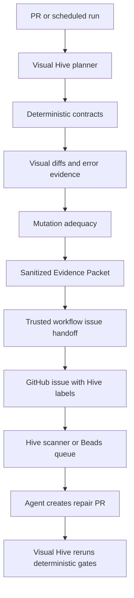

# Visual Hive Vision and Research Rationale — Updated Enterprise Research Pass

Status: research-informed product direction, agent-readable architecture guidance  
Date: 2026-07-02  
Target repo: `DavidDiaz0317/visual-hive`

---

## Executive thesis

Visual Hive is an enterprise-grade, deterministic-first visual QA orchestration and evidence platform for AI-accelerated software projects.

The important distinction is that Visual Hive is not a screenshot diff wrapper, a Playwright wrapper, a demo app, or a dashboard bolted onto test output. It is the control and evidence layer that decides what visual/user-flow risk exists, which deterministic checks should run, which targets are safe, how much the run should cost, what evidence is produced, and which human or agent receives the next repair task.

The project should be developed as frontier infrastructure for AI-maintained codebases:

```text
Visual Hive turns user-visible software risk into structured, deterministic evidence.
Humans, agents, providers, and Hive consume the evidence.
They do not replace the evidence.
```

That sentence should be preserved in the README, docs, agent instructions, prompt builders, Control Plane UI, and GitHub workflow templates.

---

## What this update adds

The previous docs already established the right foundation: deterministic-first execution, local-first defaults, GitHub-safe workflows, mutation adequacy, Evidence Packet thinking, KubeStellar/Hive handoff, provider optionality, and LLM governance. This update adds five missing layers:

1. A current ecosystem map of visual and adjacent testing tools beyond Playwright.
2. A stronger enterprise product standard.
3. A direct correlation with the AI Codebase Maturity Model paper.
4. A formal testing layer lattice from unit tests through mutation, canary, protected environments, and agent feedback loops.
5. A concrete agent-documentation strategy so Codex, Copilot, Hive agents, and future repair agents can understand the system without repeatedly rediscovering the repo.

---

## Current state of testing tools and what Visual Hive should learn

The modern testing ecosystem is no longer a simple unit/integration/e2e pyramid. It is a lattice of specialized engines, hosted review systems, observability systems, mutation engines, and AI-assisted QA platforms. Visual Hive should not rebuild all of them. It should own the orchestration layer that decides when each layer is useful and whether its output is trustworthy.

### Tool landscape

| Category | Representative tools | What they are good at | Limit for Visual Hive's vision | Visual Hive implication |
| --- | --- | --- | --- | --- |
| Browser automation and deterministic E2E | Playwright, Cypress, WebdriverIO | Real browser flows, selectors, screenshots, network interception, traces, CI execution | They execute checks but do not own repo-level policy, protected target safety, cost control, or agent handoff | Use as deterministic execution backends, with Playwright as default |
| Component and story visual testing | Storybook, Chromatic, Loki, Vitest Browser Mode, Happo | Design-system and component-level visual coverage | Often isolated from live app flows, auth states, production-like data, and repo-wide risk selection | Add component/story targets as one layer, not the full product |
| Hosted visual review | Argos, Percy/BrowserStack, Chromatic, Applitools, Happo | Hosted baselines, approval UIs, browser/device grids, team review | Can become noisy or expensive without project-aware planning and policy | Integrate through guarded adapters; Visual Hive owns selection, safety, budget, evidence |
| Open-source visual regression | BackstopJS, Loki, Lost Pixel patterns | Simple screenshot comparison, Storybook or page coverage, CI-friendly workflows | Usually weaker on enterprise governance, multi-target safety, mutation adequacy, and agent repair handoff | Borrow simplicity and local-first ergonomics, avoid becoming only a screenshot tool |
| AI-assisted QA and autonomous exploration | Meticulous, Wopee.io, QA Wolf-style managed QA | Session-derived tests, AI-generated flows, self-healing locators, broad app exploration | Model/heuristic output can be opaque; pass/fail must not depend on AI judgment alone | Use these ideas for setup/recommendation/coverage discovery; deterministic contracts still decide pass/fail |
| Test orchestration, flake, and trace systems | Currents, Replay.io, Playwright traces, CI dashboards | Test balancing, flake visibility, replayable debugging evidence | Usually not visual-QA-specific and not tied to mutation or Hive work routing | Build flake/stability history and trace extraction into Evidence Packets |
| Mutation testing | Stryker, PIT, mutation-testing research | Adequacy measurement: prove tests catch intentional faults | Traditional mutation focuses on code-level mutants, not visual/user-flow contracts | Build UI/auth/API/visual mutation operators and optionally interop with existing mutation engines |
| Synthetic monitoring and live canaries | Checkly, Playwright-based synthetic monitors, protected scheduled workflows | Post-deploy confidence and live environment monitoring | Needs strict secret handling and separation from untrusted PRs | Schedule protected/live-cluster lanes; never run secret-bearing checks on untrusted PR code |

### Lessons from specific tools

#### Playwright remains the default deterministic oracle

Playwright should stay the default runner because it supports real browser contracts, screenshots, traces, and CI execution without a paid provider. Visual Hive should continue generating readable Playwright specs and should treat `toHaveScreenshot`, selector checks, route checks, console/page/network failures, and trace artifacts as deterministic evidence.

Visual Hive should avoid overfitting to Playwright, though. The product should make space for Cypress, WebdriverIO, Vitest Browser Mode, Storybook, and provider-backed runs as adapters. The config and Evidence Packet should describe contracts, targets, outputs, and policy in Visual Hive terms first, then map to backend-specific tools second.

#### Vitest Browser Mode is strategically interesting

Vitest Browser Mode now makes browser-based component/page screenshot tests a realistic lower-level visual layer. This matters because many UI regressions can be caught before full E2E. Visual Hive should eventually support a component-visual lane that can run fast on PRs when a component or design-token file changes.

Recommended future direction:

```text
changed component/design-token files
  -> select component visual contracts
  -> optionally run Vitest Browser Mode or Storybook/Chromatic adapter
  -> include results in Evidence Packet beside Playwright app-flow results
```

#### WebdriverIO visual service broadens the device/native horizon

WebdriverIO visual testing can cover desktop browser, mobile browser, native app, and hybrid app screenshot comparisons. Visual Hive should not build this immediately, but the schema should not assume “web page only.” Enterprise customers may eventually want dashboard web apps, Electron shells, mobile surfaces, or internal admin apps covered by the same policy/evidence model.

#### Argos, Percy, Chromatic, Applitools, and Happo should be adapters, not the core

Hosted providers are useful when teams need review UIs, stable hosted baselines, cross-browser/device rendering, and team approval flows. But these providers do not replace Visual Hive's differentiator: project-aware test planning, protected target safety, mutation adequacy, cost policy, and agent-ready evidence.

Provider usage should remain:

```text
disabled by default
mockable in tests
explicit in config
forbidden on untrusted PRs unless safe and no secrets are exposed
budget-aware
summarized in reports even when skipped
```

#### Lost Pixel is useful as a pattern, not a dependency

Lost Pixel's open-source pattern is valuable because it combines Storybook/Ladle/Histoire/page/custom screenshots, masks, thresholds, and retries. However, its product status has changed. Visual Hive should learn from the architecture and ergonomics, not build a hard dependency on the service.

#### Meticulous suggests session-derived coverage and backend replay

Meticulous is valuable conceptually because it uses real user sessions to build test coverage and mocks backend responses by replaying captured responses. Visual Hive should not depend on an external AI service, but it should eventually support:

- importing route/session traces;
- converting high-value sessions into proposed contracts;
- generating deterministic fixtures or HAR-backed mocks;
- ranking routes by observed usage and risk;
- producing “suggested contracts” that a human or agent must review before they become gating checks.

This would give Visual Hive a strong new angle: not just “test the routes listed in config,” but “discover the visual/user-flow states the product actually uses.”

#### Wopee.io suggests autonomous exploration, but Visual Hive must keep deterministic gates

AI agents that explore a site and generate tests are useful for setup and coverage discovery. Visual Hive should use this idea in the Setup Agent, route discovery, contract recommendation, and missing-test prompts. It should not let an AI explorer decide pass/fail or silently approve baselines.

Safe application:

```text
AI/heuristic explorer proposes routes and contracts
  -> deterministic policy engine validates safety and scope
  -> user/owner approves contract additions
  -> deterministic runner gates future changes
```

#### Currents and Replay.io show what evidence quality should feel like

Enterprise teams need fast feedback, flake insight, historical runs, parallelization, and replayable traces. Visual Hive's Evidence Packet and Control Plane should therefore include:

- run history;
- flake/stability index;
- sharding/parallelization metadata;
- Playwright trace links;
- reproduction commands;
- artifact retention policy;
- failure fingerprints;
- rerun history;
- target lifecycle logs.

#### Stryker and PIT validate mutation adequacy as a serious engineering signal

Mutation testing is not just a research idea. It is a practical way to measure whether a test suite catches faults. Visual Hive's special contribution is applying mutation adequacy to user-visible UI/auth/API/layout contracts rather than only code-level mutants.

Recommended positioning:

```text
Traditional mutation testing asks: did unit tests catch code mutants?
Visual Hive asks: did user-visible contracts catch product-risk mutants?
```

---

## The testing layer lattice

Visual Hive should explicitly document and implement a layered testing lattice. This should replace vague “unit to e2e to mutation” language with stable layers agents can reason about.

| Layer | Name | Primary question | Typical tools | PR lane | Scheduled/protected lane | Evidence artifact |
| --- | --- | --- | --- | --- | --- | --- |
| 0 | Repo intelligence | What app, routes, packages, workflows, targets, selectors, and risk areas exist? | Visual Hive analyzer, static scanner, package/workflow parser | yes | yes | `.visual-hive/repo-map.json`, `.visual-hive/coverage.json` |
| 1 | Static/build/workflow safety | Does the code build, typecheck, lint, and avoid unsafe workflow patterns? | TypeScript, ESLint, npm scripts, GitHub workflow audit | yes | yes | build logs, workflow audit, safety findings |
| 2 | Unit | Do pure functions and low-level modules behave correctly? | Vitest/Jest, framework unit tests | changed-files only | full suite | JUnit/test output |
| 3 | Component and accessibility | Do components render usable, accessible states? | Testing Library, Storybook, axe, Vitest Browser Mode | selected | full/design-system | component reports, accessibility findings |
| 4 | API/contract | Do API contracts and error states behave as expected? | MSW, contract tests, Playwright API, mock services | selected | full/fault injected | API contract results |
| 5 | Component visual | Do UI components and design tokens visually drift? | Storybook/Chromatic/Loki/Vitest Browser/Argos | selected | broader cross-browser | component screenshots/diffs |
| 6 | E2E user-flow | Do critical routes and user flows work in a real browser? | Playwright/Cypress/WebdriverIO | fast critical flows | full flows | generated specs, traces, screenshots |
| 7 | Cross-browser/device visual | Does rendering hold across browsers/devices? | Applitools, Percy, BrowserStack, Happo, WDIO | rarely, gated by budget | yes | normalized provider result |
| 8 | Canary/synthetic/protected | Does deployed/staging/live-cluster behavior still hold? | scheduled Playwright, Checkly-like monitors, protected targets | no secrets on PR | yes | protected run report, redacted secret readiness |
| 9 | Mutation/fault injection | Would tests catch intentional UI/auth/API/layout breakage? | Visual Hive mutation engine, Stryker interop later | limited fast mutants | full mutation suite | `.visual-hive/mutation-report.json` |
| 10 | Flake/history/cost governance | Are failures trustworthy and is the system sustainable? | Visual Hive history, flake index, provider cost policy | yes summary | yes full | `.visual-hive/history.json`, cost report |
| 11 | Agent/Hive feedback loop | Can a human or agent repair the issue with bounded evidence? | GitHub issues, Hive Beads, Codex/Hive agents | issue draft only | trusted issue/handoff | Evidence Packet, repair prompt, handoff result |

### Fast PR lane

The fast PR lane should aim for under three minutes for typical repos. It should run:

- repo/workflow safety checks;
- changed-file planning;
- affected unit/component tests when available;
- critical deterministic Playwright contracts;
- no-login/public-demo canary checks when PR-safe;
- screenshot comparisons only for selected critical routes;
- a small set of high-value mutations when configured;
- no protected secrets;
- no external provider upload unless explicitly safe and allowed by policy.

### Daily/deep lane

The daily/deep lane should run:

- broader E2E routes;
- protected targets;
- fake OAuth or command groups;
- scheduled provider uploads;
- visual mutation suites;
- false-positive/false-negative calibration;
- trace extraction;
- flake/stability scoring;
- issue or Hive handoff from sanitized artifacts.

### Release/protected lane

The release/protected lane should run:

- staging/live-cluster checks;
- cross-browser/device provider adapters where justified;
- strict mutation thresholds;
- baseline approval policy;
- issue/handoff workflow;
- audit artifacts suitable for enterprise review.

---

## ACMM correlation: why the paper matters to Visual Hive

The AI Codebase Maturity Model paper is directly relevant because it argues that maturity is not about which model or tool is used; it is about feedback loop topology and whether human judgment has been encoded into persistent artifacts, tests, metrics, and governance.

Visual Hive should be framed as the visual/user-flow QA subsystem that helps a codebase progress through ACMM maturity. It is not “the agent.” It is the measurement and gating infrastructure that makes agent work safe.

### Mapping ACMM to Visual Hive

| ACMM idea | Visual Hive interpretation |
| --- | --- |
| Progression is defined by feedback loops, not model choice | Visual Hive should improve the loop: plan → run → evidence → mutation adequacy → triage → issue/handoff → repair → rerun |
| Human judgment becomes encoded in artifacts | Visual contracts, target safety rules, baselines, mutation mappings, and provider/cost policies encode review judgment |
| Testing volume/reliability is foundational | Visual Hive should treat flaky visual tests as product risk, not noise |
| Level 5 holdgated autonomy | Visual Hive can generate repair-ready issues and holdgated prompts, but human review remains explicit |
| Level 6 governed autonomy | Future only: Hive may orchestrate agents, but Visual Hive should still provide deterministic gates and audit trails |
| Beads/ledger concept | Visual Hive Evidence Packets and Hive handoff artifacts should be durable, versioned work items |
| Multi-agent governance | Visual Hive should route work to Hive, not become a general agent supervisor |

### Visual Hive maturity levels aligned to ACMM

| Visual Hive level | Name | Behavior | ACMM relationship |
| --- | --- | --- | --- |
| VH-1 | Local advisory | CLI runs locally, creates reports, no GitHub writes | ACMM Level 1/2 support |
| VH-2 | PR measured | Read-only PR workflows, no secrets, fast deterministic checks | ACMM Level 3 measurement loop |
| VH-3 | Scheduled adequacy | Daily mutation/canary/provider checks with stable artifacts | ACMM Level 4 adaptive feedback |
| VH-4 | Trusted issue handoff | Sanitized artifacts create/update GitHub issues | ACMM Level 5 holdgated agent readiness |
| VH-5 | Hive queue integration | Evidence Packets become Hive Beads or queue items | ACMM Level 5/6 bridge |
| VH-6 | Governed repair loop | Agents may open PRs, but Visual Hive reruns deterministic gates and humans approve autonomy policy | ACMM Level 6-compatible, not default |

### Product implication

Visual Hive should never jump straight to autonomous repair. The product should first make evidence reliable. Enterprise users will trust agents only if failures are reproducible, security boundaries are clear, artifacts are sanitized, and the system can explain why a target or contract was selected.

---

## KubeStellar Hive integration

Hive is a natural downstream consumer because it already separates deterministic infrastructure from agent judgment. Visual Hive should not compete with Hive as an orchestrator. Visual Hive should feed Hive high-quality QA work items.

### Division of responsibility

```text
Visual Hive owns:
  visual/user-flow risk detection
  deterministic contract execution
  visual diff metadata
  mutation adequacy
  target safety policy
  provider/LLM/cost policy
  sanitized Evidence Packets
  repair-ready issue bodies and prompts

Hive owns:
  agent queueing and assignment
  work governance
  Beads/work-item ledger
  multi-agent coordination
  hold labels and escalation
  agent PR lifecycle
```

### Recommended handoff modes

| Mode | Purpose | Default posture |
| --- | --- | --- |
| `dry_run` | Write local sanitized handoff artifacts only | enabled for development |
| `github_issue` | Trusted workflow creates or updates deduplicated issue | first real integration |
| `beads_file` | Write a Beads-compatible JSON file for Hive import | safe bridge without network |
| `beads_api` | Post directly to Hive Beads/API | future, trusted only, disabled by default |

### Handoff artifact set

```text
.visual-hive/evidence-packet.json
.visual-hive/hive-handoff.json
.visual-hive/hive-issue.md
.visual-hive/hive-bead-request.json
.visual-hive/hive-handoff-result.json
.visual-hive/repair-prompt.md
.visual-hive/missing-tests.md
```

### Handoff work item types

Visual Hive should classify agent-ready work into stable types:

- `visual_regression`
- `login_regression`
- `missing_baseline_review`
- `mutation_survivor`
- `coverage_gap`
- `flake_hotspot`
- `provider_policy_blocked`
- `protected_target_missing_secret`
- `target_startup_failure`
- `workflow_safety_violation`
- `setup_hardening_blocker`

### Example future config

```yaml
integrations:
  hive:
    enabled: false
    mode: dry_run # dry_run | github_issue | beads_file | beads_api
    labels:
      - visual-hive
      - hive/quality
      - ai-ready
    minSeverity: medium
    includeMutationSurvivors: true
    includeCoverageGaps: true
    handoffPolicy:
      trustedOnly: true
      requireSanitizedEvidence: true
      createIssuesFromWorkflowRunOnly: true
      neverExecutePrCodeInTrustedWorkflow: true
    beads:
      agent: quality
      type: visual-qa-finding
      priorityFromSeverity: true
      apiUrlEnv: HIVE_DASHBOARD_URL
      tokenEnv: HIVE_DASHBOARD_TOKEN
```

### Example handoff flow



### Feedback from Hive back to Visual Hive

Hive repair results should never directly mark a Visual Hive finding as passed. Instead, Hive should write back metadata such as:

```json
{
  "agentRepairAttempt": {
    "source": "hive",
    "beadId": "...",
    "agent": "quality",
    "prUrl": "...",
    "status": "opened",
    "notes": "..."
  },
  "visualHiveValidation": {
    "required": true,
    "latestRunId": null,
    "latestStatus": "pending"
  }
}
```

Only a new Visual Hive deterministic run should close or resolve the finding.

---

## Enterprise Evidence Packet v0.3

The Evidence Packet should become the stable contract between CLI, Control Plane, GitHub Actions, providers, LLM prompts, Hive, and future hosted/cloud mode.

### Required properties

The packet must be:

- schema-versioned;
- deterministic-first;
- sanitized;
- stable across CLI/UI/Hive integrations;
- safe to attach to GitHub issues;
- useful to agents without exposing secrets;
- traceable to repo, commit, workflow, mode, target, contract, and artifact paths;
- able to represent skipped work and why it was skipped.

### Suggested top-level shape

```json
{
  "schemaVersion": "visual-hive.evidence-packet.v0.3",
  "source": {
    "visualHiveVersion": "0.3.0",
    "generatedAt": "2026-07-02T00:00:00Z",
    "repo": "owner/repo",
    "branch": "feature/example",
    "commit": "sha",
    "workflow": {
      "provider": "github-actions",
      "trigger": "pull_request",
      "runId": "...",
      "permissions": "read-only"
    },
    "mode": "pr"
  },
  "governance": {
    "deterministicFirst": true,
    "llmNeverSoleOracle": true,
    "prSafe": true,
    "trustedWorkflow": false,
    "sanitized": true,
    "secretValuesPresent": false,
    "externalUploadAllowed": false,
    "acmmLevel": "VH-2",
    "agentPolicy": "measured"
  },
  "repoIntelligence": {
    "frameworks": [],
    "packageManager": "npm",
    "routes": [],
    "changedFiles": [],
    "riskSignals": []
  },
  "plan": {
    "selectedTargets": [],
    "selectedContracts": [],
    "excludedContracts": [
      { "id": "protected-live", "reason": "protected target not allowed on pull_request" }
    ]
  },
  "deterministicResults": {
    "status": "failed",
    "contracts": [],
    "selectorAssertions": [],
    "textAssertions": [],
    "visualDiffs": [],
    "consoleErrors": [],
    "pageErrors": [],
    "networkErrors": []
  },
  "mutationEvidence": {
    "enabled": true,
    "score": 0.82,
    "minScore": 0.75,
    "operators": []
  },
  "providers": {
    "argos": { "enabled": false, "skippedReason": "external upload disabled on PR" },
    "chromatic": { "enabled": false, "skippedReason": "storybook target not detected" }
  },
  "artifacts": {
    "reports": [],
    "screenshots": [],
    "diffs": [],
    "traces": [],
    "prompts": []
  },
  "triage": {
    "findings": [],
    "issueMarkdownPath": ".visual-hive/issue.md",
    "repairPromptPath": ".visual-hive/repair-prompt.md"
  },
  "hive": {
    "handoffReady": false,
    "recommendedMode": "github_issue",
    "labels": ["visual-hive", "hive/quality", "ai-ready"],
    "blockedReasons": []
  }
}
```

---

## Agent documentation and skills strategy

Because most coding work will be performed by agents, Visual Hive should treat agent documentation as part of the product architecture, not an afterthought.

### Required files

| File | Purpose |
| --- | --- |
| `AGENTS.md` | Root-level source of truth for Codex-style agents; must explain enterprise goal, deterministic-first policy, commands, and repo conventions |
| `.github/copilot-instructions.md` | GitHub Copilot-specific mirror of critical instructions |
| `.github/instructions/testing.instructions.md` | Path/file scoped test-authoring rules for GitHub Copilot/VS Code-style tools |
| `docs/agents/enterprise-definition-of-done.md` | Prevents agents from stopping at stubs, demos, or docs-only changes |
| `docs/agents/testing-layer-contract.md` | Defines the layer lattice and what each layer must emit |
| `docs/agents/visual-contract-authoring.md` | How to author stable visual/user-flow contracts |
| `docs/agents/mutation-adequacy.md` | How mutation operators map to contracts and what survived mutants mean |
| `docs/agents/hive-handoff-policy.md` | How to create safe GitHub/Hive work items |
| `docs/agents/provider-and-llm-governance.md` | Rules for external provider calls, LLM calls, cost, and secrets |
| `.visual-hive/repo-map.json` | Generated machine-readable repo context for agents |
| `.visual-hive/repo-context.md` | Generated human/agent-readable repo summary |

### Agent instruction principles

Every agent-facing file should repeat these rules:

- Visual Hive is enterprise software.
- Do not reduce the project to a demo.
- Deterministic evidence decides pass/fail.
- LLMs explain and draft; they do not approve.
- PR workflows do not receive secrets.
- Do not use `pull_request_target` to execute untrusted code.
- Any config field change requires Zod schema, JSON schema, docs, tests, examples, and migration notes where applicable.
- No external provider call happens unless config, policy, credentials, and run mode allow it.
- Stop feature expansion when CI is red.
- Prefer vertical slices: scan → recommend → plan → run → evidence → triage → UI → docs → tests.

---

## Research program

Visual Hive can become a strong research project if it measures the right questions.

### Core research questions

1. Does contract-aware visual mutation testing detect meaningful UI regressions beyond screenshot diffing alone?
2. Do Evidence Packets reduce time-to-diagnosis for human reviewers and AI coding agents?
3. Does changed-file planning reduce CI cost without reducing defect detection?
4. Does session-derived route discovery improve route/contract coverage compared with static config alone?
5. Do survived visual mutations produce better agent repair prompts than generic coverage reports?
6. Does Hive/GitHub issue handoff improve agent repair success rate versus raw CI logs?
7. Does a flake/baseline stability index predict which visual tests need masks, fixtures, or better readiness conditions?
8. Does provider cost policy preserve useful visual signal while avoiding unnecessary external uploads?
9. Can ACMM-style maturity levels predict when a repo is ready for holdgated or governed agent repair?

### Metrics

Visual Hive should track:

- deterministic pass/fail rate;
- selected/skipped contracts with reasons;
- created/missing/changed baseline counts;
- visual diff ratio and severity;
- console/page/network errors;
- target startup reliability;
- mutation score and survived operators;
- flaky rerun rate;
- screenshot churn rate;
- CI duration;
- external screenshot count and cost estimate;
- Evidence Packet completeness score;
- issue/handoff creation count;
- agent repair cycle count;
- time from failure to actionable repair PR;
- false-positive and false-negative calibration results.

---

## Enterprise constraints and safety model

Visual Hive should be designed for enterprise adoption from the beginning.

### Enterprise requirements

- Stable schemas for config, reports, coverage, Evidence Packet, handoff, provider results, history, and LLM usage.
- Backward-compatible migrations or clear schema-version handling.
- Redaction and sanitization for logs, URLs, headers, tokens, cookies, screenshots, prompts, and issue bodies.
- Audit trail for baseline approval, provider upload, issue creation, and config edits.
- Clear local-first mode with no hosted backend required.
- Future cloud/GitHub App mode that can ingest the same artifacts.
- Least-privilege GitHub permissions.
- Budget policy for providers and LLMs.
- Mock adapters for all provider/LLM integrations.
- SARIF/JUnit/Markdown/JSON export where useful for enterprise CI systems.
- Path traversal protections in the Control Plane artifact browser.
- Explicit retention policy for screenshots, traces, and reports.

### Non-goals

Visual Hive should not claim to prove full correctness. It complements unit, integration, accessibility, performance, reliability, security, and manual review. It protects user-visible visual and workflow contracts and produces evidence for humans and agents.

Visual Hive should not silently repair production code. The safe product path is:

```text
deterministic failure
  -> sanitized evidence
  -> human/agent-readable issue
  -> holdgated repair PR
  -> deterministic rerun
  -> explicit human or policy-approved merge
```

---

## Updated near-term direction

The next phase should focus on operational readiness, not new surface area for its own sake.

Highest-leverage order:

1. Stabilize existing CI/demo flows.
2. Add or harden Evidence Packet schema and writer.
3. Add `repo-map`/analysis output so agents stop rediscovering the repo repeatedly.
4. Add the testing layer lattice to docs, config, and report output.
5. Add Hive handoff dry-run artifacts.
6. Add trusted GitHub issue handoff design/workflow.
7. Add KubeStellar Console example coverage for hosted demo, local preview, fake OAuth planning, and protected live cluster scheduling.
8. Add flake/baseline stability tracking.
9. Add provider evaluation and mock adapters before any new real provider network calls.
10. Expand Control Plane to show Evidence Packet, layer coverage, Hive readiness, and failure inbox.

---

## References to keep in docs

- Playwright visual comparisons: https://playwright.dev/docs/test-snapshots
- Playwright traces: https://playwright.dev/docs/trace-viewer
- Cypress visual testing: https://docs.cypress.io/app/tooling/visual-testing
- WebdriverIO visual service: https://webdriver.io/docs/visual-testing/
- Vitest Browser Mode visual regression: https://vitest.dev/guide/browser/visual-regression-testing
- Storybook visual testing: https://storybook.js.org/docs/writing-tests/visual-testing
- Chromatic for Playwright: https://www.chromatic.com/docs/playwright/
- Argos GitHub Marketplace: https://github.com/marketplace/argos-visual-testing
- Percy visual testing: https://www.browserstack.com/percy/visual-testing
- Applitools Ultrafast Grid: https://applitools.com/platform/ultrafast-grid/
- Happo: https://happo.io/docs
- BackstopJS: https://github.com/garris/BackstopJS
- Loki: https://loki.js.org/
- Lost Pixel: https://docs.lost-pixel.com/user-docs/get-started/overview
- Meticulous: https://www.meticulous.ai/
- Wopee.io: https://www.wopee.io/
- QA Wolf: https://www.qawolf.com/
- Currents: https://currents.dev/
- Replay.io Playwright: https://docs.replay.io/test-suites/playwright
- Checkly: https://www.checklyhq.com/
- Stryker Mutator: https://stryker-mutator.io/
- PIT Mutation Testing: https://pitest.org/
- KubeStellar Hive: https://github.com/kubestellar/hive
- AI Codebase Maturity Model paper: https://arxiv.org/pdf/2604.09388


---

# Agent-Forward Integration Addendum

## Why this belongs in the core vision

Visual Hive is not only a visual testing tool. It is intended to be the evidence and governance layer that allows AI coding agents to safely create, review, repair, and improve tests in real codebases. The project should therefore be **agent-forward**, while remaining **deterministic-first** and **agent-independent**.

The distinction matters:

```text
Agent-forward:
  Visual Hive exposes compact, structured, machine-readable evidence and safe tools
  so agents can produce higher-quality work.

Agent-dependent:
  Visual Hive requires an LLM or agent to decide what is true.
```

Visual Hive must choose the first path. The deterministic pipeline produces truth; agents consume that truth and act on it under policy.

## Canonical integration order

The integration path should be explicit across docs, code, examples, and demos:

```text
1. CLI + stable --json output
2. Evidence Packet
3. Handoff Packet
4. GitHub issue / Hive dry-run handoff
5. Visual Hive MCP server
6. Direct Hive Bead API
7. HTTP API / hosted Control Plane API
```

This order prevents the project from prematurely tying itself to a single agent platform or orchestration runtime. A CLI with stable JSON works in local development, GitHub Actions, Codex, Claude Code, Copilot-style agents, Goose-style agents, containers, and Hive-managed agents. The Evidence Packet becomes the durable product boundary. MCP and Hive become adapters over that boundary.

## CLI as the first agent interface

The CLI should not be treated as a temporary beginner interface. It is the canonical execution surface because agents and CI can use it reliably when outputs are structured.

Required posture:

```bash
visual-hive doctor --json
visual-hive recommend --json
visual-hive validate --json
visual-hive plan --mode pr --json
visual-hive run --mode pr --json
visual-hive mutate --json
visual-hive triage --json
visual-hive evidence build --json
visual-hive handoff hive --mode dry-run --json
visual-hive handoff github-issue --dry-run --json
visual-hive mcp --stdio
visual-hive serve --api --port 8787
```

Every command that matters to an agent should have:

- schema-versioned JSON;
- stable exit codes;
- deterministic artifact paths;
- clear selected/skipped reasons;
- reproduction commands;
- no paid provider calls by default;
- no LLM calls by default;
- no secret value printing;
- protected target enforcement.

## Evidence Packet as the true API

The Evidence Packet is the stable contract that all integrations consume. It should matter more than whether the caller is CLI, UI, MCP, GitHub, Hive, or a future HTTP API.

Path:

```text
.visual-hive/evidence-packet.json
```

The packet should include:

- source metadata: repo, commit, branch, workflow, mode, Visual Hive version;
- repo intelligence: framework, package manager, scripts, routes, workflow hints, risk signals;
- test-layer map: unit, component, visual, E2E, canary, protected, mutation, governance, agent feedback;
- plan: selected/skipped targets and contracts with reasons;
- deterministic results: selector/text assertions, screenshot diffs, console/page/network errors;
- mutation adequacy: killed, survived, not-applicable, score, recommendations;
- provider posture: enabled, disabled, skipped, missing token names, cost policy, external calls made;
- safety posture: PR-safe status, protected target handling, external upload/LLM usage status;
- artifacts: paths, summaries, redaction state, local-only markers;
- triage: classification, severity, suggested files, missing tests, reproduction commands;
- handoff readiness: GitHub issue body, Hive Bead request, agent packet pointer.

This packet should be sanitized enough for trusted issue creation and agent handoff. Raw local artifacts may remain available, but the packet must explicitly mark unsafe/local-only artifacts.

## Handoff Packet as the agent queue contract

The Handoff Packet is a smaller task object derived from the Evidence Packet. It exists so Hive, GitHub issues, and repair agents do not need to ingest the entire report.

Path:

```text
.visual-hive/handoff.json
```

It should include:

```json
{
  "schemaVersion": "visual-hive.handoff.v1",
  "kind": "visual-regression-finding",
  "title": "Visual Hive: login control appeared on public demo",
  "priority": 1,
  "severity": "critical",
  "type": "bug",
  "externalRef": "visual-hive://owner/repo/commit/abc123/signature/login-public-demo",
  "dedupeSignature": "sha256:...",
  "labels": ["visual-hive", "hive/quality", "ai-ready", "needs-test"],
  "summary": "The public demo rendered login controls that should not be visible.",
  "evidencePacketPath": ".visual-hive/evidence-packet.json",
  "issueBodyPath": ".visual-hive/hive-issue.md",
  "repairPromptPath": ".visual-hive/repair-prompt.md",
  "reproductionCommands": [
    "visual-hive run --contract hosted-demo-no-login --mode local"
  ],
  "metadata": {
    "visual_hive_schema": "visual-hive.handoff.v1",
    "repo": "owner/repo",
    "commit": "abc123",
    "mode": "schedule",
    "classification": "login_regression",
    "mutation_score": "0.75"
  }
}
```

Metadata targeting Hive should remain small, sanitized, and string-valued where possible.

## Hive integration role

Hive should be treated as an optional agent governance and orchestration partner, not as a required runtime.

```text
Visual Hive:
  Detect visual/user-flow risk.
  Run deterministic checks.
  Measure mutation adequacy.
  Produce sanitized evidence.
  Classify failures.
  Generate repair-ready prompts.
  Hand off findings.

Hive:
  Govern the agent queue.
  Assign work to quality/CI/security agents.
  Enforce maturity and policy.
  Manage agent cadence and budgets.
  Open issues/PRs under governance.
  Preserve audit trail.
```

The recommended integration order is:

1. dry-run handoff artifacts;
2. trusted GitHub issue handoff with Hive labels;
3. optional direct Hive Bead API;
4. deeper cooperative agent workflows.

Direct Hive API should never be required for ordinary Visual Hive use.

## MCP-enabled tools as strength amplifiers

MCP tools can make agents stronger, but only if they are treated as gated strength amplifiers rather than always-on context dumps.

High-value categories:

| MCP/tool category | Value | Default posture |
| --- | --- | --- |
| Visual Hive MCP | Read plans, reports, evidence, mutation survivors, repair prompts, safe commands | First-party, supported |
| Playwright MCP | Live DOM/accessibility snapshots for authoring and repair | Local, optional, not CI oracle |
| Storybook/Chromatic MCP | Component/story/design-system context | Optional, strong for component-heavy repos |
| GitHub MCP | PRs, issues, checks, logs, workflow state | Read-only by default; writes trusted only |
| Applitools MCP | Enterprise visual AI and cross-browser result analysis | Paid/trusted profile only |
| BrowserStack MCP | Real-device/cross-browser debugging and logs | Paid/trusted profile only |
| Sentry MCP | Protected/prod error context and MCP observability | Optional, trusted only |
| Jira/Linear/Slack MCPs | Enterprise routing and team handoff | Later, issue-routing only |

Visual Hive should not expose every tool to every agent. The tool surface must be role-gated, budget-gated, and mode-gated.

## Token and credit efficiency thesis

The major MCP risk is not only direct provider billing. It is context bloat.

Visual Hive should therefore use this pattern:

```text
compact evidence first
  -> role-specific Agent Packet
  -> small Tool Cards
  -> local tools before external tools
  -> external MCP only with explicit reason
  -> summarize/filter results before model context
  -> cache repeatable results
  -> record cost and outcome
```

An agent should start with:

- objective;
- role;
- evidence summary;
- allowed tools;
- forbidden actions;
- reproduction command;
- budget;
- artifact pointers.

It should not start with full logs, full traces, full screenshots, full schemas, and every MCP tool definition.

## Agent Packet

Visual Hive should generate per-task agent packets.

Example:

```json
{
  "schemaVersion": "visual-hive.agent-packet.v1",
  "role": "repair_agent",
  "objective": "Repair failed dashboard-shell contract",
  "evidenceSummary": {
    "classification": "missing_element",
    "contract": "dashboard-shell",
    "target": "local-preview",
    "mutationScore": 0.72
  },
  "allowedTools": [
    "visualHive.latestEvidence",
    "visualHive.reproductionCommands",
    "visualHive.runFocused",
    "playwright.accessibilitySnapshot"
  ],
  "forbiddenActions": [
    "baseline.approve",
    "provider.upload",
    "github.write",
    "protectedTarget.run"
  ],
  "budgets": {
    "maxToolCalls": 20,
    "maxToolResultTokens": 12000,
    "maxExternalCostUsd": 0
  },
  "reproductionCommands": [
    "visual-hive run --contract dashboard-shell --mode local"
  ],
  "artifactPointers": [
    ".visual-hive/evidence-packet.json",
    ".visual-hive/artifacts/dashboard-shell/diff.png"
  ]
}
```

This is the strongest path for agent quality: give the agent exactly the job, the evidence, the safe tools, and the budget.

## Updated research questions

Add these to the research program:

1. Do Evidence Packets improve repair-agent success compared with raw CI logs?
2. Does MCP-assisted test authoring produce stronger visual/user-flow contracts than static repo context alone?
3. Which MCP categories measurably reduce false positives, false negatives, or diagnosis time?
4. How much token/cost overhead is introduced by MCP schemas and tool results under different gating policies?
5. Can Tool Cards and Agent Packets preserve agent strength while reducing context size?
6. Do mutation survivors produce better agent-generated tests than generic coverage reports?
7. Does trusted GitHub issue/Hive handoff improve auditability and reduce unsafe autonomous repair behavior?
8. Can Visual Hive learn which tools are worth using for a given repo by tracking cost, outcome, and rerun success?

## Updated references for agent/tool integration

- [Model Context Protocol introduction](https://modelcontextprotocol.io/docs/getting-started/intro)
- [Model Context Protocol architecture](https://modelcontextprotocol.io/docs/learn/architecture)
- [Playwright MCP](https://playwright.dev/docs/getting-started-mcp)
- [Chromatic MCP](https://www.chromatic.com/docs/mcp/)
- [GitHub MCP Server](https://github.com/github/github-mcp-server)
- [GitHub blog: practical guide to the GitHub MCP server](https://github.blog/ai-and-ml/generative-ai/a-practical-guide-on-how-to-use-the-github-mcp-server/)
- [Applitools MCP](https://applitools.com/docs/eyes/integrations/mcp-servers/applitools-mcp)
- [BrowserStack MCP Server](https://www.browserstack.com/docs/browserstack-mcp-server/overview)
- [Sentry MCP monitoring](https://docs.sentry.io/ai/monitoring/mcp/)
- [Anthropic engineering: code execution with MCP](https://www.anthropic.com/engineering/code-execution-with-mcp)
- [MCPGauge](https://arxiv.org/html/2508.12566v1)
