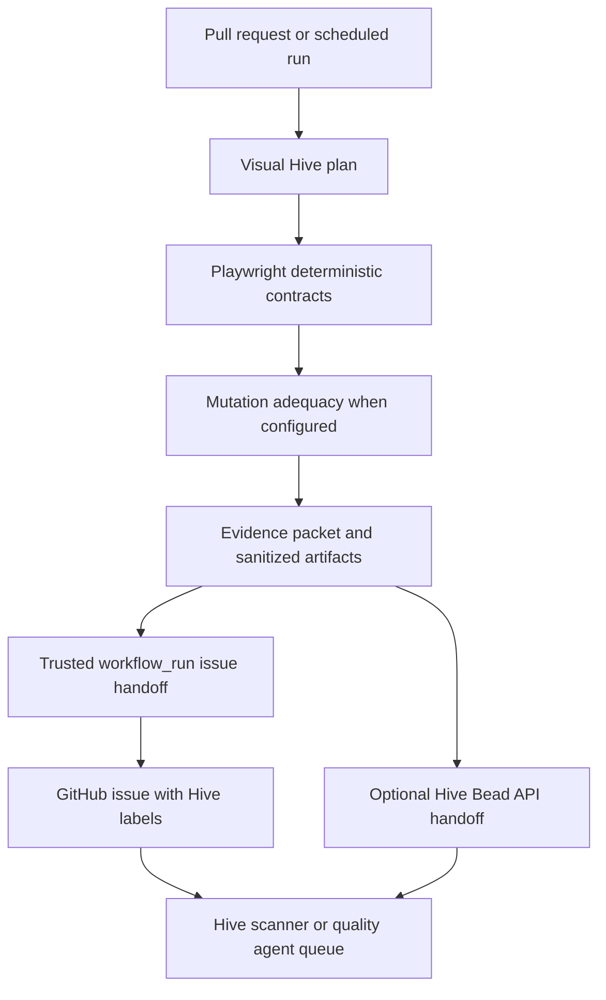

# Visual Hive Vision and Research Rationale

## Abstract

Visual Hive is a deterministic-first visual QA orchestration system for AI-accelerated software projects. Its central claim is that modern codebases, especially AI-maintained codebases, need a measurement layer that can turn user-visible risk into structured evidence before humans or agents attempt repair. Visual Hive does not treat a language model as a test oracle. Instead, it uses Playwright contracts, tolerant visual diffs, target safety rules, mutation adequacy, GitHub workflow audits, and sanitized reports to produce evidence that a developer, reviewer, or agent can act on.

This document frames Visual Hive as both a product direction and a research program. The immediate product is local-first and GitHub Actions-ready. The longer-term research question is whether deterministic visual QA evidence can reduce the cost, risk, and review burden of maintaining UI-heavy applications in an era where AI coding agents can produce changes faster than humans can inspect them.

## Thesis

Visual Hive should become the deterministic QA evidence layer for AI-maintained codebases.

It should answer:

- What user-visible behavior is protected?
- What visual routes and states matter for this change?
- Which targets are safe for untrusted PRs?
- Which checks require protected secrets or scheduled lanes?
- Did deterministic contracts fail?
- Did screenshots drift beyond tolerance?
- Did mutation checks prove the contracts are meaningful?
- What artifacts should a human, GitHub issue, or agent receive next?

The product should remain deterministic-first:

- Visual Hive's verdict layer decides pass/fail from configured deterministic evidence.
- Playwright is the default first-party local browser runner and primary PR-safe evidence source.
- Mutation adequacy measures whether contracts catch intentional breakage and may become independent gating evidence.
- LLMs, MCP tools, Hive, hosted providers, and agents consume evidence but do not replace the deterministic verdict authority unless a provider result is normalized, trusted, configured as gating, and budget-authorized.
- PR workflows remain read-only and secret-free by default.

## Verdict Engine Framing

Visual Hive should not hard-code its long-term pass/fail decision to one runner. The enterprise architecture is:

```text
Playwright = default execution engine
Visual Hive = final deterministic verdict engine
LLMs / MCPs / Hive agents = evidence consumers and repair actors
```

The verdict engine receives deterministic evidence from:

- Playwright selector, text, screenshot, route, and user-flow contracts;
- screenshot diff metadata and baseline policy;
- console, page, and network error policy;
- accessibility checks when configured;
- API/route/user-flow contracts;
- mutation adequacy thresholds;
- protected canary and synthetic checks;
- provider-normalized visual results when explicitly configured as gating.

It produces:

- `passed`
- `failed`
- `warning`
- `blocked`
- `inconclusive`

LLM explanations, agent recommendations, MCP summaries, and Hive routing are advisory. They may explain a verdict or create repair tasks; they may not become the sole source of the verdict.

## Current State of Testing

### Unit and Integration Tests

Unit and integration tests remain essential, but they usually verify code-level behavior rather than user-visible experience. They can prove that functions, reducers, API handlers, and components behave as expected under controlled inputs. They often miss layout breakage, missing UI states, hidden login regressions, broken responsive behavior, dynamic data failures, and design-system drift.

For AI-maintained codebases, this gap matters because generated changes may satisfy local type or unit checks while still damaging the interface that users see.

### End-to-End Tests

End-to-end tests exercise real browser flows and are a better fit for user-visible contracts. Playwright is a strong base because it supports browser automation, web-first assertions, screenshots, network interception, and CI execution. Playwright also includes visual comparison support through `toHaveScreenshot`, baseline generation, and configurable diff thresholds ([Playwright visual comparisons](https://playwright.dev/docs/test-snapshots)).

However, a Playwright test suite alone does not decide which target should run, whether a target is PR-safe, how much a run should cost, which changed files matter, which checks belong in scheduled lanes, whether a missing test is dangerous, or whether a failure is suitable for agent repair. Visual Hive uses Playwright as the deterministic engine, then adds the orchestration layer around it.

### Visual Regression Testing

Visual regression testing is valuable because it catches UI defects that are difficult to encode as text assertions: layout shifts, missing badges, responsive overflow, hidden panels, broken images, incorrect empty states, and accidental login exposure. Hosted providers such as Percy, Chromatic, Argos, and Applitools add team review UIs, hosted baselines, and richer visual comparison workflows.

The limitation is that visual testing can become noisy or expensive when it is not project-aware. Dynamic data, animations, rendering differences, and environment variation can create false positives. Playwright explicitly notes that browser rendering can vary by host OS, version, hardware, headless mode, and other factors, so baselines need controlled environments ([Playwright visual comparisons](https://playwright.dev/docs/test-snapshots)). Visual Hive responds by making screenshots only one layer: selector contracts, console/page errors, target modeling, changed-file planning, and mutation adequacy all contribute evidence.

### CI Workflows

CI is the natural delivery surface for this product. GitHub Actions can run PR-safe checks, scheduled protected checks, artifact uploads, and trusted issue creation. The security boundary is critical. GitHub warns that workflows using privileged triggers such as `pull_request_target` or `workflow_run` must not execute untrusted PR code or blindly trust artifacts from untrusted runs ([GitHub Actions secure use](https://docs.github.com/en/actions/reference/security/secure-use)).

Visual Hive's default workflow posture follows that boundary:

- Untrusted PR lane: `pull_request`, read-only permissions, no secrets, PR-safe targets only.
- Trusted scheduled/manual lane: protected targets, optional secrets, optional provider uploads.
- Trusted follow-up lane: consumes sanitized artifacts and may create/update issues without checking out or executing PR code.

### Mutation Testing

Mutation testing introduces artificial faults and asks whether tests detect them. Mutation score can be used as an adequacy signal: not merely "did we run tests?", but "would these tests catch meaningful breakage?" The mutation testing literature frames mutation as a way to evaluate test-suite adequacy and guide test improvement ([Mutation Testing Advances: An Analysis and Survey](https://mutationtesting.uni.lu/survey.pdf)).

Visual Hive adapts this idea to UI, auth, API, and visual contracts:

- Hide a critical button.
- Force a login page on a public demo.
- Remove a demo badge.
- Return API 500 responses.
- Return empty data.
- Create mobile overflow.

If the relevant contract fails, the mutation is killed. If it survives, Visual Hive has found a missing test or weak assertion. This is especially useful for AI-maintained codebases because it gives agents and humans concrete missing-test evidence instead of vague advice.

## Limits and Dangers of AI Codebases

AI coding tools change the rate and shape of software change. They can generate code quickly, but fast generation does not imply adequate validation.

### Plausible but Wrong Code

SWE-bench showed that resolving real GitHub issues requires codebase-level understanding across files, tests, and execution context, and early evaluated models solved only a small fraction of those real-world tasks ([SWE-bench](https://arxiv.org/abs/2310.06770)). Even as models improve, the benchmark highlights the core point: real software repair is not just code generation. It is contextual, evidence-driven, and validation-heavy.

### Security Weaknesses

Empirical work on Copilot-generated code found a substantial rate of security weaknesses across generated snippets and many CWE categories ([Security Weaknesses of Copilot-Generated Code in GitHub Projects](https://arxiv.org/html/2310.02059v4)). A broader CSET report on AI-generated code identifies risk categories including insecure generated code, model manipulation, and downstream cybersecurity effects ([Cybersecurity Risks of AI-Generated Code](https://cset.georgetown.edu/wp-content/uploads/CSET-Cybersecurity-Risks-of-AI-Generated-Code.pdf)).

Visual Hive is not a security scanner, but it is designed with the same lesson: generated output needs independent verification. For UI-heavy applications, that verification must include user-visible state, auth exposure, workflow permissions, secret handling, and artifact redaction.

### Agent Drift

KubeStellar Hive's design is valuable because it separates deterministic pipeline decisions from agent judgment. Hive describes a system where deterministic scripts perform filtering, classification, merge-gating, and enforcement before LLM agents receive work ([kubestellar/hive](https://github.com/kubestellar/hive)). This is aligned with Visual Hive's model: let deterministic systems decide what is true, then let agents operate on bounded, structured tasks.

### Test Flakiness and Review Fatigue

Flaky tests reduce confidence and delay releases. A multivocal review of flaky tests describes them as a major challenge because they reduce the effectiveness and efficiency of testing and slow release processes ([Test Flakiness' Causes, Detection, Impact and Responses](https://arxiv.org/abs/2212.00908)). Visual testing can become flaky when screenshots depend on unstable data, animations, fonts, timing, or network behavior.

Visual Hive should therefore treat flake management as a first-class research and product concern. It should track created baselines, missing baselines, visual diffs, retry patterns, target lifecycle failures, and history over time.

## Visual Hive Approach

Visual Hive turns isolated visual checks into a layered quality system.

### Project-Aware Planning

Visual Hive reads a repository config and changed files, then selects the appropriate contracts by mode, target safety, severity, cost, and selection rules. The important distinction is that a plan is evidence. It says not only what will run, but why it was selected or skipped.

### Target Safety

Real projects have different target types:

- `url`: hosted or already-running target.
- `command`: install/build/serve local preview target.
- `commandGroup`: multiple services for fake OAuth or fullstack flows.
- `protected`: staging, live cluster, or secret-bearing target.

The model prevents accidental use of secrets in untrusted PRs. Protected targets belong in trusted scheduled/manual lanes unless explicitly allowed.

### User-Visible Contracts

Contracts should describe visible obligations:

- A public demo must never expose login controls.
- A dashboard route must render its shell, card grid, and primary actions.
- A cluster page must show route-level structure.
- A settings route must preserve controls and empty states.
- A mobile viewport must not overflow horizontally.

This is more durable than testing implementation details and more actionable than a raw screenshot diff.

### Tolerant Visual Diffs

Screenshots are compared with configured tolerance and explicit artifact metadata. Visual Hive owns the baseline path, actual path, diff path, pixel counts, and ratio. Missing local baselines can be created for review; CI missing baselines fail unless explicitly configured otherwise.

### Mutation Adequacy

Mutation checks convert "we have tests" into "these tests catch known classes of breakage." A survived mutation is strong evidence for a missing contract. It is also an ideal agent task because the desired improvement is specific and testable.

### Structured Reports

The report is the product boundary. `.visual-hive/report.json`, `.visual-hive/mutation-report.json`, `.visual-hive/triage.json`, `.visual-hive/issue.md`, and artifact indexes make the run reproducible, reviewable, and suitable for trusted automation.

## Visual Hive Evidence Packet

A future formal Evidence Packet should become the stable handoff object for humans, GitHub, Hive, and optional LLM review.

Minimum fields:

- source: Visual Hive version, repo, branch, commit, workflow run, mode.
- plan: selected contracts, selected targets, skipped/excluded contracts, reasons.
- deterministic results: pass/fail status, contract results, selector assertions, text assertions, visual diffs, console/page/network errors.
- mutation evidence: operators, selected contracts, killed/survived/not-applicable status, failure excerpts.
- target evidence: lifecycle events, server startup, protected secret names present/missing by name only.
- artifacts: generated spec, screenshots, diffs, reports, prompts, issue drafts.
- safety posture: PR-safe status, workflow trigger, permissions, provider/LLM posture, sanitization status.
- repair guidance: likely classification, suggested files, reproduction commands, suggested missing tests.

The packet should be machine-readable, sanitized, schema-versioned, and stable enough for downstream tools.

## KubeStellar Hive Integration Rationale

Hive is a natural partner because it is already organized around deterministic governance plus agent execution. Visual Hive should not compete with Hive as an agent orchestrator. Visual Hive should feed Hive high-quality QA work items.

The clean division is:

```text
Visual Hive:
  Detect visual/user-flow risk.
  Produce deterministic evidence.
  Measure mutation adequacy.
  Sanitize artifacts.
  Draft repair-ready issues.

Hive:
  Classify work.
  Assign agents.
  Maintain queues and maturity levels.
  Track agent progress.
  Open PRs under governance.
```

The safest first integration is GitHub issue handoff from a trusted workflow. The direct Hive Bead API should be optional and disabled by default.

### Proposed Handoff Flow



### Suggested Future Config

```yaml
integrations:
  hive:
    enabled: false
    mode: github_issue # github_issue | bead_api | dry_run
    labels:
      - visual-hive
      - hive/quality
      - ai-ready
    beadApi:
      url: ${HIVE_DASHBOARD_URL}
      tokenEnv: HIVE_DASHBOARD_TOKEN
      agent: quality
```

### Suggested Future CLI

```bash
visual-hive integrations hive handoff --dry-run
visual-hive integrations hive handoff --mode github_issue
visual-hive integrations hive handoff --mode bead_api
```

### Suggested Future Artifacts

- `.visual-hive/hive-handoff.json`
- `.visual-hive/hive-issue.md`
- `.visual-hive/hive-bead-request.json`
- `.visual-hive/hive-handoff-result.json`

Hive's current Beads API accepts structured bead creation through `POST /api/beads/{agent}` with title, type, priority, external reference, and metadata. A Visual Hive handoff should fit that model without requiring Hive to run Visual Hive or trust untrusted PR code.

## Automation Maturity Model

Visual Hive should expose automation levels that mirror the governance style used by Hive while staying specific to QA:

| Level | Name | Visual Hive behavior |
| --- | --- | --- |
| 1 | Local advisory | Run locally, generate reports, no GitHub writes. |
| 2 | PR measured | Read-only PR checks, artifacts, PR summary, no secrets. |
| 3 | Trusted issue handoff | Trusted workflow creates/updates sanitized failure issues. |
| 4 | Agent-ready queue | Issues or Beads are labeled and routed to Hive quality agents. |
| 5 | Holdgated repair | Agents may open PRs, but humans review and remove hold labels. |
| 6 | Governed autonomy | Future state only: strict policy, green CI, audit trails, and explicit owner approval. |

This framing helps prevent the common failure mode where teams jump from "AI can explain this" to "AI should change production code." Visual Hive should make every escalation visible and reversible.

## Research Questions

1. Does contract-aware mutation testing improve visual test adequacy compared with screenshot baselines alone?
2. Do Visual Hive evidence packets reduce mean time to diagnose UI regressions?
3. Does changed-file planning reduce CI cost/noise without reducing defect detection?
4. Do PR-safe/protected target rules prevent common workflow security mistakes in open source projects?
5. Are mutation survivors better prompts for test-generation agents than generic coverage gaps?
6. Does a trusted issue/Bead handoff improve agent repair quality compared with raw CI logs?
7. Can longitudinal baseline and flake history predict which visual tests need stabilization?
8. Should AI-authored or agent-authored PRs automatically select deeper user-flow and mutation lanes?

## Evaluation Plan

### Demo App

Use `examples/demo-react-app` for deterministic experiments:

- Seed known UI regressions.
- Compare baseline-only detection with contract plus mutation detection.
- Measure generated evidence completeness.
- Verify Control Plane onboarding and review flows.

### KubeStellar Console

Use KubeStellar Console as the realistic target:

- Hosted demo no-login canary.
- Local preview dashboard, clusters, settings screenshots.
- Fake OAuth planning/runtime once stable.
- Protected live-cluster scheduled lane.
- Agent-ready issue handoff for failures.

KubeStellar's own documentation describes a workflow where tests define expected behavior and AI agents implement fixes, making it a strong evaluation environment for Visual Hive's evidence-first model ([KubeStellar AI-maintained codebase](https://kubestellar.io/docs/news/ai-maintained-codebase)).

### Metrics

Track:

- deterministic pass/fail rate;
- visual diff count and severity;
- mutation score and survived mutation classes;
- created/missing baseline count;
- flaky rerun or unstable screenshot count;
- selected vs skipped contract count;
- CI duration and external provider screenshot budget;
- diagnosis time from failure to actionable issue;
- repair success rate for human and agent-generated PRs.

## Valuable Additions

### Formal Evidence Packet Schema

Add a schema such as `schemas/visual-hive.evidence-packet.schema.json`. This becomes the stable contract between Visual Hive, GitHub issue creation, Hive Beads, Control Plane views, and future LLM workflows.

### Hive Handoff Adapter

Implement `visual-hive integrations hive handoff` in phases:

1. Dry run: write sanitized handoff artifacts only.
2. GitHub issue mode: generate trusted workflow-ready issue body and labels.
3. Bead API mode: post to Hive when explicitly enabled in trusted environments.
4. Control Plane visibility: show handoff readiness, missing token names, and latest handoff result.

### AI-Authored PR Risk Signal

When a PR is detectably agent-authored, Visual Hive can select deeper lanes without assuming the code is bad. Signals may include author, commit metadata, labels, PR body markers, or workflow-provided environment variables. The output should be an explainable risk reason, not a punishment.

### Flake and Baseline Stability Index

Visual Hive should measure visual test trust over time:

- screenshots that repeatedly fail then pass;
- baselines frequently updated;
- target startup instability;
- console/page errors that appear intermittently;
- dynamic areas that need masks or fixtures.

### Mutation-Guided Test Suggestions

Survived mutations should become first-class prompts for humans and agents:

- what broke;
- which contract should have caught it;
- suggested selector/text/screenshot addition;
- reproduction command;
- expected future mutation status.

## Limitations and Ethics

Visual Hive should not imply that visual QA proves full application correctness. It protects user-visible contracts and visual regressions; it complements unit, integration, accessibility, performance, security, and API testing.

The project should preserve these safety limits:

- No LLM output decides pass/fail.
- No model call is made by default.
- No paid provider is required by default.
- No PR workflow gets secrets by default.
- No issue creation happens directly from untrusted PR code.
- No provider upload happens unless policy, credentials, and trusted mode allow it.
- Secret values are never printed; only missing environment variable names are reported.
- Agent handoff is evidence delivery, not autonomous repair approval.

## Roadmap

### Near Term

- Publish this research rationale.
- Add Evidence Packet schema and artifact writer.
- Improve `triage` and `report` to reference the evidence packet.
- Add Hive-friendly labels and issue body sections.

### Next

- Add `integrations.hive` config validation with default disabled posture.
- Add `visual-hive integrations hive handoff --dry-run`.
- Add trusted GitHub issue handoff workflow using evidence packets.
- Add Control Plane "Agent handoff" readiness panel.

### Later

- Add optional Hive Bead API handoff with missing-token handling and mock tests.
- Collaborate with Hive maintainers on a stable external findings endpoint if Beads are not the final ingestion format.
- Evaluate Visual Hive on KubeStellar Console seeded regressions.
- Build a public benchmark dataset of visual/user-flow regressions and mutation survivors.

## Paper Scaffold

A future paper can use this structure:

1. Introduction: AI-accelerated codebases need deterministic QA evidence.
2. Background: visual regression, E2E testing, mutation testing, CI security, agentic coding.
3. Problem: current tools detect fragments but do not orchestrate project-aware visual quality.
4. System: Visual Hive architecture, config, planner, target model, runner, mutation, reports, Control Plane.
5. Integration: GitHub Actions, trusted issue handoff, Hive agent routing.
6. Evaluation: demo app, KubeStellar Console, seeded regressions, mutation adequacy, CI cost, repair outcomes.
7. Threats to validity: rendering variance, benchmark scope, equivalent mutants, agent variability, project-specific selectors.
8. Discussion: deterministic governance around nondeterministic agents.
9. Conclusion: visual QA as an evidence layer for human and agent maintenance.

## References

- [Playwright Visual Comparisons](https://playwright.dev/docs/test-snapshots)
- [GitHub Actions Secure Use Reference](https://docs.github.com/en/actions/reference/security/secure-use)
- [Test Flakiness' Causes, Detection, Impact and Responses](https://arxiv.org/abs/2212.00908)
- [Mutation Testing Advances: An Analysis and Survey](https://mutationtesting.uni.lu/survey.pdf)
- [Security Weaknesses of Copilot-Generated Code in GitHub Projects](https://arxiv.org/html/2310.02059v4)
- [Cybersecurity Risks of AI-Generated Code](https://cset.georgetown.edu/wp-content/uploads/CSET-Cybersecurity-Risks-of-AI-Generated-Code.pdf)
- [SWE-bench: Can Language Models Resolve Real-World GitHub Issues?](https://arxiv.org/abs/2310.06770)
- [kubestellar/hive](https://github.com/kubestellar/hive)
- [KubeStellar Console: How KubeStellar Console Is Built: An AI-Maintained Codebase](https://kubestellar.io/docs/news/ai-maintained-codebase)
